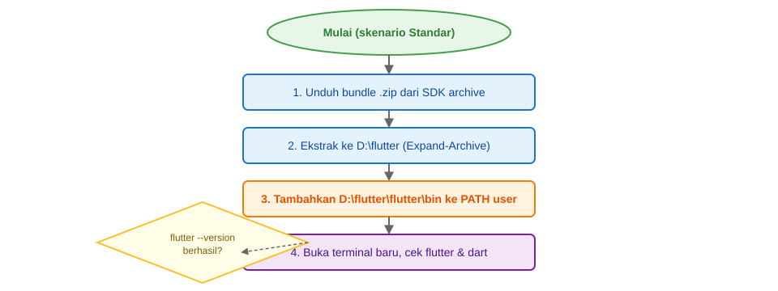
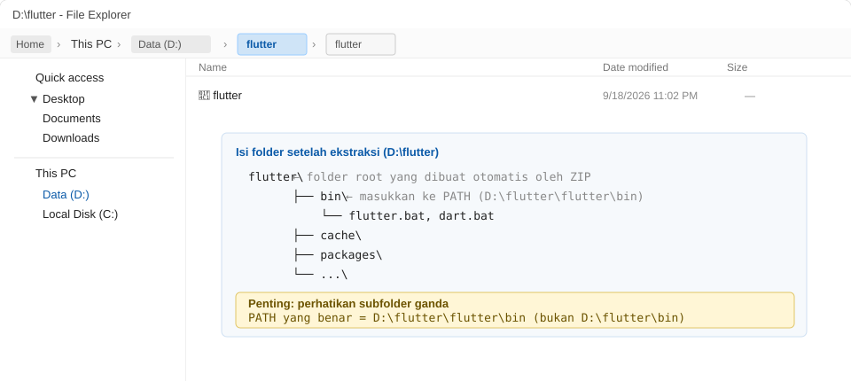
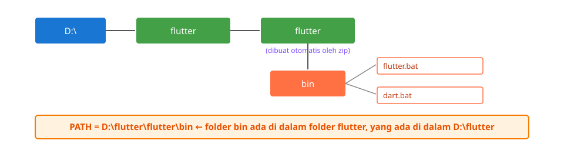
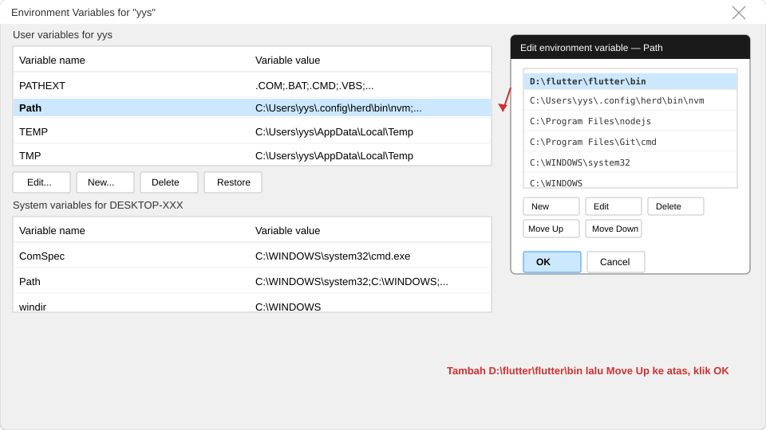
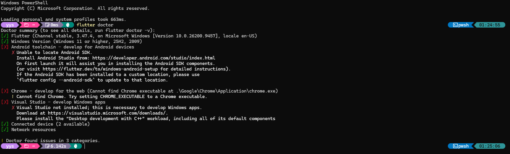
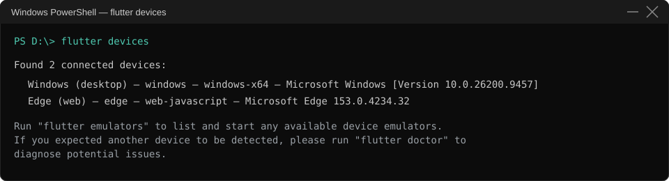

# Instalasi Flutter SDK — Windows (Skenario Standar)

**USA-WP2360241 — Pemrograman Aplikasi Bergerak** | Panduan Praktikum

Dokumen ini merupakan pelengkap [`Panduan-Lengkap-PAB.md`](./Panduan-Lengkap-PAB.md). Isinya berupa panduan langkah demi langkah beserta screenshot untuk instalasi Flutter SDK pada Windows dengan **Skenario Standar** (tanpa emulator). Langkah-langkahnya mengacu pada [petunjuk instalasi manual resmi Flutter](https://docs.flutter.dev/install/manual), khususnya bagian Windows: mengunduh bundle, mengekstrak, lalu **menambahkan ke PATH**.

> **Tujuan pembelajaran.** Setelah mempelajari panduan ini, mahasiswa diharapkan mampu:
>
> 1. Mengunduh bundle Flutter SDK versi *stable* dari SDK archive resmi.
> 2. Mengekstrak bundle dan menjelaskan struktur folder yang terbentuk setelah ekstraksi.
> 3. Mengatur variabel lingkungan **User PATH** agar perintah `flutter` dan `dart` dapat dipanggil dari direktori kerja mana pun.
> 4. Memverifikasi instalasi menggunakan `flutter --version`, `flutter doctor`, dan `flutter devices`.
> 5. Mengidentifikasi komponen yang wajib dan komponen yang opsional berdasarkan hasil `flutter doctor`.

---

## 0. Persiapan dan Batas Skenario

Skenario Standar menginstal Flutter SDK beserta Dart SDK. Dart SDK terpasang secara otomatis bersama Flutter SDK, sehingga tidak perlu diunduh terpisah. Target utama praktikum ini adalah platform web (Chrome); dengan demikian, Android Studio, Android SDK, dan emulator tidak diperlukan dalam skenario ini.

> **Istilah *mesin contoh* pada dokumen ini** mengacu pada komputer yang digunakan untuk mendemonstrasikan prosedur instalasi berikut. Seluruh keluaran perintah pada dokumen ini ditampilkan sebagai contoh hasil dari mesin tersebut, sehingga tidak bersifat mutlak terhadap komputer lain.

| Komponen | Skenario Standar | Keterangan |
|:---|:---:|:---|
| Flutter SDK | ✅ dipasang | berisi `flutter.bat` dan `dart.bat` |
| Dart SDK | ✅ ikut terpasang | dipasang secara otomatis, tidak perlu diunduh terpisah |
| Google Chrome | ❌ tidak terpasang | perlu dipasang bila akan menjalankan `flutter run -d chrome` |
| Android Studio + Android SDK | ❌ tidak terpasang | hanya diperlukan pada Skenario Lengkap (Minggu 11 dan seterusnya) |
| Visual Studio | ❌ tidak terpasang | hanya diperlukan bila target aplikasi Windows desktop |

> **Catatan lokasi instalasi:** pilih lokasi yang **pendek dan tanpa spasi/karakter khusus**. Panduan resmi Flutter menyarankan folder seperti `%USERPROFILE%\develop` (mis. `C:\Users\<user>\develop`). **Pada mesin contoh** dalam dokumen ini, lokasi yang dipakai adalah `D:\flutter` (drive `C:` sudah banyak terpakai; jalur yang dipilih pendek dan tanpa spasi). Anda bebas menyesuaikan lokasi, asalkan nilai PATH akhirnya menunjuk ke **folder `bin` yang benar-benar ada**.

### Prasyarat (dari panduan resmi)
1. **Git for Windows** — diperlukan; pada mesin contoh, perintah `git` sudah tersedia.
2. **Editor/IDE** (opsional) — VS Code beserta ekstensi Flutter dan Dart. Tidak wajib untuk instalasi CLI, tetapi membantu praktikum selanjutnya.
3. Sistem Windows 10/11 64-bit (x64).

---

## 1. Diagram Alur Instalasi (Skenario Standar)



Empat langkah utama:

1. Unduh bundle `.zip` dari **SDK archive** resmi Flutter.
2. Ekstrak ke lokasi folder (mis. `D:\flutter`).
3. Tambahkan folder `...\flutter\bin` ke variabel lingkungan **User PATH**.
4. Buka terminal baru, lalu verifikasi perintah `flutter` dan `dart`.

---

## 2. Unduh Bundle Flutter

Pilih versi **stable** terbaru dari [Flutter SDK Archive](https://docs.flutter.dev/install/archive). Pada saat dokumentasi ini disusun, versi stabil terbaru yang berhasil diunduh adalah **Flutter 3.47.4** (termasuk Dart 3.13.3).

Contoh perintah unduhan (PowerShell) untuk versi 3.47.4:

```powershell
# Unduh ke D:\flutter_sdk (folder sementara)
$OutFile = "D:\flutter_sdk\flutter_windows_3.47.4-stable.zip"
Invoke-WebRequest `
  -Uri "https://storage.googleapis.com/flutter_infra_release/releases/stable/windows/flutter_windows_3.47.4-stable.zip" `
  -OutFile $OutFile
```

> Sesuaikan `3.47.4` dengan versi stable terbaru yang Anda pilih. Penamaan file bundle selalu mengikuti pola `flutter_windows_<versi>-stable.zip`.

---

## 3. Membuat Folder dan Mengekstrak SDK

Buat folder tujuan, kemudian ekstrak bundle ke folder tersebut. Panduan resmi menggunakan perintah `Expand-Archive`:

```powershell
# Buat folder tujuan lalu ekstrak
New-Item -ItemType Directory -Path "D:\flutter" -Force
Expand-Archive -Path "D:\flutter_sdk\flutter_windows_3.47.4-stable.zip" -DestinationPath "D:\flutter" -Force
```

### Struktur yang terbentuk

Perlu diperhatikan bahwa bundle `.zip` Flutter Windows berisi satu folder root bernama `flutter`. Akibatnya, hasil ekstraksi selalu berada **satu level lebih dalam** dari folder tujuan.



```text
D:\flutter\            ← folder tujuan yang Anda buat
└── flutter\           ← subfolder yang dibuat otomatis oleh file zip
    ├── bin\           ← lokasi perintah `flutter` dan `dart`
    │   ├── flutter.bat
    │   ├── dart.bat
    │   └── ...
    ├── packages\
    └── version
```

### Mengapa `bin` berada di `D:\flutter\flutter\bin`?



Karena file `.zip` resmi Flutter berisi folder root `flutter\`, mengekstraknya ke `D:\flutter` menghasilkan struktur **`D:\flutter\flutter\`** (bukan `D:\flutter\`). Dengan demikian, folder `bin` berada pada:

```text
D:\flutter\flutter\bin
```

Struktur folder ganda ini terkadang membingungkan; diagram pada bagian sebelumnya memberikan visualisasi yang lebih jelas.

> Apabila Anda menghendaki struktur tanpa folder ganda, ekstrak bundle ke folder kosong, lalu **pindahkan** isi `D:\flutter\flutter\*` ke `D:\flutter\`, sehingga `bin` berada di `D:\flutter\bin`. Hal yang paling penting: nilai PATH harus selalu menunjuk ke **folder `bin` yang benar-benar ada**.

---

## 4. Menambahkan Flutter ke PATH

Alasan `bin` perlu ditambahkan ke PATH adalah sebagai berikut: ketika perintah diketik pada terminal, Windows mencari program yang bersangkutan terlebih dahulu di folder-folder yang tercantum pada variabel PATH. Apabila folder `D:\flutter\flutter\bin` dimuat ke dalam PATH, perintah `flutter` dan `dart` dapat dipanggil dari direktori kerja mana pun tanpa perlu mengetikkan lokasi lengkapnya setiap kali.

Pengaturan PATH dapat dilakukan dengan dua cara yang sama-sama efektif: melalui **GUI** (dialog *Environment Variables* Windows) atau melalui **PowerShell**. Kedua cara menulis pada variabel lingkungan yang sama. Untuk praktikum, cara GUI lebih visual dan cocok bagi pemula; cara PowerShell lebih ringkas bagi yang sudah terbiasa.

### 4.1 Metode GUI — Dialog "Environment Variables" (disarankan bagi pemula)

Langkah berikut merupakan prosedur GUI sesuai panduan resmi Flutter, dengan asumsi folder `bin` berada di `D:\flutter\flutter\bin`:

1. Tekan **Win + Pause** untuk membuka dialog **System → About**. Jika keyboard tidak memiliki tombol *Pause*, gunakan **Win + Fn + B**.
2. Klik **Advanced system settings**, pilih tab **Advanced**, lalu klik tombol **Environment Variables…**. Dialog **Environment Variables** akan terbuka.
3. Pada bagian **User variables for \<username\>**, cari entri **`Path`**:
   - **Bila entri `Path` sudah ada**, klik dua kali (double-click) pada `Path`. Dialog *Edit environment variable* akan terbuka.
   - **Bila entri `Path` belum ada**, klik **New…**, lalu isi *Variable name* dengan `Path` dan *Variable value* dengan `D:\flutter\flutter\bin`.
4. Di dalam dialog *Edit environment variable*, klik tombol **New**, kemudian ketik:
   ```text
   D:\flutter\flutter\bin
   ```
5. Pilih baris Flutter yang baru ditambahkan, lalu klik **Move Up** hingga baris tersebut berada di posisi paling atas daftar. Posisi ini disarankan oleh panduan resmi agar prioritas folder `bin` paling tinggi.
6. Klik **OK** sebanyak tiga kali, masing-masing untuk menutup dialog *Edit user environment variable*, dialog **Environment Variables**, dan dialog **System**.
7. Tutup dan buka kembali semua jendela terminal, command prompt, dan IDE yang sedang berjalan agar perubahan PATH diterapkan.



> **Screenshot di atas** menggambarkan dialog Windows yang serupa dengan yang dimunculkan pada [panduan resmi Flutter — Add Flutter to your PATH](https://docs.flutter.dev/install/add-to-path). Urutan langkahnya sesuai dengan panduan tersebut.

#### Catatan penting: PATH bersifat per-user, bukan per-shell atau per-terminal

> Setelah PATH diatur satu kali (baik melalui GUI maupun PowerShell), perubahan tersebut disimpan secara **per-user** di registry Windows (`HKEY_CURRENT_USER\Environment`). Implikasinya adalah sebagai berikut:
>
> - **Semua** shell, terminal, dan IDE baru yang dibuka pada user yang sama (**PowerShell, CMD, Git Bash, VS Code, Android Studio, dll.**) akan membaca PATH yang baru secara otomatis.
> - Anda **tidak perlu** mengatur ulang PATH untuk setiap terminal baru, dan **tidak perlu** mengatur ulang setelah komputer di-restart.
> - Satu-satunya hal yang perlu dilakukan setelah mengatur PATH adalah **menutup lalu membuka kembali** terminal/IDE yang telah terbuka *sebelum* perubahan dilakukan. Proses yang sudah berjalan masih menyimpan PATH lama di dalam memori.
>
> Dengan kata lain, PATH cukup diatur satu kali untuk seluruh terminal dan IDE pada user yang sama. Penjelasan di atas berlaku untuk **User PATH** yang diatur pada panduan ini. Apabila menggunakan *System PATH*/*Machine PATH*, efek yang dihasilkan serupa, tetapi berlaku untuk semua user pada komputer tersebut.

### 4.2 Metode PowerShell (alternatif ringkas)

Bagi pengguna yang terbiasa dengan PowerShell, User PATH dapat ditambahkan melalui perintah berikut tanpa perlu menyentuh GUI:

```powershell
# Lihat User PATH saat ini
[Environment]::GetEnvironmentVariable('Path','User')

# Tambahkan folder bin Flutter ke User PATH
$u = [Environment]::GetEnvironmentVariable('Path','User')
[Environment]::SetEnvironmentVariable('Path', "$u;D:\flutter\flutter\bin", 'User')

# Cek kembali entri Flutter yang terpasang
[Environment]::GetEnvironmentVariable('Path','User') -split ';' | Where-Object { $_ -like '*flutter*' }
```

> Metode PowerShell menghasilkan efek yang sama dengan metode GUI karena keduanya menulis pada variabel **User PATH** yang sama. Setelah perintah dijalankan, buka terminal baru agar perubahan terbaca. Contoh hasil setelah User PATH diatur adalah sebagai berikut:

```text
D:\flutter\flutter\bin
```

---

## 5. Verifikasi Instalasi

Buka **terminal baru** (PowerShell, CMD, atau terminal VS Code), kemudian jalankan:

```powershell
flutter --version
dart --version
```

Contoh keluaran yang diharapkan:


```text
Flutter 3.47.4 • channel stable • https://github.com/flutter/flutter.git
Framework • revision 9584c6713b (8 days ago) • 2026-09-10 15:25:10 -0700
Engine • hash 0e228ec8c8d2abc9fcf1d053e8a40665bb859ec7 (revision 06a2e2a110)
Tools • Dart 3.13.3 • DevTools 2.60.0
```

```text
Dart SDK version: 3.13.3 (stable) (Tue Sep 1 01:07:17 2026 -0700) on "windows_x64"
```

Untuk memastikan lokasi folder yang terdeteksi sudah benar, jalankan:

```powershell
(Get-Command flutter).Source   # → D:\flutter\flutter\bin\flutter.bat
(Get-Command dart).Source      # → D:\flutter\flutter\bin\dart.bat
```

Apabila kedua perintah di atas menampilkan lokasi folder `bin` yang sesuai, berarti pengaturan PATH telah berhasil.

---

## 6. Jalankan `flutter doctor`

```powershell
flutter doctor
```

Contoh hasil pada mesin contoh:



```text
[√] Flutter (Channel stable, 3.47.4, on Microsoft Windows [Version 10.0.26200.9457])
[√] Windows Version (Windows 11 or higher, 25H2, 2009)
[X] Android toolchain - develop for Android devices
[X] Chrome - develop for the web
[X] Visual Studio - develop Windows apps
[√] Connected device (2 available)
[√] Network resources
! Doctor found issues in 3 categories.
```

### Cara membaca tanda `[X]`

| Baris | Arti | Penanganan untuk Skenario Standar |
|:---|:---|:---|
| `[X] Android toolchain` | Android SDK belum terpasang | **Abaikan** — hanya diperlukan untuk target Android (Skenario Lengkap). |
| `[X] Chrome` | Chrome tidak terdeteksi | **Pasang Google Chrome** bila ingin menggunakan `flutter run -d chrome`; atau atur `CHROME_EXECUTABLE`. |
| `[X] Visual Studio` | Visual Studio belum terpasang | **Abaikan** — hanya diperlukan untuk membangun aplikasi Windows desktop. |

Tanda `[X]` pada baris-baris di atas tidak menghalangi praktikum pada Skenario Standar yang berbasis web. Tanda `[√]` pada baris **Flutter** dan **Windows Version** menunjukkan bahwa komponen inti yang diperlukan untuk praktikum sudah berfungsi. Perlu dicatat bahwa tanda `[X]` dapat berubah menjadi `[√]` setelah komponen terkait dipasang, misalnya saat beralih ke Skenario Lengkap.

> Untuk memperoleh informasi yang lebih rinci, jalankan `flutter doctor -v` (verbose).

---

## 7. Perangkat yang Terdeteksi (`flutter devices`)

```powershell
flutter devices
```

Contoh hasil pada mesin contoh:



```text
Found 2 connected devices:
  Windows (desktop) — windows — windows-x64 — Microsoft Windows [Version 10.0.26200.9457]
  Edge (web)        — edge    — web-javascript — Microsoft Edge 153.0.4234.32
```

Meskipun **Chrome** belum terpasang, Flutter tetap mendeteksi **Microsoft Edge** sebagai target web. Dengan demikian, aplikasi Flutter dapat dijalankan pada web menggunakan Edge. Untuk mengikuti alur praktikum `flutter run -d chrome`, pasang Google Chrome terlebih dahulu; tanpa Chrome, gunakan target yang terdeteksi.

> Emulator Android tidak muncul pada daftar karena belum terpasang (Skenario Standar tidak menggunakan emulator).

---

## 8. Ringkasan Perintah (untuk Disalin)

Kumpulan perintah berikut dapat disalin langsung untuk memverifikasi instalasi pada terminal:

```powershell
# 1) Verifikasi versi
flutter --version
dart --version

# 2) Verifikasi PATH sudah benar
(Get-Command flutter).Source
(Get-Command dart).Source

# 3) Cek kesehatan lingkungan
flutter doctor

# 4) Lihat perangkat yang tersedia
flutter devices
```

---

## 9. Troubleshooting (panduan resmi dan pengalaman lokal)

| Gejala | Penyebab | Solusi |
|:---|:---|:---|
| `flutter: command not recognized` | PATH belum dimuat ulang pada terminal yang terbuka | **Tutup dan buka kembali terminal**, lalu pastikan User PATH memuat `D:\flutter\flutter\bin`. |
| PATH sudah benar tetapi tetap `not recognized` | Kesalahan penulisan PATH atau penunjukan folder yang keliru | Periksa dengan `(Get-Command flutter).Source`; pastikan nilainya menunjuk ke `...\flutter\bin` yang benar-benar ada. |
| `flutter: not found` pada **bash** | Hanya User PATH PowerShell yang diatur | Tambahkan juga ke **System PATH** atau ke file profil shell sesuai lingkungan yang digunakan. |
| `flutter doctor` menandai Android | Android SDK belum terpasang | Hal ini normal pada Skenario Standar; abaikan, atau lanjutkan ke Skenario Lengkap. |
| `flutter run -d chrome` gagal | Chrome belum terpasang | Pasang Chrome, atau atur `CHROME_EXECUTABLE` agar menunjuk ke file `.exe` Chrome atau Edge. |
| Build pertama berjalan lambat | Unduhan komponen awal yang dibutuhkan Flutter | Pastikan jaringan stabil; ulangi perintah apabila koneksi terputus. |

> Panduan troubleshooting resmi: [Flutter install troubleshooting](https://docs.flutter.dev/install/troubleshoot) dan [Add to PATH](https://docs.flutter.dev/install/add-to-path).

---

## 10. Langkah Selanjutnya: Membuat Project Pertama

Setelah instalasi terverifikasi, lanjutkan ke panduan praktikum pada [`Panduan-Lengkap-PAB.md`](./Panduan-Lengkap-PAB.md) Bagian III:

```powershell
flutter create pab_p1_<nim>
cd pab_p1_<nim>
flutter run -d chrome      # target web (Chrome); jika Chrome belum ada, gunakan target yang terdeteksi
```

Untuk penjelasan lebih lanjut tentang pembuatan project dan *hot reload*, lihat **[Panduan Lengkap](./Panduan-Lengkap-PAB.md)** dan **[Pertemuan 1](../pertemuan-01/01-Pertemuan-1.md)**.

---

## Daftar Screenshot dan Diagram

| Gambar | Lokasi | Isi |
|:---|:---|:---|
| Diagram alur instalasi | [`assets/diagram-alur-instalasi.svg`](./assets/diagram-alur-instalasi.svg) | Alur empat langkah dan keputusan verifikasi |
| Struktur File Explorer | [`assets/explorer-flutter-structure.svg`](./assets/explorer-flutter-structure.svg) | Struktur `D:\flutter\flutter` dan peringatan folder ganda |
| Alasan struktur `bin` | [`assets/diagram-folder-bin.svg`](./assets/diagram-folder-bin.svg) | Mengapa PATH = `D:\flutter\flutter\bin` |
| Dialog Environment Variables | [`assets/dialog-environment-variables.svg`](./assets/dialog-environment-variables.svg) | Menambah User PATH melalui GUI Windows |
| `flutter --version` | [`assets/terminal-flutter-version.svg`](./assets/terminal-flutter-version.svg) | Keluaran versi Flutter dan Dart serta sumber PATH |
| `flutter doctor` | [`assets/terminal-flutter-doctor.png`](./assets/terminal-flutter-doctor.png) | Laporan `flutter doctor` dengan tanda √ dan X |
| `flutter devices` | [`assets/terminal-flutter-devices.svg`](./assets/terminal-flutter-devices.svg) | Perangkat terdeteksi (Windows desktop, Edge web) |
