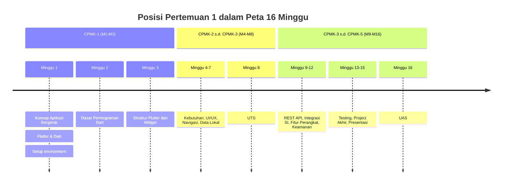
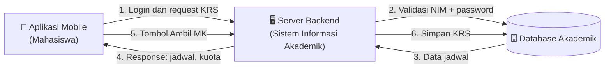
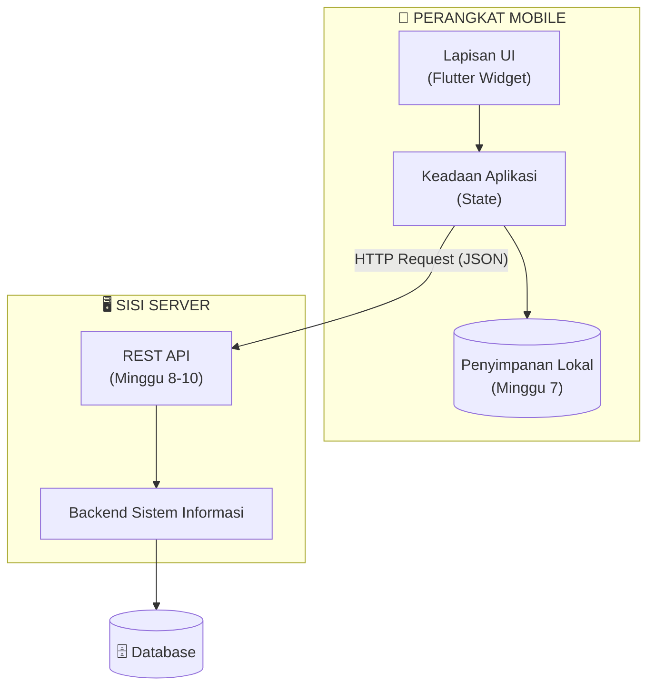
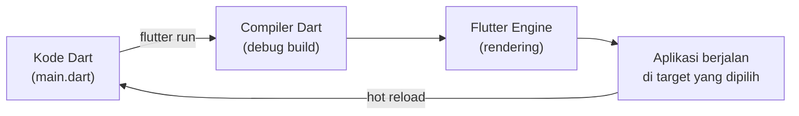
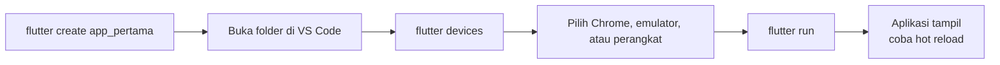
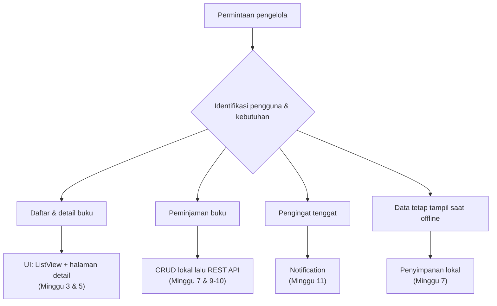
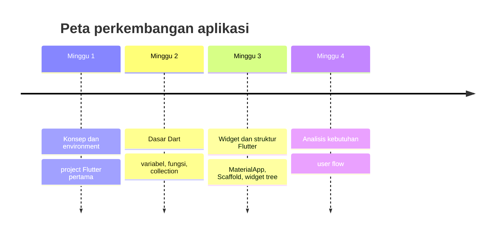

# Pertemuan 1 — Konsep Aplikasi Bergerak dalam Sistem Informasi, Flutter & Dart

| | |
|:--|:--|
| **Minggu** | 1 |
| **Tanggal** | Rabu, 16 September 2026 (SI-VIIB) / Sabtu, 19 September 2026 (SI-VIIA) |
| **CPMK** | CPMK-1 |
| **Model Pembelajaran** | Case Based Learning / Problem Based Learning |
| **Stack** | Flutter + Dart |

> **Catatan penting:** Pertemuan 1 sengaja **belum** membangun UI yang kompleks. Fokusnya adalah membangun pemahaman dasar: karakteristik aplikasi bergerak, peran aplikasi bergerak dalam Sistem Informasi, ekosistem Flutter & Dart, serta menyiapkan lingkungan pengembangan. Project Flutter pertama menjadi bukti bahwa seluruh toolchain sudah berjalan. Setelah fondasi ini kuat, Pertemuan 2 masuk ke Dasar Pemrograman Dart dan Pertemuan 3 ke Struktur Aplikasi Flutter dan Widget.

---

## Daftar Isi

- [Pertemuan 1 — Konsep Aplikasi Bergerak dalam Sistem Informasi, Flutter \& Dart](#pertemuan-1--konsep-aplikasi-bergerak-dalam-sistem-informasi-flutter--dart)
  - [Daftar Isi](#daftar-isi)
  - [1. Keterkaitan Pertemuan dengan RPS OBE](#1-keterkaitan-pertemuan-dengan-rps-obe)
  - [2. Capaian Pembelajaran Pertemuan](#2-capaian-pembelajaran-pertemuan)
  - [3. Pemantik Kasus: Aplikasi Layanan Akademik di Ponsel](#3-pemantik-kasus-aplikasi-layanan-akademik-di-ponsel)
  - [4. Konsep Aplikasi Bergerak dalam Sistem Informasi](#4-konsep-aplikasi-bergerak-dalam-sistem-informasi)
  - [5. Karakteristik Aplikasi Bergerak](#5-karakteristik-aplikasi-bergerak)
  - [6. Ekosistem Aplikasi Bergerak](#6-ekosistem-aplikasi-bergerak)
  - [7. Arsitektur Dasar Aplikasi Bergerak](#7-arsitektur-dasar-aplikasi-bergerak)
  - [8. Mengenali Flutter dan Dart](#8-mengenali-flutter-dan-dart)
  - [9. Ekosistem Flutter](#9-ekosistem-flutter)
  - [10. Studi Kasus: Aplikasi Perpustakaan](#10-studi-kasus-aplikasi-perpustakaan)
  - [11. Demo: Project Flutter Pertama](#11-demo-project-flutter-pertama)
  - [12. Case Based Learning: Identifikasi Kebutuhan Aplikasi Perpustakaan](#12-case-based-learning-identifikasi-kebutuhan-aplikasi-perpustakaan)
  - [13. Aktivitas Kelompok](#13-aktivitas-kelompok)
  - [14. Latihan Individu](#14-latihan-individu)
  - [15. Pemanfaatan AI sebagai Coding Assistant](#15-pemanfaatan-ai-sebagai-coding-assistant)
  - [16. Kuis Formatif](#16-kuis-formatif)
  - [17. Keluaran Pembelajaran — Tugas 1](#17-keluaran-pembelajaran--tugas-1)
    - [Cara Pengumpulan — Push ke Repository GitHub Kelas](#cara-pengumpulan--push-ke-repository-github-kelas)
  - [18. Rubrik Tugas 1](#18-rubrik-tugas-1)
  - [19. Persiapan menuju Pertemuan 2](#19-persiapan-menuju-pertemuan-2)
    - [📎 Lampiran: Kode Praktikum](#-lampiran-kode-praktikum)

---

## 1. Keterkaitan Pertemuan dengan RPS OBE

Pertemuan 1 memberikan dasar untuk mengikuti mata kuliah Pemrograman Aplikasi Bergerak. Dalam kerangka OBE (Outcome Based Education), pertemuan ini menyumbang capaian pada **CPMK-1**:

> Mahasiswa mampu menjelaskan konsep aplikasi bergerak dalam konteks Sistem Informasi serta mempersiapkan lingkungan pengembangan berbasis Flutter dan Dart.

Pertemuan ini juga menjadi fondasi bagi seluruh rangkaian 16 minggu: pemahaman karakteristik aplikasi bergerak akan dipakai ulang pada analisis kebutuhan (Minggu 4), perancangan UI/UX (Minggu 5–6), integrasi REST API (Minggu 9–10), hingga finalisasi project (Minggu 14–16).



---

## 2. Capaian Pembelajaran Pertemuan

Setelah mengikuti pertemuan ini, mahasiswa mampu:

| No. | Kemampuan | Indikator |
| :-: | --------- | --------- |
| 1 | Menjelaskan peran aplikasi bergerak dalam Sistem Informasi | Mahasiswa dapat memberi contoh kasus SI yang dilayani oleh aplikasi bergerak |
| 2 | Menguraikan karakteristik aplikasi bergerak | Mahasiswa dapat menjelaskan pengaruh konektivitas, ukuran layar, dan daya terhadap desain aplikasi |
| 3 | Menggambarkan ekosistem dan arsitektur dasar aplikasi bergerak | Mahasiswa dapat menggambar diagram alur aplikasi mobile dengan backend |
| 4 | Menjelaskan posisi Flutter dan Dart dalam pengembangan aplikasi bergerak | Mahasiswa dapat membedakan Flutter, Dart, SDK, dan framework |
| 5 | Menyiapkan lingkungan pengembangan Flutter | Mahasiswa dapat menyelesaikan `flutter doctor` tanpa error penghambat |
| 6 | Membuat dan menjalankan project Flutter pertama | Mahasiswa dapat menjalankan aplikasi `counter` bawaan pada target web, emulator, atau perangkat fisik |

---

## 3. Pemantik Kasus: Aplikasi Layanan Akademik di Ponsel

Perhatikan skenario berikut ketika Anda membuka **aplikasi layanan akademik** kampus dari ponsel:

1. Anda login dengan NIM dan password.
2. Halaman menampilkan jadwal kuliah dan notifikasi pengumuman.
3. Anda menekan tombol **"Ambil Mata Kuliah"** dari pemberhentian bus, tanpa Wi-Fi kampus.

Pertanyaan pemantik:

- Mengapa aplikasi tersebut **dibuat sebagai aplikasi mobile**, bukan sekadar situs web?
- Apa yang **berbeda** saat aplikasi dijalankan di ponsel: ukuran layar, konektivitas, daya tahan baterai, sensor?
- Apa yang **terjadi di balik layar** ketika tombol "Ambil Mata Kuliah" ditekan — dari jari menyentuh layar sampai data berubah di server kampus?



Pertanyaan tersebut akan dibahas secara bertahap sepanjang semester. Aplikasi bergerak menyediakan antarmuka pada perangkat pengguna, sedangkan backend SI — yang dipelajari pada mata kuliah Prak-backend — memproses permintaan, menerapkan aturan bisnis, dan mengelola data.

---

## 4. Konsep Aplikasi Bergerak dalam Sistem Informasi

**Aplikasi bergerak (mobile app)** adalah perangkat lunak yang dirancang untuk berjalan pada perangkat bergerak seperti ponsel cerdas dan tablet. Dalam konteks **Sistem Informasi (SI)**, aplikasi bergerak berperan sebagai antarmuka yang membawa proses bisnis SI ke tangan pengguna.

Peran aplikasi bergerak dalam SI:

1. **Titik layanan utama** — layanan SI kini diakses lebih banyak dari ponsel daripada komputer.
2. **Pemrosesan di lokasi pengguna** — input data (absensi, kamera, lokasi) dapat dilakukan di tempat kejadian.
3. **Notifikasi dan interaksi seketika** — informasi penting sampai kepada pengguna tanpa menunggu mereka membuka aplikasi.
4. **Pemanfaatan kapabilitas perangkat** — kamera, GPS, dan penyimpanan lokal menjadi bagian dari proses bisnis.

Tiga peran pelaku dalam arsitektur SI yang berlaku sepanjang semester:

| Peran | Contoh pada kasus akademik | Dibahas pada |
|:------|:---------------------------|:-------------|
| **Aplikasi bergerak (client)** | Aplikasi layanan akademik di ponsel | Mata kuliah ini (Minggu 1–16) |
| **Backend (server)** | REST API layanan akademik | Mata kuliah Prak-backend |
| **Database** | Data mahasiswa, jadwal, nilai | Mata kuliah Basis Data |

---

## 5. Karakteristik Aplikasi Bergerak

Aplikasi bergerak memiliki karakteristik yang membedakannya dari aplikasi web desktop. Karakteristik ini menentukan keputusan desain pada Minggu 4–7.

| Karakteristik | Penjelasan | Konsekuensi pada desain aplikasi |
|:--------------|:-----------|:---------------------------------|
| **Konektivitas terbatas** | Jaringan dapat hilang atau lambat kapan saja | Aplikasi perlu menyimpan data lokal dan menampilkan keadaan error dengan baik |
| **Layar kecil dan variatif** | Ukuran layar berbeda antar perangkat | Tata letak harus adaptif; elemen sentuh cukup besar |
| **Interaksi sentuh** | Input utama adalah sentuhan, bukan mouse | Target sentuh minimal 48x48 piksel; hindari input panjang |
| **Sesi penggunaan singkat** | Pengguna membuka aplikasi dalam hitungan menit | Alur utama harus selesai dalam beberapa langkah |
| **Daya dan data terbatas** | Baterai dan kuota internet terbatas | Hindari proses yang tidak perlu; hemat penggunaan jaringan |
| **Konteks bergerak** | Pengguna berpindah tempat saat memakai aplikasi | Fungsi lokasi, kamera, dan sensor relevan bagi proses bisnis |
| **Banyak variasi perangkat** | Versi OS dan spesifikasi hardware beragam | Aplikasi diuji pada beberapa perangkat/emulator |

> **Catatan:** Karakteristik di atas bukan sekadar teori — setiap karakteristik akan kembali muncul saat mahasiswa menganalisis kebutuhan (Minggu 4), merancang UI (Minggu 5), mengelola data lokal (Minggu 7), dan memanfaatkan fitur perangkat (Minggu 11).

---

## 6. Ekosistem Aplikasi Bergerak

Ada dua platform utama aplikasi bergerak:

| Aspek | Android | iOS |
|:------|:--------|:----|
| Pengembang platform | Google | Apple |
| Bahasa resmi | Kotlin, Java | Swift, Objective-C |
| Tool resmi | Android Studio | Xcode |
| Bahasa di Indonesia | Lebih luas | Lebih terbatas |
| Emulator/perangkat uji | Emulator di berbagai OS | Simulator butuh macOS |

**Pendekatan pengembangan lintas platform (cross-platform):** satu basis kode untuk Android dan iOS.

| Pendekatan | Karakteristik | Contoh |
|:-----------|:--------------|:-------|
| **Native** | Satu basis kode per platform; akses penuh ke fitur perangkat | Kotlin/Java (Android), Swift (iOS) |
| **Cross-platform** | Satu basis kode untuk Android dan iOS | **Flutter**, React Native |
| **Hybrid web** | Aplikasi web dibungkus aplikasi native | Ionic, Cordova |

Mata kuliah ini menggunakan **Flutter** karena: satu basis kode untuk Android dan iOS, kinerja yang mendekati native, dan dokumentasi yang lengkap. Mahasiswa tetap perlu memahami bahwa keputusan teknologi dalam industri bergantung pada kebutuhan project.

---

## 7. Arsitektur Dasar Aplikasi Bergerak

Sebagian besar aplikasi bergerak dalam SI mengikuti pola **client–server** yang sama dengan backend web:



Pola arsitektur ini menjadi peta semester:

- **Minggu 1–3:** membangun lapisan UI dan memahami struktur project Flutter.
- **Minggu 4–6:** menganalisis kebutuhan, merancang alur UI, navigasi, dan interaksi.
- **Minggu 7:** mengelola data lokal pada perangkat.
- **Minggu 8:** UTS — evaluasi tengah semester.
- **Minggu 9–10:** menghubungkan aplikasi dengan REST API dan proses bisnis SI.
- **Minggu 11–12:** memanfaatkan fitur perangkat, menerapkan validasi dan keamanan praktis.
- **Minggu 13–16:** testing, pengembangan project, presentasi, dan finalisasi.

---

## 8. Mengenali Flutter dan Dart

**Flutter** adalah framework UI dari Google untuk membangun aplikasi yang berjalan secara native pada mobile, web, dan desktop dari satu basis kode.

**Dart** adalah bahasa pemrograman yang digunakan untuk menulis seluruh kode Flutter. Dart berorientasi objek, memiliki sintaks yang mirip JavaScript/Java, dan mendukung null safety sejak Dart 2.12.

| Aspek | Flutter | Dart |
|:------|:--------|:-----|
| Apa itu | Framework/UI toolkit | Bahasa pemrograman |
| Untuk apa | Membangun UI dan logika aplikasi | Menulis kode aplikasi Flutter |
| Dikembangkan oleh | Google | Google |
| Analogi | Kerangka bangunan | Bahan bangunan |

Komponen dalam ekosistem pengembangan:

| Komponen | Fungsi |
|:---------|:-------|
| **Flutter SDK** | Kumpulan tool dan framework Flutter (compiler, engine, widget, `flutter` CLI) |
| **Dart SDK** | Ikut terpasang bersama Flutter SDK; berisi compiler dan tool bahasa Dart |
| **IDE** | VS Code atau Android Studio beserta plugin Flutter |
| **Emulator/Simulator/Perangkat** | Tempat aplikasi dijalankan untuk diuji |

Apa yang terjadi ketika aplikasi Flutter dijalankan:



- **Hot reload:** perubahan kode tampil dalam hitungan detik tanpa kehilangan keadaan aplikasi — keunggulan utama produktivitas Flutter.
- **Hot restart:** mengulang aplikasi dari awal (keadaan diatur ulang).

---

## 9. Ekosistem Flutter

Beberapa istilah yang akan sering muncul sepanjang semester:

| Istilah | Penjelasan |
|:--------|:-----------|
| **Widget** | Satuan dasar UI Flutter; segala sesuatu di layar adalah widget |
| **Material Design** | Bahasa desain bawaan Flutter; disediakan lewat `MaterialApp` |
| **`pubspec.yaml`** | Berkas konfigurasi project: nama, versi, dan daftar dependency |
| **Pub.dev** | Repositori package Dart/Flutter publik (analog dengan npm pada backend) |
| **`pub get`** | Perintah mengunduh dependency ke folder `.dart_tool` |
| **`flutter pub add <pkg>`** | Cara paling mudah menambahkan package ke `pubspec.yaml` |
| **Emulator/AVD** | Perangkat Android virtual yang dijalankan di komputer |
| **Hot reload** | Menerapkan perubahan kode tanpa mengulang aplikasi |

> **Catatan:** Pada Pertemuan 1 kita belum memasang package tambahan — penggunaan `pub` secara intensif dimulai saat package diperlukan untuk penyimpanan lokal pada Minggu 7 dan REST API pada Minggu 9. Komponen di atas diperkenalkan lebih dulu agar struktur project yang dihasilkan `flutter create` dapat dibaca.

---

## 10. Studi Kasus: Aplikasi Perpustakaan 

**Skenario:** Perpustakaan kampus ingin layanan peminjaman yang dapat diakses mahasiswa dari ponsel. Aplikasi bergerak yang dibutuhkan:

- Mahasiswa dapat melihat daftar buku dan detail satu buku.
- Mahasiswa dapat mencari buku dan meminjam buku yang stoknya tersedia.
- Mahasiswa menerima notifikasi ketika masa pinjam hampir berakhir.
- Petugas mengelola data buku melalui backend SI (bukan melalui aplikasi mahasiswa).

Analisis kebutuhan awal — dibahas bersama di kelas:

| Aspek | Hasil analisis |
|:------|:---------------|
| Pengguna | Mahasiswa (utama), petugas (melalui sistem lain) |
| Masalah | Peminjaman harus datang ke loket; ketersediaan buku tidak dapat dipantau |
| Solusi aplikasi bergerak | Katalog, pencarian, peminjaman, notifikasi jatuh tempo |
| Data utama | Buku (judul, penulis, stok), peminjaman (mahasiswa, tanggal) |
| Layanan di luar aplikasi | REST API perpustakaan (backend SI), notifikasi |

Studi kasus ini akan menjadi **project paralel sepanjang semester**: Minggu 4 (kebutuhan & user flow), Minggu 5–6 (UI & navigasi), Minggu 7 (data lokal), Minggu 9–10 (REST API), Minggu 11 (notifikasi), Minggu 13–16 (project akhir).

---

## 11. Demo: Project Flutter Pertama

Kita buktikan bahwa seluruh toolchain sudah berjalan dengan membuat project Flutter pertama. Kode lengkap ada di [`code/pertemuan-01/main.dart`](../code/pertemuan-01/main.dart).



Langkah demo:

```bash
flutter create app_pertama
cd app_pertama
flutter devices          # periksa target yang tersedia
flutter run -d chrome    # target web untuk tahap awal
# Alternatif: flutter run untuk emulator atau perangkat fisik
```

Struktur project yang dihasilkan (bagian yang penting):

```text
app_pertama/
├── lib/
│   └── main.dart          # titik masuk aplikasi — kode kita ditulis di sini
├── pubspec.yaml           # konfigurasi project dan dependency
├── android/               # konfigurasi khusus Android
├── ios/                   # konfigurasi khusus iOS
├── test/                  # unit test (dibahas Minggu 13)
└── README.md
```

Inti kode demo (versi sederhana dari aplikasi counter bawaan):

```dart
import 'package:flutter/material.dart';

void main() {
  runApp(const MyApp());
}

class MyApp extends StatelessWidget {
  const MyApp({super.key});

  @override
  Widget build(BuildContext context) {
    return MaterialApp(
      title: 'Pertemuan 1 — Aplikasi Pertama',
      home: Scaffold(
        appBar: AppBar(title: const Text('PAB — Pertemuan 1')),
        body: const Center(child: Text('Halo, Flutter!')),
      ),
    );
  }
}
```

Perhatikan empat hal saat demo:

1. `main()` adalah titik masuk; `runApp()` memasang widget utama (`MyApp`) ke layar.
2. `MaterialApp` dan `Scaffold` menyediakan struktur halaman dasar — detailnya dibahas Pertemuan 3.
3. `Text` adalah widget; segala sesuatu yang tampil di layar adalah widget.
4. Ubah teks `Halo, Flutter!` lalu simpan — aplikasi diperbarui tanpa diulang (*hot reload*).

---

## 12. Case Based Learning: Identifikasi Kebutuhan Aplikasi Perpustakaan

**Skenario:** Pengelola perpustakaan meminta aplikasi berbasis mobile. Saat ini mahasiswa harus datang ke loket untuk memastikan ketersediaan buku, dan sering kehilangan tenggat pengembalian karena tidak ada pengingat.

Pihak pengelola mengajukan permintaan berikut:

1. Mahasiswa dapat melihat daftar dan detail buku tanpa datang ke perpustakaan.
2. Mahasiswa dapat meminjam buku yang stoknya tersedia.
3. Mahasiswa menerima pengingat sebelum tenggat pengembalian.
4. Aplikasi tetap dapat menampilkan daftar buku terakhir meski jaringan sedang tidak tersedia.

Rancangan referensi (akan diverifikasi mahasiswa di aktivitas kelompok):

| Permintaan | Karakteristik mobile yang terkait | Fitur aplikasi | Materi pemenuh |
|:-----------|:----------------------------------|:---------------|:---------------|
| Lihat katalog & detail buku | Layar kecil, sesi singkat | Halaman daftar + halaman detail | Minggu 3, 5 |
| Pinjam buku stok tersedia | Interaksi sentuh, kecepatan | Tombol pinjam + validasi stok | Minggu 7, 9–10 |
| Pengingat tenggat | Notifikasi perangkat | Local notification | Minggu 11 |
| Katalog tetap tampil saat offline | Konektivitas terbatas | Penyimpanan lokal | Minggu 7 |



Pertanyaan analisis untuk kelompok:

- Permintaan mana yang **wajib** ada pada versi pertama dan mana yang bisa ditunda? Apa alasannya?
- Karakteristik mobile apa yang paling menentukan desain aplikasi ini?
- Data apa saja yang perlu disimpan **di perangkat** dan data apa yang sebaiknya **di server**?

---

## 13. Aktivitas Kelompok

Bentuk kelompok 3–4 orang, kerjakan menggunakan app diagram digital:

1. **Bedah kasus (15 menit)** — Pilih satu aplikasi mobile yang sering dipakai (Shopee/Tokopedia/BRImo/MyTelkomsel). Identifikasi minimal **5 fitur**, lalu petakan: fitur itu menyelesaikan masalah SI apa, dan karakteristik mobile apa yang terlibat.
2. **Analisis kebutuhan (20 menit)** — Dari skenario CBL di atas, lengkapi tabel analisis: tambahkan minimal **2 permintaan tambahan** dari sudut pandang petugas atau kepala perpustakaan, tentukan fitur aplikasi dan materi pemenuhnya.
3. **Presentasi singkat (5 menit/kelompok)** — Satu kelompok terpilih memaparkan hasilnya; kelompok lain menanggapi: adakah kebutuhan yang sebenarnya adalah tugas backend, bukan aplikasi mobile? Adakah fitur yang tidak realistis di perangkat mobile?

**Target:** tiap kelompok menghasilkan tabel kebutuhan yang membedakan dengan jelas pekerjaan **aplikasi mobile** dan pekerjaan **backend SI**.

---

## 14. Latihan Individu

Kerjakan setelah demo; urutan langkah ada di [`code/pertemuan-01/main.dart`](../code/pertemuan-01/main.dart) (bagian komentar terbimbing) dan [Panduan Lengkap PAB](../panduan/Panduan-Lengkap-PAB.md).

1. **Verifikasi lingkungan** — Jalankan `flutter doctor`, catat hasilnya, dan selesaikan satu isu yang muncul (mis. license Android belum diterima). Lihat [`Panduan-Lengkap-PAB.md`](../panduan/Panduan-Lengkap-PAB.md) bagian *Mengatasi Error Umum* (Bagian IV).
2. **Buat project pertama** — Jalankan `flutter create pab_p1_<nim>`, buka di VS Code, lalu jalankan dengan `flutter run -d chrome`. Emulator atau perangkat fisik dapat digunakan sebagai alternatif.
3. **Identifikasi struktur** — Temukan dan catat letak: `main.dart`, `pubspec.yaml`, dan folder `android/`/`ios/`.
4. **Hot reload** — Ubah `title` pada `MaterialApp` dan teks pada widget `Text`, simpan, amati hasilnya. Catat perbedaan *hot reload* dengan *hot restart* (`Shift+R` di terminal).
5. **Refleksi singkat** — Tulis 3 kalimat: karakteristik mobile apa yang paling memengaruhi desain aplikasi SI yang Anda rencanakan, dan mengapa?

---

## 15. Pemanfaatan AI sebagai Coding Assistant

**AI assistant (GitHub Copilot, ChatGPT, Claude, Gemini, Cursor) boleh dipakai — dengan cara yang benar:**

**✅ Gunakan AI untuk:**

- Menjelaskan ulang konsep yang belum paham ("apa bedanya Flutter SDK dan Dart SDK?", "kenapa `flutter doctor` menandai Android toolchain?")
- Membantu menafsirkan pesan error saat setup environment (gradle, license, emulator gagal dijalankan)
- Mereview hasil analisis kebutuhan yang sudah Anda tulis sendiri
- Membuat skenario pengujian sederhana untuk fitur yang diusulkan
- Menjelaskan struktur project Flutter baris per baris

**❌ Jangan gunakan AI untuk:**

- Menuliskan **seluruh** Tugas 1 — identifikasi masalah, pemilihan fitur, dan justifikasi merupakan bagian utama yang dinilai dari pemahaman Anda
- Menyalin tabel kebutuhan tanpa mampu menjelaskan alasannya
- Menjawab kuis formatif — kuis mengukur pemahaman **Anda**, bukan kemampuan AI

**Etika di kelas ini:**

1. Anda **wajib bisa menjelaskan** setiap kebutuhan dan fitur yang Anda usulkan
2. Jika memakai AI, **cantumkan** di komentar kode: `// Bantuan: ChatGPT — penjelasan hasil flutter doctor`

   Contoh penerapan pada kode Flutter:
   ```dart
   // Bantuan: ChatGPT — menafsirkan pesan error "Unable to locate Android SDK"
   // Perbaikan: pastikan Android SDK terpasang melalui Android Studio,
   // lalu jalankan `flutter doctor` kembali untuk memverifikasi.
   ```
3. AI = **asisten**, bukan **pengganti**. Anda tetap harus memahami karakteristik aplikasi bergerak dan arsitektur client–server serta memverifikasi setiap hasil yang digunakan.


---

## 16. Kuis Formatif

**Kuis (10 menit, tutup catatan):**

1. Sebutkan tiga karakteristik aplikasi bergerak dan konsekuensinya pada desain aplikasi.
2. Apa perbedaan pendekatan native, cross-platform, dan hybrid web?
3. Apa fungsi `pubspec.yaml` dalam project Flutter?
4. Apa perbedaan Flutter dan Dart?
5. Apa yang terjadi ketika developer melakukan *hot reload*?

---

## 17. Keluaran Pembelajaran — Tugas 1

**Tugas 1 — Identifikasi Kebutuhan Aplikasi Bergerak** (dikumpulkan sebelum Pertemuan 2). Panduan pengerjaan tersedia di [`contoh-tugas-1-mahasiswa.md`](./contoh-tugas-1-mahasiswa.md).

Pilih **satu** domain Sistem Informasi yang memiliki pengguna, masalah, dan proses bisnis yang jelas. Contoh domain yang dapat dipilih adalah 

- perpustakaan,
- laboratorium, 
- akademik, 
- absensi organisasi, 
- usaha mikro, 
- layanan kesehatan kampus, 
- pengaduan fasilitas, 
- kegiatan kemahasiswaan, 
- atau pemesanan ruang. 

`Anda juga dapat mengusulkan domain lain selama domain tersebut relevan dengan aplikasi bergerak`, dapat dikembangkan menggunakan materi PAB, dan memiliki ruang lingkup yang dapat diselesaikan sampai UAS.

Kerjakan:

1. **Deskripsi sistem** — 1 paragraf: siapa penggunanya, apa masalahnya, dan mengapa solusinya berbentuk **aplikasi mobile** (kaitkan dengan minimal 2 karakteristik aplikasi bergerak).
2. **Diagram arsitektur** — gambarkan alur `Aplikasi Mobile → HTTP Request → Backend SI → Database → HTTP Response → Aplikasi Mobile` menggunakan **tool diagram digital** — disarankan [Excalidraw](https://excalidraw.com/) (gratis, tanpa install); alternatif: [draw.io / diagrams.net](https://app.diagrams.net/) atau [Mermaid Live Editor](https://mermaid.live/). Ekspor sebagai PNG/SVG, dan sertakan juga **file sumbernya** (`.excalidraw` / `.drawio` / kode `.mmd`) agar mudah direvisi.
3. **Tabel kebutuhan** — minimal **6 kebutuhan**, berisi: permintaan, pengguna, karakteristik mobile yang terkait, fitur aplikasi, dan perkiraan materi pemenuh (Minggu berapa).
4. **Bukti environment siap** — tangkapan layar `flutter doctor -v` **sebelum dan sesudah** perbaikan, serta tangkapan layar aplikasi counter berjalan pada target web, emulator, atau perangkat fisik.
5. **Refleksi** — 3 kalimat: fitur perangkat (kamera/lokasi/notifikasi) apa yang paling relevan untuk domain yang Anda pilih, dan mengapa?

### Cara Pengumpulan — Push ke Repository GitHub Kelas

Tugas dikumpulkan dengan **push ke repository GitHub kelas** (sesuai kelas Anda):

| Kelas | Repository |
|:------|:-----------|
| SI-VIIB | `SI-VIIB-Mobile` |
| SI-VIIA | `SI-VIIA-Mobile` |

> Alamat lengkap repo (organisasi/URL) akan dibagikan melalui kanal kelas. Gunakan repo kelas Anda sendiri — tugas yang di-push ke kelas lain tidak dinilai.

Langkah pengumpulan:

1. *Clone* repo kelas, lalu buat folder tugas dengan nama `<nim>-<nama>`:
    ```bash
    git clone https://github.com/<org-kelas>/SI-VIIB-Mobile.git
    cd SI-VIIB-Mobile
    mkdir -p tugas-1/<nim>-<nama>
    ```
2. Simpan berkas tugas ke dalam folder tersebut:
    - `README.md` atau `tugas-1.pdf` — deskripsi sistem, tabel kebutuhan, refleksi (cantumkan Nama + NIM).
    - `diagram.png` (hasil ekspor) **plus** file sumbernya (`diagram.excalidraw` / `.drawio` / `.mmd`).
    - `flutter-doctor/sebelum.png` dan `flutter-doctor/sesudah.png` — bukti perbaikan environment.
    - `aplikasi.png` — tangkapan layar aplikasi counter berjalan.
3. Commit dan push:
    ```bash
    git add tugas-1/<nim>-<nama>
    git commit -m "tugas-1: identifikasi kebutuhan aplikasi bergerak - <nama> <nim>"
    git push origin main
    ```
4. **Verifikasi** — buka repo di browser dan pastikan berkas tugas Anda sudah tampil sebelum tenggat. Terlambat dihitung dari waktu *push* terakhir.

---

## 18. Rubrik Tugas 1

| Kriteria | Bobot | 4 (Sangat Baik) | 3 (Baik) | 2 (Cukup) | 1 (Perlu Bimbingan) |
|:---------|:-----:|:----------------|:---------|:----------|:--------------------|
| Deskripsi masalah & justifikasi mobile | 25% | Masalah jelas, justifikasi mobile terkait ≥2 karakteristik | Masalah jelas, 1 karakteristik terkait | Justifikasi lemah | Tidak mengaitkan dengan karakteristik mobile |
| Tabel kebutuhan | 25% | ≥6 kebutuhan, kolom lengkap, membedakan mobile vs backend | 5–6 kebutuhan, ada kolom kurang tepat | 4 kebutuhan | Kurang dari 4 kebutuhan |
| Diagram arsitektur | 20% | Lengkap, benar, rapi | Lengkap, kurang rapi | Ada komponen salah | Tidak menggambarkan alur |
| Bukti environment siap | 20% | `flutter doctor` bersih + aplikasi berjalan | `flutter doctor` masih ada 1 peringatan non-penghambat | Bukti tidak lengkap | Tidak ada bukti |
| Skenario uji & ketepatan waktu | 10% | Refleksi 3 kalimat logis, tepat waktu | Refleksi ada, kurang mendalam | Refleksi kurang dari 3 kalimat | Tidak ada / terlambat |

**Nilai = Σ(bobot × skor) / 16 × 100.** Pengumpulan terlambat: pengurangan 1 level rubrik per hari.

---

## 19. Persiapan menuju Pertemuan 2

Pada pertemuan ini, kita telah mempelajari **konsep aplikasi bergerak dalam Sistem Informasi**, yaitu peran aplikasi mobile sebagai pintu layanan SI, karakteristik yang membedakannya dari aplikasi web, serta posisi Flutter dan Dart dalam pengembangan lintas platform. Lingkungan pengembangan telah disiapkan dan project Flutter pertama telah dijalankan.

Pada **Pertemuan 2** (**Dasar Pemrograman Dart**, 23 September 2026), kita akan beralih dari memahami **apa itu aplikasi bergerak dan Flutter** ke mempelajari **bahasa pemrograman yang digunakan untuk membangunnya**.

Materi yang akan dipelajari meliputi variabel dan tipe data, operator, percabangan, perulangan, fungsi, serta collection (`List`, `Set`, `Map`). Materi tersebut penting karena seluruh logika aplikasi Flutter — mulai dari validasi form (Minggu 6) hingga pemrosesan data API (Minggu 9) — ditulis dengan Dart.

Dengan demikian, proses pembelajaran kita berlangsung secara bertahap:

- **Pertemuan 1:** Memahami konsep aplikasi bergerak dan menyiapkan environment Flutter
- **Pertemuan 2:** Menguasai dasar pemrograman Dart sebagai bahasa aplikasi Flutter


**Persiapan:**

- Pastikan `flutter doctor` sudah bersih dari error penghambat — mulai Pertemuan 2 kita banyak menulis kode Dart.
- Selesaikan **Tugas 1** dan *push* ke repo GitHub kelas sebelum pertemuan.
- Opsional: buka `lib/main.dart` project Anda, coba ubah-ubah teks dan warna, amati hasilnya dengan hot reload.
- Opsional: kerjakan latihan dasar Dart di [dartpad.dev](https://dartpad.dev/) — tanpa perlu install apa pun.


- Minggu 1 — Memahami
  Mahasiswa memahami konsep aplikasi bergerak dalam SI dan berhasil menjalankan project Flutter pertama.

- Minggu 2 — Menguasai
  Mahasiswa mempelajari sintaks dan fitur Dart yang digunakan dalam kode Flutter.

- Minggu 3 — Menggunakan
  Mahasiswa mulai menggunakan widget untuk membangun halaman aplikasi.

- Minggu 4 — Menganalisis
  Mahasiswa menganalisis kebutuhan dan menyusun user flow aplikasi SI.

---

### 📎 Lampiran: Kode Praktikum

| File | Keterangan |
|:-----|:-----------|
| [`code/pertemuan-01/main.dart`](../code/pertemuan-01/main.dart) | Project Flutter pertama: struktur aplikasi minimal + komentar terbimbing untuk latihan individu |
| [`panduan/Panduan-Lengkap-PAB.md`](../panduan/Panduan-Lengkap-PAB.md) | Panduan lengkap: skenario instalasi, setup tool, alur praktikum Flutter, dan penanganan error umum |
| [`contoh-tugas-1-mahasiswa.md`](./contoh-tugas-1-mahasiswa.md) | Panduan pengerjaan Tugas 1 untuk mahasiswa: definisi komponen, struktur tabel, dan cara menguji jawaban sendiri |
