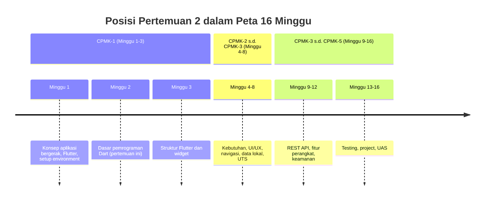
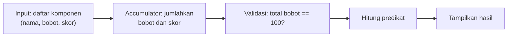
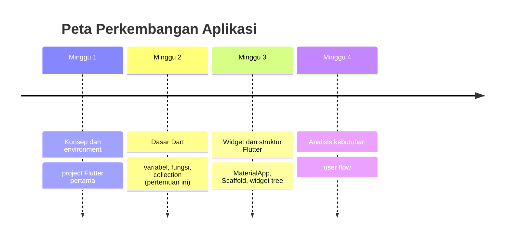

# Pertemuan 2 — Dasar Pemrograman Dart

| | |
|:--|:--|
| **Minggu** | 2 |
| **Tanggal** | Rabu, 23 September 2026 (SI-VIIB) / Sabtu, 26 September 2026 (SI-VIIA) |
| **CPMK** | CPMK-1 |
| **Model Pembelajaran** | Case Based Learning / Problem Based Learning |
| **Stack** | Dart (Flutter SDK) |

> **Catatan penting:** Pertemuan 2 membahas **sintaks dan fitur dasar Dart**, yaitu variabel dan konstanta, tipe data, operator, percabangan, perulangan, fungsi, dan koleksi (`List`, `Set`, `Map`). Seluruh materi ini akan digunakan kembali di Pertemuan 3 (struktur Flutter dan widget) hingga akhir semester — setiap baris kode Flutter yang Anda tulis nanti ditulis dengan Dart. Oleh karena itu, penguasaan sintaks dasar pada pertemuan ini menjadi syarat mengikuti praktikum widget di Pertemuan 3.
>
> **Batas cakupan:** Pertemuan 2 berfokus pada materi dasar sesuai CPMK-1, RPS, dan urutan `TIMELINE.md`. Dokumentasi resmi Dart dapat digunakan untuk memperdalam variabel, tipe data, kontrol alur, fungsi, dan koleksi. Materi `async`/`await`, JSON, testing, package, dan topik lanjutan dipelajari pada pertemuan berikutnya sesuai kebutuhan REST API, validasi, testing, dan project.

---

## Daftar Isi

- [Pertemuan 2 — Dasar Pemrograman Dart](#pertemuan-2--dasar-pemrograman-dart)
  - [Daftar Isi](#daftar-isi)
  - [1. Keterkaitan Pertemuan dengan RPS OBE](#1-keterkaitan-pertemuan-dengan-rps-obe)
  - [2. Capaian Pembelajaran Pertemuan](#2-capaian-pembelajaran-pertemuan)
  - [3. Pemantik Kasus: Tabel Nilai yang Salah Hitung](#3-pemantik-kasus-tabel-nilai-yang-salah-hitung)
  - [4. Variabel dan Konstanta](#4-variabel-dan-konstanta)
  - [5. Tipe Data](#5-tipe-data)
  - [6. Operator](#6-operator)
  - [7. Percabangan](#7-percabangan)
  - [8. Perulangan](#8-perulangan)
  - [9. Fungsi](#9-fungsi)
  - [10. Koleksi: List, Set, dan Map](#10-koleksi-list-set-dan-map)
    - [List](#list)
    - [Set](#set)
    - [Map](#map)
  - [11. Case Based Learning: Skema Penilaian Mata Kuliah](#11-case-based-learning-skema-penilaian-mata-kuliah)
  - [12. Aktivitas Kelompok](#12-aktivitas-kelompok)
  - [13. Latihan Individu](#13-latihan-individu)
  - [14. Pemanfaatan AI sebagai Coding Assistant](#14-pemanfaatan-ai-sebagai-coding-assistant)
  - [15. Kuis Formatif](#15-kuis-formatif)
  - [16. Keluaran Pembelajaran — Tugas 2](#16-keluaran-pembelajaran--tugas-2)
    - [Cara Pengumpulan — Push ke Repository GitHub Kelas](#cara-pengumpulan--push-ke-repository-github-kelas)
  - [17. Rubrik Tugas 2](#17-rubrik-tugas-2)
  - [18. Persiapan menuju Pertemuan 3](#18-persiapan-menuju-pertemuan-3)
    - [📎 Lampiran: Kode Praktikum](#-lampiran-kode-praktikum)

---

## 1. Keterkaitan Pertemuan dengan RPS OBE

Pertemuan 2 melanjutkan capaian **CPMK-1** — mahasiswa mampu menjelaskan konsep aplikasi bergerak dalam konteks Sistem Informasi serta mempersiapkan lingkungan pengembangan berbasis Flutter dan Dart. Pada pertemuan ini, fokus bergeser dari menyiapkan lingkungan (Pertemuan 1) ke **sintaks dan fitur Dart** yang menjadi bahan dasar setiap kode Flutter.

> Seluruh praktikum dari Pertemuan 3 (widget), 5–6 (form dan navigasi), 7 (data lokal), 9–10 (REST API), hingga 12 (keamanan) ditulis dengan Dart. Kesalahan memahami tipe data atau kontrol alur pada pertemuan ini akan terasa di setiap pertemuan berikutnya.



---

## 2. Capaian Pembelajaran Pertemuan

Setelah mengikuti pertemuan ini, mahasiswa mampu:

| No. | Kemampuan | Indikator |
|:---:|:----------|:----------|
| 1 | Menggunakan `var`, `final`, `const`, dan penulisan tipe eksplisit | Menuliskan deklarasi variabel dan konstanta sesuai peruntukan di kode praktikum |
| 2 | Mengenal dan mengubah tipe data Dart | Mengonversi `String` ke `int` dengan `int.parse` dan menjelaskan tipe hasil operasi aritmetika |
| 3 | Menulis percabangan dengan `if/else if/else` | Menentukan predikat nilai berdasarkan aturan rentang yang diberikan |
| 4 | Menulis perulangan `for`, `for-in`, dan `while` | Menghitung jumlahan daftar nilai dan menampilkan tiap entri daftar |
| 5 | Mendefinisikan fungsi dengan parameter wajib, default, dan arrow function | Menulis fungsi dengan named parameter default dan fungsi satu-baris |
| 6 | Menggunakan `List`, `Set`, dan `Map` serta operasi dasarnya | Mengakses, menambah, dan memproses entri `Map` dalam kode praktikum |

---

## 3. Pemantik Kasus: Tabel Nilai yang Salah Hitung

Dalam sebuah sistem informasi akademik, modul praktikum menghasilkan tabel nilai yang salah ketika dikonversi dari skor ke predikat. Cuplikan kode lama yang menghasilkan keluaran salah:

```dart
// kode lama — keluaran salah
String hitungPredikat(String nilai) {
  if (nilai == '8') return 'A';
  if (nilai == '7') return 'B';
  // ... dan seterusnya untuk satu digit saja
}
```

Pertanyaan pemantik:

- Kode di atas menerima `nilai` sebagai **String** dan membandingkannya dengan `'8'`. Apa yang terjadi jika nilai sebenarnya `82` atau `8.5`?
- Mengapa membandingkan angka dengan String dapat menghasilkan kesimpulan yang salah?
- Bagaimana cara menulis ulang fungsi ini agar menangani nilai numerik dengan benar?
- Jika Anda memiliki daftar 100 mahasiswa, bagaimana cara menghitung predikat seluruhnya tanpa menuliskan 100 baris `if`?

Pertemuan ini menjawab pertanyaan-pertanyaan tersebut melalui sintaks dasar Dart: tipe data yang benar, percabangan, perulangan, dan fungsi.

---

## 4. Variabel dan Konstanta

Dart mendukung tiga cara mendeklarasikan nilai: `var`, `final`, dan `const`.

| Keyword | Perilaku | Kapan dipakai |
|:--------|:----------|:--------------|
| `var` | Nilai dapat berubah; tipe ditelusuri otomatis | Nilai memang perlu diubah (perhitungaan, akumulator) |
| `final` | Nilai tidak dapat diubah setelah diinisialisasi | **Pilihan default** — sebagian besar deklarasi |
| `const` | Nilai tetap sejak awal, dihitung saat kompilasi | Konfigurasi yang memang konstan (limit, total SKS, tanggal akademik) |

```dart
var pertemuan = 2;           // var — dapat diubah
pertemuan = 3;               // boleh

final kodeMk = 'USA-WP2360241'; // final — tidak boleh diubah setelah diinisialisasi
// kodeMk = 'LAINNYA';        // error: final sudah diinisialisasi

const int totalPertemuan = 16;  // const — nilai tetap sejak awal
// totalPertemuan = 14;         // error: const tidak boleh diubah
```

**Kesalahan umum:** menggunakan `var` untuk nilai yang tidak pernah berubah. Gunakan `final` sebagai pilihan default; gunakan `var` hanya jika nilai memang berubah; gunakan `const` untuk nilai yang konstan di seluruh eksekusi program.

---

## 5. Tipe Data

Dart memiliki tipe data inti yang konsisten dengan kode Flutter:

| Tipe | Contoh | Keterangan |
|:-----|:-------|:-----------|
| `int` | `42` | Bilangan bulat |
| `double` | `3.14` | Bilangan real |
| `String` | `'PAB'` | Rangkaian teks |
| `bool` | `true` | Nilai benar/salah |
| `num` | — | Supertipe `int` dan `double`; dipakai sebagai hint umum |
| `List` | `[1, 2, 3]` | Kumpulan berurutan |
| `Set` | `{1, 2, 3}` | Kumpulan unik |
| `Map` | `{'a': 1}` | Pasangan kunci-nilai |
| `null` | — | Nilai tidak ada |

**Konversi String ke numerik** — sering terjadi saat membaca input form (Minggu 6) atau mem-parse response JSON (Minggu 9):

```dart
final skorInput = '75';            // String dari form
final skor = int.parse(skorInput); // 75 — int
```

**Konsekuensi:** `int.parse` menghasilkan **error** jika string tidak berisi bilangan bulat valid (mis. `'75.5'` atau `'abc'`). Penanganannya dibahas pada validasi form di Pertemuan 6 dan 12.

**Tipe hasil operasi aritmetika:**

```dart
final setengah = 75 / 2;     // 37.5 — pembagian selalu menghasilkan double
final sisa = 75 % 2;        // 1
final perkalian = 3 * 4;    // 12 — int * int tetap int
```

---

## 6. Operator

| Kategori | Contoh | Keterangan |
|:---------|:-------|:-----------|
| Aritmetika | `+ - * / %` | Hasil `/` selalu `double` |
| Perbandingan | `== != < <= > >=` | Hasilnya `bool` |
| Logika | `&& \|\| !` | Dipakai pada kondisi `if` |
| Assign | `=` | Menetapkan nilai |
| Nullish | `??` | Mengembalikan nilai cadangan jika sisi kiri `null` |

```dart
final nilai = 75;
print('Cukup (>= 60)? ${nilai >= 60}');       // true
print('Belum maksimal? ${nilai < 90}');       // true
final cadangan = 0;
final hasil = null ?? cadangan;                // 0
```

> **Kesalahan umum:** memakai `==` untuk membandingkan objek `List`/`Map` — perbandingan dilakukan pada referensi, bukan isi. Untuk membandingkan isi, gunakan `json` atau perbandingan elemen per elemen; hal ini relevan saat memvalidasi data (Minggu 12).

---

## 7. Percabangan

```dart
int skor = 88;
String predikat;

if (skor >= 86) {
  predikat = 'A';
} else if (skor >= 76) {
  predikat = 'B';
} else if (skor >= 61) {
  predikat = 'C';
} else {
  predikat = 'Perlu perbaikan';
}

print('Predikat: $predikat'); // Predikat: A
```

**Ekspresi ternary** — versi ringkas untuk dua cabang:

```dart
final status = skor >= 60 ? 'Lulus' : 'Remedial';
```

**Penggunaan pada kode Flutter** — pola yang sama muncul di widget (Pertemuan 3):

```dart
body: tersedia ? ListView(buku) : Text('Belum ada buku.'),
```

---

## 8. Perulangan

```dart
final daftarKelas = ['SI-VIIB', 'SI-VIIA'];

// for klasik
for (var i = 0; i < daftarKelas.length; i++) {
  print('Kelas ${i + 1}: ${daftarKelas[i]}');
}

// for-in
for (var kelas in daftarKelas) {
  print('Jadwal: $kelas mengikuti praktikum sesuai TIMELINE.md.');
}

// while
var tahap = 0;
while (tahap < 3) {
  print('Tahap $tahap');
  tahap++;
}
```

**Pola penting untuk kode Flutter** — `ListView` dan iterasi daftar data pada Minggu 5–7 umumnya memakai `for-in` atau `.map()`:

```dart
final namaDaftar = daftarKelas.map((kelas) => '$kelas — aktif').toList();
print(namaDaftar); // [SI-VIIB — aktif, SI-VIIA — aktif]
```

---

## 9. Fungsi

```dart
// Fungsi dengan return eksplisit
String hitungPredikat(int nilai) {
  if (nilai >= 86) return 'A';
  if (nilai >= 76) return 'B';
  if (nilai >= 61) return 'C';
  return 'Perlu perbaikan';
}

// Arrow function — satu baris, return implisit
final kaliDua = (int nilai) => nilai * 2;
print(kaliDua(7)); // 14

// Named parameter dengan default
String buatJadwal(String kelas, {String hari = 'Rabu', String jam = '16:00'}) {
  return '$kelas ($hari, $jam)';
}
print(buatJadwal('SI-VIIA', hari: 'Sabtu', jam: '10:00'));
// SI-VIIA (Sabtu, 10:00)
```

**Ketentuan:**

- Fungsi Dart **tidak** mengalami hoisting — fungsi harus didefinisikan sebelum dipakai di lingkup yang sama (kecuali method pada class).
- Parameter `named` (curly braces) harus dipanggil dengan nama: `namaKelas: 'SI-VIIB'`.
- Parameter `optional` yang diberi default boleh dilewati saat pemanggilan.
- Pola named parameter + default menjadi dasar banyak widget Flutter (Pertemuan 3).

---

## 10. Koleksi: List, Set, dan Map

### List

Kumpulan berurutan yang boleh duplikat:

```dart
final skorUts = [75, 88, 61];
skorUts.add(92);
print(skorUts);     // [75, 88, 61, 92]
print(skorUts.length); // 4
print(skorUts.first);  // 75
print(skorUts.last);   // 92
```

Method yang paling sering dipakai pada materi berikutnya:

| Method | Hasil |
|:-------|:------|
| `map` | Mengubah setiap elemen menjadi nilai baru |
| `where` | Menyeleksi elemen yang lolos kondisi |
| `firstWhere` | Mengambil elemen pertama yang cocok |
| `contains` | Mengecek keberadaan elemen |
| `reduce` | Menggabungkan seluruh elemen menjadi satu nilai |

```dart
final rata = skorUts.reduce((a, b) => a + b) / skorUts.length;
print('Rata-rata: $rata');
final lulus = skorUts.where((s) => s >= 61);
print('Skor lulus: $lulus');
```

### Set

Kumpulan nilai unik:

```dart
final materi = {'Flutter', 'Dart', 'REST API', 'Flutter'};
print(materi); // {Flutter, Dart, REST API} — duplikat otomatis hilang
```

### Map

Pasangan kunci-nilai:

```dart
final detailMk = {
  'kode': 'USA-WP2360241',
  'nama': 'Pemrograman Aplikasi Bergerak',
  'sks': 3,
};

print(detailMk['kode']);  // USA-WP2360241
print(detailMk['belum']); // null
for (final (kunci, nilai) in detailMk.entries) {
  print('$kunci: $nilai');
}
```

> **Catatan pola `for (final (kunci, nilai) in ...)`** — dekonstruksi entri Map menjadi dua variabel. Pola ini dipakai saat mem-process data JSON (Minggu 9–10).

---

## 11. Case Based Learning: Skema Penilaian Mata Kuliah

**Konteks:** Anda diminta membuat modul kecil yang menghitung nilai akhir dari komponen penilaian: Tugas (30%), Praktikum (25%), UTS (20%), UAS (25%).

| Komponen | Bobot | Skor Mahasiswa |
|:---------|:------|:---------------|
| Tugas | 30 | 28 |
| Praktikum | 25 | 24 |
| UTS | 20 | 15 |
| UAS | 25 | 23 |

Pertanyaan untuk dibahas bersama:

1. **Data apa yang harus disimpan** agar sistem dapat menghitung skor setiap komponen? (petunjuk: pakai `Map` dengan kunci `nama`, `bobot`, `skor`.)
2. **Bagaimana cara menghitung total skor** tanpa menuliskan penjumlahan manual?
3. **Bagaimana cara memverifikasi bahwa total bobot seluruh komponen = 100%**?
4. **Bagaimana cara menentukan predikat** berdasarkan total skor? (petunjuk: pakai `if/else if/else`.)
5. **Bagaimana menampilkan hasil** dalam format yang rapi?

Kode penyelesaian tersedia di [`code/pertemuan-02/solusi-dasar-dart.dart`](../code/pertemuan-02/solusi-dasar-dart.dart). Kerjakan latihan individu terlebih dahulu, baru bandingkan dengan solusi.



---

## 12. Aktivitas Kelompok

Bentuk kelompok 3–4 orang:

1. **Eksplorasi (15 menit)** — Salin `code/pertemuan-02/demo-dasar-dart.dart` ke folder Anda. Tambahkan tiga baris percobaan baru (variabel baru, satu percabangan, satu perulangan). Simpan dan jalankan dengan `dart demo-dasar-dart.dart`, catat keluaran.
2. **Perbaikan (15 menit)** — Tulis ulang kode lama pada bagian Pemantik Kasus (fungsi `hitungPredikat` yang memakai String) menjadi fungsi yang memakai `int`. Tunjukkan perbandingan keluaran sebelum dan sesudah.
3. **Pertanyaan (5 menit/kelompok)** — Satu kelompok mempresentasikan hasil; kelompok lain menanggapi: ada variabel yang lebih tepat memakai `final`? Apakah `int.parse` aman untuk input form yang bisa kosong?

**Target:** setiap kelompok menghasilkan fungsi `hitungPredikat(int nilai)` yang benar dan satu kesimpulan tentang kapan `var`, `final`, dan `const` digunakan.

---

## 13. Latihan Individu

Kerjakan setelah demo; kerangka TODO terbimbing ada di [`code/pertemuan-02/latihan-dasar-dart.dart`](../code/pertemuan-02/latihan-dasar-dart.dart). Kasus: **skema penilaian mata kuliah PAB**.

1. **TODO 1** — Deklarasikan konstanta jumlah komponen dan variabel nama kuliah.
2. **TODO 2** — Tulis fungsi `predikat(int nilai)` dengan rentang yang benar.
3. **TODO 3** — Jalankan perulangan pada daftar komponen dan cetak baris per komponen.
4. **TODO 4** — Akumulasikan total bobot dan total skor dengan perulangan.
5. **TODO 5** — Ambil komponen `UAS` menggunakan `firstWhere` dengan `orElse`.
6. **TODO 6** — Tulis fungsi arrow `kalikanSkor`.

Setelah selesai, jalankan `dart latihan-dasar-dart.dart` dan pastikan keluaran sesuai spesifikasi tiap TODO.

---

## 14. Pemanfaatan AI sebagai Coding Assistant

**AI assistant (GitHub Copilot, ChatGPT, Claude, Gemini, Cursor) boleh dipakai — dengan cara yang benar:**

**✅ Gunakan AI untuk:**

- Menjelaskan makna error `type 'String' is not 'int'` dan cara memperbaikinya
- Meminta contoh dekonstruksi entri `Map` yang belum dipahami
- Memeriksa apakah fungsi `predikat` Anda sudah menangani seluruh rentang
- Membantu menulis ulang perulangan menjadi `reduce`

**❌ Jangan gunakan AI untuk:**

- Menuliskan seluruh Tugas 2 — penguasaan sintaks dasar adalah inti yang dinilai
- Menyalin solusi tanpa menjalankan dan memodifikasinya

**Etika di kelas ini:**

1. Anda **wajib bisa menjelaskan** setiap baris kode pada latihan dan tugas.
2. Jika memakai AI, **cantumkan** di komentar kode:

   ```dart
   // Bantuan: Claude — menjelaskan cara memakai Map.entries untuk iterasi
   ```

3. AI = **asisten**, bukan **pengganti**. Penguasaan sintaks dasar Dart harus Anda kuasai sendiri.

---

## 15. Kuis Formatif

**Kuis (10 menit, tutup catatan):**

1. Apa perbedaan `var`, `final`, dan `const`? Berikan satu contoh peruntukan masing-masing.
2. Apa hasil dari `75 / 2` di Dart? Jelaskan mengapa.
3. Mengapa `int.parse('75.5')` menghasilkan error?
4. Tuliskan fungsi `predikat(int nilai)` dengan aturan: `>= 86` → A, `76–85` → B, `61–75` → C, selain itu → Perlu perbaikan.
5. Apa perbedaan `List` dan `Set`? Kapan Anda memilih `Set`?
6. Tuliskan satu baris kode untuk menjumlahkan seluruh elemen `List<int>` menggunakan `reduce`.


---

## 16. Keluaran Pembelajaran — Tugas 2

**Tugas 2 — Modul Hitung Nilai (dikumpulkan sebelum Pertemuan 3).** Panduan pengerjaan tersedia di [`contoh-tugas-2-mahasiswa.md`](./contoh-tugas-2-mahasiswa.md).

Pilih **satu** skema penilaian sesuai kebutuhan domain Sistem Informasi Anda. Kerjakan:

1. **Buat file `hitung_nilai.dart`** berisi:
   - Deklarasi `List<Map<String, Object>>` berisi minimal 5 komponen penilaian (boleh menambah komponen sesuai kebutuhan project SI Anda).
   - Fungsi `hitungRataRata(List<Map<String, Object>> komponen)` yang mengembalikan `double`.
   - Fungsi `predikat(double nilai)` yang mengembalikan `String` sesuai aturan rentang yang Anda tentukan (catat aturannya di komentar).
   - Blok `main()` yang menampilkan: nama mata kuliah, daftar komponen, rata-rata, dan predikat akhir.
2. **Jalankan dan dokumentasikan** — salin hasil keluaran ke dalam `README.md` tugas Anda.
3. **Refleksi** — 3 kalimat: sintaks apa yang paling sering Anda salahgunakan dan mengapa?

### Cara Pengumpulan — Push ke Repository GitHub Kelas

Tugas dikumpulkan dengan **push ke repository GitHub kelas** (sesuai kelas Anda):

| Kelas | Repository |
|:------|:-----------|
| SI-VIIB | `SI-VIIB-Mobile` |
| SI-VIIA | `SI-VIIA-Mobile` |

> Alamat lengkap repo (organisasi/URL) akan dibagikan melalui kanal kelas. Gunakan repo kelas Anda sendiri — tugas yang di-push ke kelas lain tidak dinilai.

Langkah pengumpulan:

1. *Clone* repo kelas, lalu buat folder tugas dengan nama `<nim>-<nama>`:
   ```bash
   git clone https://github.com/<org-kelas>/SI-VIIB-Mobile.git
   cd SI-VIIB-Mobile
   mkdir -p tugas-2/<nim>-<nama>
   ```
2. Simpan berkas tugas ke dalam folder tersebut:
   - `hitung_nilai.dart` — kode modul.
   - `README.md` — hasil keluaran program + refleksi 3 kalimat.
3. Jalankan `dart hitung_nilai.dart` dan pastikan tanpa error.
4. Commit dan push:
   ```bash
   git add tugas-2/<nim>-<nama>
   git commit -m "tugas-2: modul hitung nilai - <nama> <nim>"
   git push origin main
   ```
5. **Verifikasi** — buka repo di browser dan pastikan berkas tugas Anda sudah tampil sebelum tenggat. Terlambat dihitung dari waktu *push* terakhir.

---

## 17. Rubrik Tugas 2

| Kriteria | Bobot | 4 (Sangat Baik) | 3 (Baik) | 2 (Cukup) | 1 (Perlu Bimbingan) |
|:---------|:-----:|:----------------|:---------|:----------|:--------------------|
| Struktur data (List Map) | 25% | `List<Map<String, Object>>` berisi ≥ 5 komponen, tipe eksplisit | ≥ 5 komponen, tipe bagian salah | 3–4 komponen | Kurang dari 3 komponen |
| Fungsi `hitungRataRata` | 25% | Mengembalikan `double`, benar untuk seluruh input | Benar untuk input umum | Sebagian benar | Salah |
| Fungsi `predikat` + aturan | 20% | Semua rentang benar, aturan terdokumentasi | Semua rentang benar, aturan kurang jelas | 1–2 rentang salah | Tidak ada fungsi |
| Blok `main()` + keluaran | 15% | Keluaran lengkap, rapi, sesuai spesifikasi | Keluaran lengkap, kurang rapi | Keluaran sebagian | Tidak berjalan |
| Refleksi + ketepatan waktu | 15% | Refleksi 3 kalimat logis, tepat waktu | Refleksi ada, kurang mendalam | Refleksi kurang dari 3 kalimat | Tidak ada / terlambat |

**Nilai = Σ(bobot × skor) / 16 × 100.** Pengumpulan terlambat: pengurangan 1 level rubrik per hari.

---

## 18. Persiapan menuju Pertemuan 3

Pada pertemuan ini, Anda telah mempelajari **sintaks dan fitur dasar Dart**. Pada **Pertemuan 3** (**Struktur Flutter dan Widget**, 30 September 2026 — SI-VIIB; 3 Oktober 2026 — SI-VIIA), materi bergeser ke **struktur aplikasi Flutter**: `MaterialApp`, `Scaffold`, widget tree, dan `runApp`.

Materi yang akan dipelajari: struktur project Flutter, widget stateless vs stateful, `Scaffold` dan komponennya, serta cara menggambar layout dasar. Materi ini membangun langsung di atas sintaks Pertemuan 2 — setiap widget memakai fungsi, konstanta, dan Map.

**Persiapan:**

- Pastikan `dart hitung_nilai.dart` (Tugas 2) berjalan tanpa error — push ke repo sebelum pertemuan.
- Baca ulang `demo-dasar-dart.dart`; coba ubah aturan `predikat` dan amati perbedaannya.
- Opsional: buka [dartpad.dev](https://dartpad.dev/), salin kode `demo-dasar-dart.dart`, dan jalankan langsung di browser.



- **Pertemuan 1** — Memahami konsep aplikasi bergerak dan menyiapkan environment Flutter.
- **Pertemuan 2** — Menguasai sintaks dan fitur dasar Dart sebagai bahasa aplikasi Flutter.
- **Pertemuan 3** — Menggunakan widget untuk membangun halaman aplikasi.
- **Pertemuan 4** — Menganalisis kebutuhan dan menyusun user flow aplikasi SI.

---

### 📎 Lampiran: Kode Praktikum

| File | Keterangan |
|:-----|:-----------|
| [`code/pertemuan-02/demo-dasar-dart.dart`](../code/pertemuan-02/demo-dasar-dart.dart) | Demo live: variabel, konstanta, tipe data, operator, percabangan, perulangan, fungsi, dan koleksi |
| [`code/pertemuan-02/latihan-dasar-dart.dart`](../code/pertemuan-02/latihan-dasar-dart.dart) | Kerangka latihan individu dengan TODO terbimbing (kasus skema penilaian) |
| [`code/pertemuan-02/solusi-dasar-dart.dart`](../code/pertemuan-02/solusi-dasar-dart.dart) | Solusi referensi CBL: skema penilaian mata kuliah (untuk dosen) |
| [`contoh-tugas-2-mahasiswa.md`](./contoh-tugas-2-mahasiswa.md) | Panduan pengerjaan Tugas 2 untuk mahasiswa: definisi komponen, struktur, dan cara menguji jawaban sendiri |
