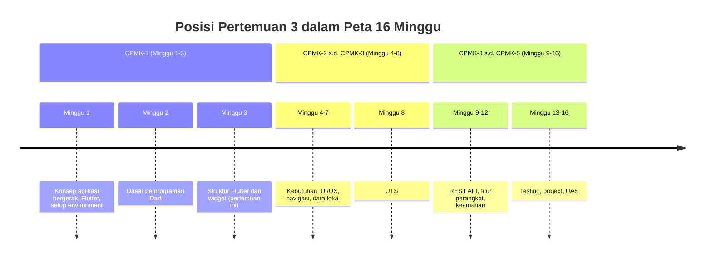
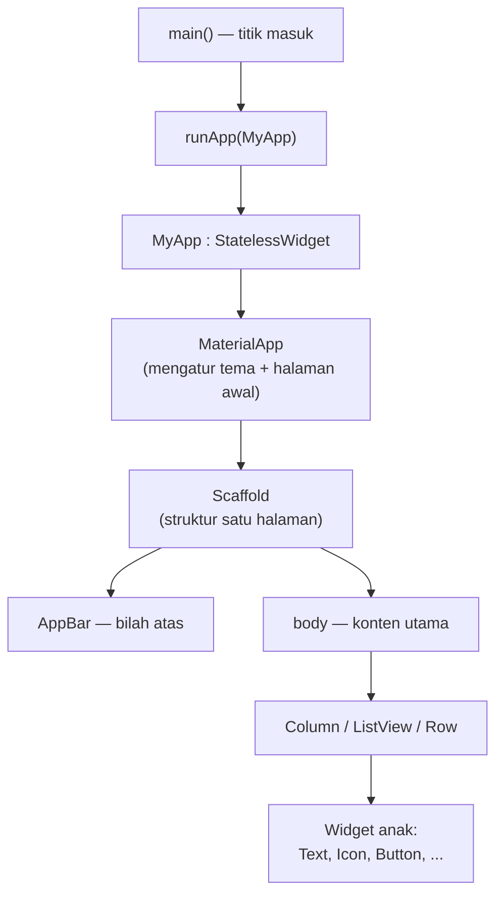
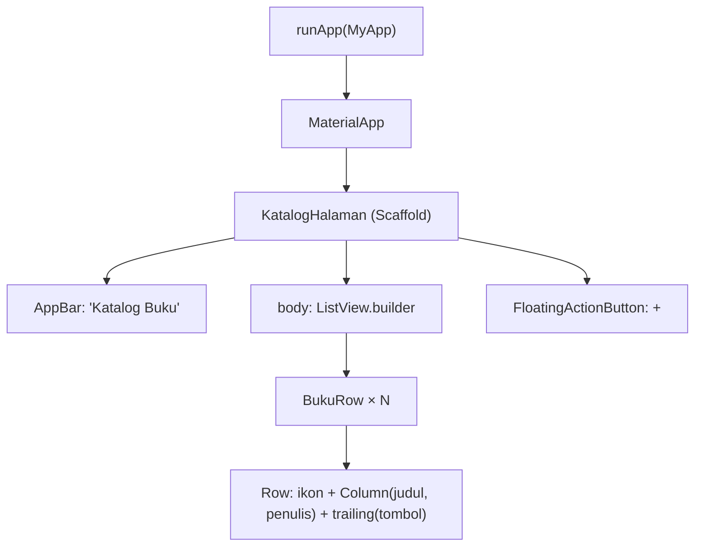
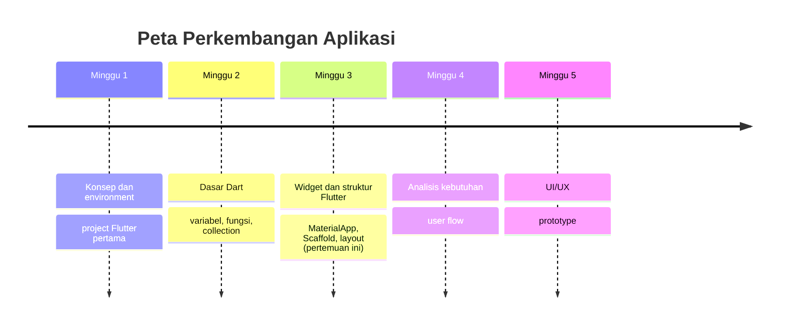

# Pertemuan 3 — Struktur Flutter dan Widget

| | |
|:--|:--|
| **Minggu** | 3 |
| **Tanggal** | Rabu, 30 September 2026 (SI-VIIB) / Sabtu, 3 Oktober 2026 (SI-VIIA) |
| **CPMK** | CPMK-1 |
| **Model Pembelajaran** | Case Based Learning / Problem Based Learning |
| **Stack** | Flutter + Dart |

> **Catatan penting:** Pertemuan 3 membahas **struktur aplikasi Flutter dan widget**: `MaterialApp`, `Scaffold`, widget tree, serta layout dasar (`Column`, `Row`, `Padding`, `ListView`). Materi ini membangun langsung di atas sintaks Pertemuan 2 — setiap widget ditulis dengan fungsi, konstanta, dan ekspresi Dart. Output pertemuan ini adalah **halaman aplikasi sederhana** yang dapat ditunjukkan pada target web (Chrome) melalui DartPad atau `flutter run -d chrome`.
>
> **Batas cakupan:** Pertemuan 3 berfokus pada struktur Flutter dan widget sesuai CPMK-1, RPS, dan urutan `TIMELINE.md`. Materi `StatefulWidget` dan `setState` dibahas pada pertemuan berikutnya saat form dan navigasi (minggu 6) mulai dipraktikkan. Dokumentasi resmi Flutter dapat digunakan untuk memperdalam widget, layout, dan komposisi.

---

## Daftar Isi

- [Pertemuan 3 — Struktur Flutter dan Widget](#pertemuan-3--struktur-flutter-dan-widget)
  - [Daftar Isi](#daftar-isi)
  - [1. Keterkaitan Pertemuan dengan RPS OBE](#1-keterkaitan-pertemuan-dengan-rps-obe)
  - [2. Capaian Pembelajaran Pertemuan](#2-capaian-pembelajaran-pertemuan)
  - [3. Pemantik Kasus: Halaman Katalog Buku](#3-pemantik-kasus-halaman-katalog-buku)
  - [4. Struktur Project Flutter](#4-struktur-project-flutter)
  - [5. Widget Tree](#5-widget-tree)
  - [6. MaterialApp dan Scaffold](#6-materialapp-dan-scaffold)
    - [6.1 Komponen Scaffold](#61-komponen-scaffold)
  - [7. Layout Dasar](#7-layout-dasar)
    - [7.1 Column dan Row](#71-column-dan-row)
    - [7.2 Padding, Center, dan Align](#72-padding-center-dan-align)
    - [7.3 Stack](#73-stack)
    - [7.4 ListView](#74-listview)
  - [8. Praktik: Membangun Halaman Sederhana](#8-praktik-membangun-halaman-sederhana)
  - [9. Case Based Learning: Struktur Halaman Aplikasi Perpustakaan](#9-case-based-learning-struktur-halaman-aplikasi-perpustakaan)
  - [10. Aktivitas Kelompok](#10-aktivitas-kelompok)
  - [11. Latihan Individu](#11-latihan-individu)
  - [12. Pemanfaatan AI sebagai Coding Assistant](#12-pemanfaatan-ai-sebagai-coding-assistant)
  - [13. Kuis Formatif](#13-kuis-formatif)
  - [14. Output Pembelajaran — Tugas 3](#14-output-pembelajaran--tugas-3)
    - [Cara Pengumpulan — Push ke Repository GitHub Kelas](#cara-pengumpulan--push-ke-repository-github-kelas)
  - [15. Rubrik Tugas 3](#15-rubrik-tugas-3)
  - [16. Verifikasi Kode — Dua Jalur](#16-verifikasi-kode--dua-jalur)
    - [Jalur 1: DartPad (tanpa instalasi)](#jalur-1-dartpad-tanpa-instalasi)
    - [Jalur 2: Flutter SDK (sesuai Panduan Lengkap)](#jalur-2-flutter-sdk-sesuai-panduan-lengkap)
  - [17. Persiapan ke Pertemuan 4](#17-persiapan-ke-pertemuan-4)
    - [📎 Lampiran: Kode Praktikum](#-lampiran-kode-praktikum)

---

## 1. Keterkaitan Pertemuan dengan RPS OBE

Pertemuan 3 melanjutkan capaian **CPMK-1** — mahasiswa mampu menjelaskan konsep aplikasi bergerak dalam konteks Sistem Informasi serta mempersiapkan lingkungan pengembangan berbasis Flutter dan Dart. Pada pertemuan ini, pembelajaran berfokus pada **struktur aplikasi Flutter**: memahami bagaimana sebuah halaman dibangun dari `MaterialApp` hingga widget pada tingkat hierarki terdalam, serta bagaimana widget dirangkai menjadi *layout* yang terstruktur dan bermakna.

> Widget merupakan unit dasar antarmuka Flutter. Seluruh aplikasi — mulai dari elemen teks sederhana hingga halaman yang kompleks — dibangun melalui komposisi widget. Pemahaman struktur widget pada pertemuan ini menjadi fondasi untuk form (minggu 6), data lokal (minggu 7), dan integrasi REST API (minggu 9–10).



---

## 2. Capaian Pembelajaran Pertemuan

Setelah mengikuti pertemuan ini, mahasiswa mampu:

| No. | Kemampuan | Indikator |
|:---:|:----------|:----------|
| 1 | Menjelaskan struktur project Flutter hasil `flutter create` | Mengidentifikasi peran `lib/main.dart`, `pubspec.yaml`, dan folder `android/`/`ios/` |
| 2 | Menggambar widget tree dari `runApp` hingga widget paling dalam | Menuliskan urutan: `runApp` → `MaterialApp` → `Scaffold` → `AppBar`/`body` → child |
| 3 | Memahami peran `MaterialApp` dan `Scaffold` | Menjelaskan bahwa `MaterialApp` mengatur tema aplikasi dan `Scaffold` menyediakan struktur satu halaman |
| 4 | Mengidentifikasi komponen `Scaffold` | Menyebutkan `appBar`, `body`, `floatingActionButton`, `drawer`, dan `bottomNavigationBar` beserta peruntukannya |
| 5 | Merangkai layout dengan `Column`, `Row`, `Padding`, `Center`, `Stack`, dan `ListView` | Membangun satu halaman sederhana yang menampilkan daftar data secara vertikal |
| 6 | Menjalankan dan memverifikasi kode widget | Menjalankan kode melalui DartPad (tanpa instalasi) atau `flutter run -d chrome` (Flutter SDK) |

---

## 3. Pemantik Kasus: Halaman Katalog Buku

Perhatikan sebuah aplikasi perpustakaan kampus yang memiliki halaman **katalog buku**. Halaman tersebut menampilkan daftar judul, penulis, dan status ketersediaan buku dalam satu layar yang dapat digulir.

Struktur halaman tersebut terdiri dari:

- **Bilah atas** — judul aplikasi: "Katalog Buku"
- **Konten utama** — daftar buku, setiap baris menampilkan ikon, judul, penulis, dan status
- **Tombol aksi** — tombol mengambang untuk menambah buku

Pertanyaan pemantik:

- Dari widget mana saja halaman ini tersusun? Widget mana yang menjadi "induk" dan mana yang menjadi "anak"?
- Bagaimana Flutter menentukan posisi `AppBar` di bagian atas dan `ListView` pada area konten? Apakah posisi tersebut perlu ditentukan menggunakan koordinat secara manual?
- Jika Anda ingin menampilkan 100 buku, apakah harus menuliskan 100 widget `Text` secara manual?
- Widget mana yang paling cocok untuk menampilkan data yang jumlahnya berubah-ubah (buku baru ditambah, stok berubah)?

Pertemuan ini menjawab pertanyaan-pertanyaan tersebut melalui widget tree, `Scaffold`, dan layout dasar.

---

## 4. Struktur Project Flutter

Hasil `flutter create` menghasilkan folder project dengan struktur berikut:

```text
nama_project/
├── lib/
│   └── main.dart          # titik masuk aplikasi — seluruh kode widget ditulis di sini
├── pubspec.yaml           # konfigurasi project: nama, versi, dependency
├── android/               # konfigurasi build khusus Android (Gradle, manifest)
├── ios/                   # konfigurasi build khusus iOS (Xcode project)
├── web/                   # konfigurasi build khusus web (index.html, main.dart.js)
├── test/                  # unit test (dibahas minggu 13)
└── .gitignore
```

| Berkas | Peran |
|:-------|:------|
| `lib/main.dart` | Titik masuk: berisi `main()` dan seluruh widget yang Anda definisikan |
| `pubspec.yaml` | Menyatakan dependency; dijalankan `flutter pub get` setelah perubahan |
| `android/` | File Gradle dan manifest Android — hanya diedit jika perlu konfigurasi khusus platform |
| `ios/` | Xcode project — hanya diedit jika perlu konfigurasi khusus iOS |

> **Catatan:** Pada praktikum PAB, seluruh perubahan kode dilakukan pada `lib/main.dart`. Folder `android/` dan `ios/` tidak perlu diubah kecuali instruksi eksplisit diberikan.

---

## 5. Widget Tree

Aplikasi Flutter dibangun dari **pohon widget** (*widget tree*), yaitu struktur hierarkis di mana setiap widget dapat memiliki widget anak (*child*) yang juga merupakan widget. Alur eksekusi dari titik masuk hingga layar:



Aturan dasar widget tree:

| Aturan | Penjelasan |
|:-------|:-----------|
| Widget merupakan objek | Widget direpresentasikan oleh class dan object; method `build()` menghasilkan widget turunannya |
| Satu root | `runApp` menerima tepat satu widget sebagai akar |
| Komposisi, bukan hierarki | Widget tidak harus mewarisi widget lain; widget disusun dengan menempatkan widget anak melalui parameter `child` atau `children` |
| Widget stateless | `StatelessWidget` — digunakan untuk tampilan yang tidak memiliki data internal yang berubah |

> **Kesalahan umum:** menempatkan widget pada parameter `child` lebih dari satu kali secara salah. `child` (tunggal) menerima satu widget; `children` (jamak) menerima `List<Widget>`.

---

## 6. MaterialApp dan Scaffold

### 6.1 Komponen Scaffold

`Scaffold` adalah widget yang menyediakan struktur dasar satu halaman. Parameternya:

| Parameter | Peruntukan | Contoh |
|:----------|:-----------|:-------|
| `appBar` | Bilah judul di bagian atas halaman | `AppBar(title: Text('Katalog'))` |
| `body` | Konten utama — mengisi ruang antara `appBar` dan `bottomNavigationBar` | `ListView(...)`, `Column(...)`, `Text(...)` |
| `floatingActionButton` | Tombol mengambang, biasanya di pojok kanan bawah | `FloatingActionButton(onPressed: ..., child: Icon(Icons.add))` |
| `drawer` | Panel samping yang dapat ditarik dari tepi kiri | Menu navigasi, profil |
| `bottomNavigationBar` | Bilah di bagian bawah | Tab navigasi antara halaman |

**Pola penulisan standar satu halaman:**

```dart
Scaffold(
  appBar: AppBar(
    title: const Text('Judul Halaman'),
    centerTitle: true,
  ),
  body: Column(
    children: [
      Text('Konten utama'),
    ],
  ),
  floatingActionButton: FloatingActionButton(
    onPressed: () {},
    child: const Icon(Icons.add),
  ),
)
```

> **Catatan:** Jika `body` berisi `ListView` atau konten yang mungkin melebihi tinggi layar, gunakan `Expanded` atau `shrinkWrap` agar layout tidak error.

---

## 7. Layout Dasar

Layout dasar mengontrol posisi dan spasi widget pada layar.

### 7.1 Column dan Row

| Widget | Orientasi | Parameter utama |
|:-------|:----------|:----------------|
| `Column` | Vertikal (atas ke bawah) | `children`, `mainAxisAlignment`, `crossAxisAlignment` |
| `Row` | Horizontal (kiri ke kanan) | `children`, `mainAxisAlignment`, `crossAxisAlignment` |

```dart
Column(
  mainAxisAlignment: MainAxisAlignment.center,
  crossAxisAlignment: CrossAxisAlignment.start,
  children: [
    const Text('Judul'),
    const SizedBox(height: 8),
    const Text('Subjudul'),
  ],
)
```

- `mainAxisAlignment` — pengaturan posisi anak pada **sumbu utama** (vertikal untuk `Column`, horizontal untuk `Row`).
- `crossAxisAlignment` — pengaturan posisi anak pada **sumbu silang**.

**Kesalahan umum:** menempatkan `ListView` secara langsung sebagai anak `Column` tanpa `Expanded` dapat menyebabkan error `RenderFlex overflow`. Solusi: bungkus `ListView` dengan `Expanded(child: ListView(...))`.

### 7.2 Padding, Center, dan Align

| Widget | Fungsi |
|:-------|:-------|
| `Padding` | Menambahkan spasi di sekeliling widget anak |
| `Center` | Memposisikan widget anak di tengah; secara konsep setara dengan `Align` menggunakan `Alignment.center` |
| `Align` | Memposisikan anak pada titik tertentu dalam area |

```dart
Padding(
  padding: const EdgeInsets.all(16),
  child: const Text('Isi dengan spasi 16 piksel'),
)

Center(
  child: const Text('Di tengah'),
)

Align(
  alignment: Alignment.topRight,
  child: const Text('Kanan atas'),
)
```

### 7.3 Stack

`Stack` menumpuk widget secara vertikal dalam ruang yang sama; sering digunakan untuk overlay.

```dart
Stack(
  children: [
    // Lapis pertama (paling belakang)
    Container(color: Colors.blue.shade100, height: 100),
    // Lapis kedua (di depan)
    Positioned(
      bottom: 8,
      right: 8,
      child: Icon(Icons.add, color: Colors.blue),
    ),
  ],
)
```

### 7.4 ListView

Menampilkan daftar yang dapat digulir; widget yang paling sering digunakan untuk menampilkan data berurutan.

| Constructor | Kapan dipakai |
|:------------|:--------------|
| `ListView(children: [...])` | Daftar pendek dan tetap (jumlah item diketahui, tidak banyak) |
| `ListView.builder(itemCount: n, itemBuilder: ...)` | Daftar panjang — widget dibuat hanya saat terlihat di layar (efisien) |

```dart
// Daftar pendek
ListView(
  children: [
    ListTile(title: Text('Buku 1')),
    ListTile(title: Text('Buku 2')),
  ],
)

// Daftar panjang — menggunakan data
ListView.builder(
  itemCount: daftarBuku.length,
  itemBuilder: (context, index) {
    final buku = daftarBuku[index];
    return ListTile(
      title: Text(buku['judul'] as String),
      subtitle: Text(buku['penulis'] as String),
    );
  },
)
```

> **Catatan:** `ListView` harus berada di dalam `Scaffold.body` atau di dalam `Column` dengan `Expanded`. Tidak perlu `shrinkWrap` jika `ListView` adalah anak langsung `Expanded`.

---

## 8. Praktik: Membangun Halaman Sederhana

Gunakan seluruh widget yang telah dipelajari untuk membangun halaman katalog buku sederhana. Struktur lengkap tersedia di [`code/pertemuan-03/demo-struktur-flutter.dart`](../code/pertemuan-03/demo-struktur-flutter.dart).



Langkah-langkah praktik:

1. Buka berkas [`demo-struktur-flutter.dart`](../code/pertemuan-03/demo-struktur-flutter.dart).
2. Jalankan melalui [Jalur 1: DartPad](#jalur-1-dartpad-tanpa-instalasi) atau [Jalur 2: Flutter SDK](#jalur-2-flutter-sdk-sesuai-panduan-lengkap).
3. Amati struktur *widget tree*: `MyApp` → `KatalogHalaman` → `Scaffold` → `AppBar` + `ListView` + `BukuRow`.
4. Kerjakan TODO 1–3 di dalam file tersebut.
5. Simpan dan amati hasil hot reload.

---

## 9. Case Based Learning: Struktur Halaman Aplikasi Perpustakaan

**Konteks:** Pengelola perpustakaan memerlukan halaman katalog yang menampilkan daftar buku beserta status ketersediaannya. Rancang struktur halaman berikut:

| Bagian halaman | Widget yang digunakan | Alasan teknis |
|:---------------|:---------------------|:--------------|
| Bilah atas | `AppBar` | Menampilkan judul aplikasi; konsisten dengan Material Design |
| Daftar buku | `ListView.builder` | Jumlah buku dapat bertambah; widget dibuat hanya saat terlihat (efisien) |
| Satu baris buku | `ListTile` atau `Row` | Menyusun ikon, judul, penulis, dan status dalam satu baris secara horizontal |
| Status ketersediaan | `Text` + warna (ternary) | Stok > 0 = biru; stok = 0 = abu-abu |
| Tombol tambah | `FloatingActionButton` | Aksi utama yang dapat diakses dari halaman mana pun |

Pertanyaan untuk dibahas bersama:

1. **Mengapa `ListView.builder`** dan bukan `ListView(children: [...])` jika daftar buku dapat bertambah?
2. **Bagaimana menampilkan status "Habis"** tanpa menulis dua widget `Text` terpisah? (Petunjuk: gunakan ekspresi ternary dari materi P2.)
3. **Apa yang terjadi** jika Anda menaruh `ListView` langsung di dalam `Column` tanpa `Expanded`?
4. **Widget mana** yang paling cocok untuk menampilkan detail buku (judul, sinopsis, tombol pinjam) dalam satu kartu? (Petunjuk: `Card` + `Column`.)

Kode penyelesaian tersedia di [`code/pertemuan-03/demo-struktur-flutter.dart`](../code/pertemuan-03/demo-struktur-flutter.dart). Kerjakan latihan individu terlebih dahulu, kemudian bandingkan hasilnya dengan solusi.

---

## 10. Aktivitas Kelompok

Bentuk kelompok yang terdiri atas 3–4 mahasiswa:

1. **Analisis *widget tree* (15 menit)** — Pilih salah satu aplikasi bergerak yang sering Anda gunakan (mis. Shopee, Tokopedia, MyTelkomsel). Gambarkan *widget tree* halaman utamanya: dari `MaterialApp` hingga widget paling dalam (maksimal 4 tingkat). Tandai widget layout (`Column`, `Row`, `Stack`, `ListView`) dan widget konten (`Text`, `Image`, `Button`).
2. **Perbaikan *layout* (15 menit)** — Gunakan salinan `demo-struktur-flutter.dart` sebagai dasar. Tambahkan `Card` di sekeliling `ListTile` agar setiap buku ditampilkan sebagai kartu yang terpisah. Gunakan `FloatingActionButton.extended` dengan label "Tambah". Simpan dan jalankan.
3. **Presentasi singkat (5 menit/kelompok)** — Satu kelompok memaparkan *widget tree* yang telah dibuat; kelompok lain memberikan tanggapan: apakah ada widget yang bisa digabung agar tree lebih pendek?

**Target:** setiap kelompok menghasilkan widget tree empat tingkat dan satu perbaikan layout pada `demo-struktur-flutter.dart`.

---

## 11. Latihan Individu

Kerjakan setelah demonstrasi; kerangka TODO terbimbing tersedia di [`code/pertemuan-03/latihan-widget-flutter.dart`](../code/pertemuan-03/latihan-widget-flutter.dart). Kasus: **halaman perpustakaan kampus**.

1. **TODO 1** — Bangun `Scaffold` + `AppBar` dengan judul "Perpustakaan Kampus".
2. **TODO 2** — Isi `body` dengan `Column`: sapaan + `SizedBox` + `ListView`.
3. **TODO 3** — Deklarasikan `daftarBuku` dengan minimal 4 entri (`List<Map<String, String>>`).
4. **TODO 4** — Ganti placeholder dengan `ListView.builder` yang memanggil `BukuListTile`.
5. **TODO 5** — Tambahkan `padding` pada `BukuListTile`.
6. **TODO 6** — Warna teks stok berdasarkan ketersediaan (ternary).

Jalankan melalui [Jalur 1](#16-verifikasi-kode--dua-jalur) atau [Jalur 2](#16-verifikasi-kode--dua-jalur), kemudian verifikasi bahwa tampilan telah sesuai dengan spesifikasi.

---

## 12. Pemanfaatan AI sebagai Coding Assistant

**AI assistant (GitHub Copilot, ChatGPT, Claude, Gemini, Cursor) dapat digunakan sebagai alat bantu pembelajaran dengan ketentuan berikut:**

**✅ Gunakan AI untuk:**

- Menjelaskan mengapa `ListView.builder` lebih efisien daripada `ListView(children: [...])` untuk daftar panjang
- Membantu merapikan widget tree yang terlalu dalam (menyederhanakan nesting)
- Menafsirkan pesan error `RenderFlex overflowed` dan cara memperbaikinya dengan `Expanded`
- Mengecek apakah layout Anda sudah memperhatikan aksesibilitas (target sentuh, kontras)

**❌ Jangan gunakan AI untuk:**

- Menuliskan seluruh Tugas 3 — pemahaman struktur widget dan layout adalah inti yang dinilai
- Menyalin kode tanpa memahami mengapa widget tertentu ditempatkan pada posisi tertentu

**Etika di kelas ini:**

1. Anda **wajib bisa menjelaskan** widget tree setiap halaman yang Anda bangun.
2. Jika memakai AI, **cantumkan** di komentar kode:

   ```dart
   // Bantuan: Claude — menjelaskan cara memperbaiki RenderFlex overflow dengan Expanded
   ```

3. AI digunakan sebagai **asisten pembelajaran**, bukan sebagai **pengganti proses pemahaman**. Mahasiswa tetap harus memahami *widget tree* dan *layout* dasar.

---

## 13. Kuis Formatif

**Kuis formatif (10 menit, dikerjakan tanpa membuka catatan):**

1. Apa fungsi `MaterialApp` dan apa fungsi `Scaffold`? Apa bedanya?
2. Sebutkan empat komponen utama `Scaffold` beserta peruntukannya.
3. Apa perbedaan `ListView(children: [...])` dan `ListView.builder`? Kapan Anda memilih masing-masing?
4. Apa yang terjadi jika `ListView` ditempatkan secara langsung sebagai anak `Column` tanpa `Expanded`? Bagaimana cara memperbaikinya?
5. Gambarkan widget tree dari `runApp` hingga widget `Text` di dalam `body` `Scaffold` (4 tingkat cukup).
6. Apa perbedaan `child` (tunggal) dan `children` (jamak) pada widget Flutter?


---

## 14. Output Pembelajaran — Tugas 3

**Tugas 3 — Halaman Aplikasi Sederhana (dikumpulkan sebelum Pertemuan 4).** Panduan pengerjaan tersedia di [`contoh-tugas-3-mahasiswa.md`](./contoh-tugas-3-mahasiswa.md).

Pilih **satu** domain Sistem Informasi yang sama dengan Tugas 1 dan 2. Selanjutnya, kerjakan tugas berikut:

1. **Buat file `halaman_aplikasi.dart`** berisi:
   - `MaterialApp` dengan `title` sesuai nama aplikasi Anda.
   - `Scaffold` dengan `AppBar` dan `body` yang menampilkan **halaman utama** aplikasi (sesuai domain SI Anda — contoh: katalog buku, daftar layanan, jadwal, dsb.).
   - Minimal **3 layout berbeda** yang digunakan dalam satu halaman: `Column`, `Row`, dan salah satu dari `Stack` / `Padding` / `ListView`.
   - Data menampilkan minimal **4 entri** (daftar data statis di dalam kode, bukan dari API).
2. **Jalankan aplikasi dan dokumentasikan hasilnya** — tangkap layar hasil pada target web (Chrome) atau DartPad; simpan sebagai `screenshot-halaman.png`.
3. **Widget tree** — gambarkan widget tree halaman Anda (diagram, minimal 3 tingkat) dan simpan sebagai `widget-tree.png` atau `.excalidraw`.
4. **Refleksi** — 3 kalimat: widget layout mana yang paling sulit Anda rangkai dan mengapa?

### Cara Pengumpulan — Push ke Repository GitHub Kelas

Tugas dikumpulkan dengan melakukan **push ke repository GitHub kelas** (sesuai kelas Anda):

| Kelas | Repository |
|:------|:-----------|
| SI-VIIB | `SI-VIIB-Mobile` |
| SI-VIIA | `SI-VIIA-Mobile` |

> Alamat lengkap repo (organisasi/URL) akan dibagikan melalui kanal kelas. Gunakan repo kelas Anda sendiri — tugas yang di-push ke kelas lain tidak dinilai.

Langkah pengumpulan:

1. *Clone* repo kelas, lalu buat folder tugas dengan nama `<nim>-<nama>`:
   ```bash
   git clone https://github.com/<org-kelas>/SI-VIIB-Mobile.git
   cd SI-VIIB-Mobile
   mkdir -p tugas-3/<nim>-<nama>
   ```
2. Simpan berkas tugas ke dalam folder tersebut:
   - `halaman_aplikasi.dart` — kode halaman.
   - `widget-tree.png` atau `widget-tree.excalidraw` — diagram widget tree.
   - `screenshot-halaman.png` — tangkapan layar hasil.
   - `README.md` — deskripsi halaman + refleksi 3 kalimat.
3. Jalankan kode (DartPad atau Flutter SDK) dan verifikasi bahwa aplikasi dapat dijalankan tanpa menghasilkan error.
4. Commit dan push:
   ```bash
   git add tugas-3/<nim>-<nama>
   git commit -m "tugas-3: halaman aplikasi sederhana - <nama> <nim>"
   git push origin main
   ```
5. **Verifikasi** — buka repository di browser dan verifikasi bahwa berkas tugas Anda telah tampil sebelum tenggat. Terlambat dihitung dari waktu *push* terakhir.

---

## 15. Rubrik Tugas 3

| Kriteria | Bobot | 4 (Sangat Baik) | 3 (Baik) | 2 (Cukup) | 1 (Perlu Bimbingan) |
|:---------|:-----:|:----------------|:---------|:----------|:--------------------|
| Struktur `MaterialApp` + `Scaffold` | 20% | `AppBar` + `body` lengkap, tanpa error | Lengkap, ada 1 peringatan | `Scaffold` ada, `AppBar` kurang | Tidak ada `Scaffold` |
| Penggunaan layout (Column, Row, ≥1 dari Stack/Padding/ListView) | 30% | 3 layout berbeda, rapi, tanpa overflow | 3 layout, kurang rapi | 2 layout | Kurang dari 2 layout |
| Data (≥ 4 entri) | 20% | ≥ 4 entri, konsisten, relevan domain | 4 entri, kurang konsisten | 3 entri | Kurang dari 3 entri |
| Widget tree + dokumentasi | 20% | Diagram jelas, ≥ 3 tingkat, sesuai kode | Diagram ada, kurang detail | Diagram parsial | Tidak ada diagram |
| Refleksi + ketepatan waktu | 10% | Refleksi 3 kalimat logis, tepat waktu | Refleksi ada, kurang mendalam | Refleksi kurang dari 3 kalimat | Tidak ada / terlambat |

**Nilai = Σ(bobot × skor) / 16 × 100.** Pengumpulan terlambat: pengurangan 1 level rubrik per hari.

---

## 16. Verifikasi Kode — Dua Jalur

Kode praktikum Pertemuan 3 dapat diverifikasi melalui dua jalur. Gunakan salah satu sesuai kapasitas lingkungan Anda (lihat [Panduan Lengkap PAB](../panduan/Panduan-Lengkap-PAB.md) bagian skenario instalasi).

### Jalur 1: DartPad (tanpa instalasi)

Jalur ini tidak memerlukan Flutter SDK atau emulator. Jalur ini sesuai untuk laptop dengan spesifikasi terbatas atau laboratorium komputer yang tidak dapat menjalankan proses build Flutter.

1. Buka [DartPad — template App](https://dartpad.dev/?template=app) di browser.
2. Salin seluruh isi file kode (`demo-struktur-flutter.dart`, `latihan-widget-flutter.dart`, atau `solusi-widget-flutter.dart`) ke panel kiri.
3. Tekan **Run**. Hasil aplikasi akan ditampilkan pada panel kanan.

> **Catatan:** DartPad template App menyediakan environment Flutter di browser melalui WebAssembly. Hanya kode yang cocok dalam **satu file** dapat dijalankan — tidak ada `import` antar-file. Seluruh file kode praktikum PAB telah dirancang agar dapat dijalankan di DartPad tanpa perubahan.

### Jalur 2: Flutter SDK (sesuai Panduan Lengkap)

Jalur ini memerlukan Flutter SDK sesuai skenario instalasi yang Anda pilih (ringan/standar/lengkap) di [Panduan-Lengkap-PAB.md](../panduan/Panduan-Lengkap-PAB.md).

1. Salin file kode ke `lib/main.dart` pada project hasil `flutter create`.
2. Jalankan dari folder project:
   ```bash
   flutter run -d chrome    # target web — tanpa emulator
   # atau: flutter run      # perangkat otomatis (emulator/perangkat fisik)
   ```
3. Amati hasil aplikasi pada browser atau perangkat yang telah dipilih.

| Jalur | Butuh instalasi | Butuh emulator | Cocok untuk |
|:------|:----------------|:---------------|:------------|
| DartPad | Tidak (browser saja) | Tidak | Laptop dengan spesifikasi terbatas, lab terbatas, materi P3 |
| Flutter SDK | Ya (Flutter SDK) | Tidak (target web) | Laptop standar, seluruh materi PAB |

---

## 17. Persiapan ke Pertemuan 4

Pada pertemuan ini, mahasiswa telah mempelajari **struktur aplikasi Flutter dan widget**: `MaterialApp`, `Scaffold`, widget tree, serta layout dasar (`Column`, `Row`, `Padding`, `Stack`, `ListView`). Pada **Pertemuan 4** (**Analisis Kebutuhan dan User Flow**, 7 Oktober 2026 — SI-VIIB; 10 Oktober 2026 — SI-VIIA), materi bergeser ke **CPMK-2**: menganalisis pengguna, kebutuhan, dan proses bisnis SI, lalu menyusun user flow aplikasi.

**Persiapan:**

- Pastikan `halaman_aplikasi.dart` (Tugas 3) dapat dijalankan tanpa error, kemudian lakukan push ke repository sebelum pertemuan berikutnya.
- Baca kembali `demo-struktur-flutter.dart`, kemudian ubah data `daftarBuku` dan amati perubahan yang dihasilkan.
- Siapkan dokumen domain SI dari Tugas 1 untuk digunakan sebagai acuan dalam analisis kebutuhan pada Pertemuan 4.



- **Pertemuan 1** — Memahami konsep aplikasi bergerak dan menyiapkan environment Flutter.
- **Pertemuan 2** — Menguasai sintaks dan fitur dasar Dart sebagai bahasa aplikasi Flutter.
- **Pertemuan 3** — Menggunakan widget untuk membangun halaman aplikasi.
- **Pertemuan 4** — Menganalisis kebutuhan dan menyusun user flow aplikasi SI.

---

### 📎 Lampiran: Kode Praktikum

| File | Keterangan |
|:-----|:-----------|
| [`code/pertemuan-03/demo-struktur-flutter.dart`](../code/pertemuan-03/demo-struktur-flutter.dart) | Demo live: `MaterialApp`, `Scaffold`, widget tree, `ListView.builder`, TODO 1–3 |
| [`code/pertemuan-03/latihan-widget-flutter.dart`](../code/pertemuan-03/latihan-widget-flutter.dart) | Kerangka latihan individu dengan TODO terbimbing (halaman perpustakaan) |
| [`code/pertemuan-03/solusi-widget-flutter.dart`](../code/pertemuan-03/solusi-widget-flutter.dart) | Solusi referensi CBL: halaman perpustakaan lengkap (untuk dosen) |
| [`contoh-tugas-3-mahasiswa.md`](./contoh-tugas-3-mahasiswa.md) | Panduan pengerjaan Tugas 3 untuk mahasiswa: definisi komponen, struktur, dan cara menguji jawaban sendiri |
| [`panduan/Panduan-Lengkap-PAB.md`](../panduan/Panduan-Lengkap-PAB.md) | Skenario instalasi, tautan unduhan, alur `flutter run`, dan troubleshooting |
