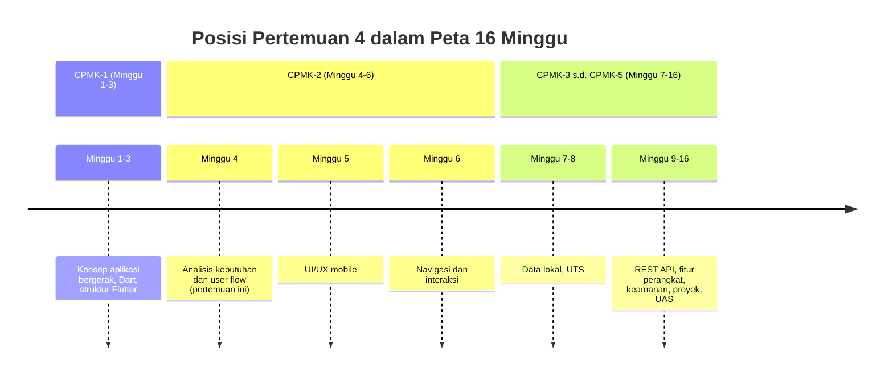
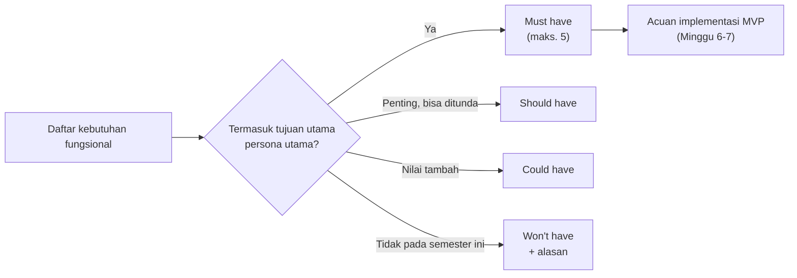
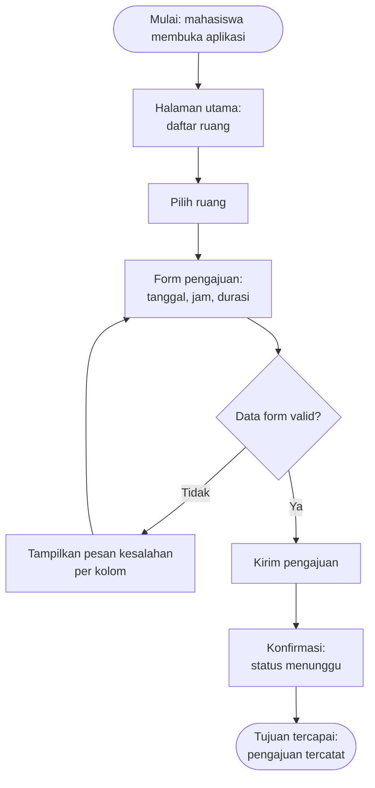
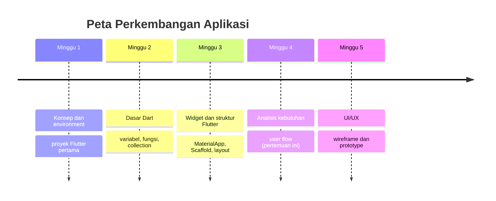

# Pertemuan 4 — Analisis Kebutuhan dan User Flow

| | |
|:--|:--|
| **Minggu** | 4 |
| **Tanggal** | Rabu, 7 Oktober 2026 (SI-VIIB) / Sabtu, 10 Oktober 2026 (SI-VIIA) |
| **CPMK** | CPMK-2 |
| **Model Pembelajaran** | Case Based Learning / Problem Based Learning |
| **Stack** | Dokumen analisis (Markdown + diagram) — tanpa kode Flutter baru |

> **Catatan penting:** Pertemuan 4 membahas **analisis kebutuhan dan user flow**: identifikasi pengguna, penyusunan kebutuhan fungsional dan nonfungsional, penetapan prioritas fitur, serta perancangan user flow aplikasi. Pertemuan ini merupakan titik peralihan dari **CPMK-1** (konsep dan environment) ke **CPMK-2** (analisis kebutuhan dan perancangan): hasil analisis pada pertemuan ini menjadi dasar prototype UI/UX (Pertemuan 5), navigasi (Pertemuan 6), dan seluruh implementasi proyek hingga UAS. Keluaran pertemuan ini adalah **dokumen kebutuhan dan user flow** untuk domain Sistem Informasi yang telah dipilih sejak Tugas 1.
>
> **Batas cakupan:** Pertemuan 4 berfokus pada aktivitas analisis sesuai CPMK-2, RPS, dan urutan `TIMELINE.md`. Pertemuan ini tidak memperkenalkan kode Flutter baru — widget dan layout dari Pertemuan 3 tetap digunakan sebagai referensi ketika kebutuhan dipetakan ke antarmuka. Metode pengumpulan kebutuhan yang lebih formal (wawancara terstruktur, kuesioner skala besar) dan pemodelan proses bisnis lanjutan (BPMN) tidak menjadi cakupan pertemuan ini; cukup analisis pengguna, kebutuhan, dan alur utama sesuai target `TIMELINE.md` dan milestone M1 pada `MILESTONE.md`.

---

## Daftar Isi

- [Pertemuan 4 — Analisis Kebutuhan dan User Flow](#pertemuan-4--analisis-kebutuhan-dan-user-flow)
  - [Daftar Isi](#daftar-isi)
  - [1. Keterkaitan Pertemuan dengan RPS OBE](#1-keterkaitan-pertemuan-dengan-rps-obe)
  - [2. Capaian Pembelajaran Pertemuan](#2-capaian-pembelajaran-pertemuan)
  - [3. Pemantik Kasus: Aplikasi yang Dibangun Tanpa Analisis](#3-pemantik-kasus-aplikasi-yang-dibangun-tanpa-analisis)
  - [4. Identifikasi Pengguna dan User Persona](#4-identifikasi-pengguna-dan-user-persona)
    - [4.1 Mengidentifikasi Pengguna](#41-mengidentifikasi-pengguna)
    - [4.2 User Persona](#42-user-persona)
  - [5. Kebutuhan Fungsional dan Nonfungsional](#5-kebutuhan-fungsional-dan-nonfungsional)
    - [5.1 Definisi dan Perbedaan](#51-definisi-dan-perbedaan)
    - [5.2 Pola Penulisan Kebutuhan Fungsional](#52-pola-penulisan-kebutuhan-fungsional)
    - [5.3 Kebutuhan Nonfungsional yang Relevan](#53-kebutuhan-nonfungsional-yang-relevan)
  - [6. Prioritas Fitur](#6-prioritas-fitur)
  - [7. User Flow](#7-user-flow)
    - [7.1 Notasi Diagram User Flow](#71-notasi-diagram-user-flow)
    - [7.2 Contoh User Flow](#72-contoh-user-flow)
  - [8. Pemetaan Kebutuhan ke Antarmuka](#8-pemetaan-kebutuhan-ke-antarmuka)
  - [9. Case Based Learning: Aplikasi Peminjaman Ruang Laboratorium](#9-case-based-learning-aplikasi-peminjaman-ruang-laboratorium)
  - [10. Aktivitas Kelompok](#10-aktivitas-kelompok)
  - [11. Latihan Individu](#11-latihan-individu)
  - [12. Pemanfaatan AI sebagai Coding Assistant](#12-pemanfaatan-ai-sebagai-coding-assistant)
  - [13. Kuis Formatif](#13-kuis-formatif)
  - [14. Keluaran Pembelajaran — Tugas 4](#14-keluaran-pembelajaran--tugas-4)
    - [Cara Pengumpulan — Push ke Repository GitHub Kelas](#cara-pengumpulan--push-ke-repository-github-kelas)
  - [15. Rubrik Tugas 4](#15-rubrik-tugas-4)
  - [16. Verifikasi Hasil — Artefak Analisis](#16-verifikasi-hasil--artefak-analisis)
    - [Jalur 1: Pemeriksaan Mandiri](#jalur-1-pemeriksaan-mandiri)
    - [Jalur 2: Peer Review](#jalur-2-peer-review)
  - [17. Persiapan ke Pertemuan 5](#17-persiapan-ke-pertemuan-5)
    - [📎 Lampiran: Artefak dan Template](#-lampiran-artefak-dan-template)

---

## 1. Keterkaitan Pertemuan dengan RPS OBE

Pertemuan 4 memulai capaian **CPMK-2** — mahasiswa mampu menganalisis kebutuhan pengguna dan merancang solusi aplikasi bergerak yang sesuai dengan proses bisnis Sistem Informasi. Pada pertemuan ini, pembelajaran berfokus pada **aktivitas analisis sebelum implementasi**: mengidentifikasi siapa pengguna aplikasi, menetapkan kebutuhan yang harus dipenuhi, memprioritaskan fitur, dan merancang alur penggunaan (*user flow*) dari awal hingga selesai.

> Analisis kebutuhan menentukan mutu seluruh tahapan berikutnya. Fitur yang tidak didasarkan pada kebutuhan pengguna berpotensi menjadi pekerjaan yang tidak bernilai; sebaliknya, kebutuhan yang terdokumentasi dengan baik menjadi acuan objektif untuk prototype (Pertemuan 5), implementasi (Pertemuan 6–7), dan pengujian (Pertemuan 13). Pada milestone M1 (`MILESTONE.md`), dokumen kebutuhan dan user flow merupakan keluaran yang dinilai.



Keterkaitan dengan milestone: pertemuan ini bersama Pertemuan 5 menuntaskan **M1 — Analisis Kebutuhan** (keluaran: user persona, daftar kebutuhan, prioritas fitur, user flow) dan mempersiapkan **M2 — UI/UX Prototype**.

---

## 2. Capaian Pembelajaran Pertemuan

Setelah mengikuti pertemuan ini, mahasiswa mampu:

| No. | Kemampuan | Indikator |
|:---:|:----------|:----------|
| 1 | Mengidentifikasi pengguna aplikasi dan menyusun user persona | Menuliskan minimal 2 persona yang memuat peran, tujuan, dan kendala pengguna |
| 2 | Membedakan kebutuhan fungsional dan nonfungsional | Mengklasifikasikan pernyataan kebutuhan ke dalam kategori yang tepat dengan alasan |
| 3 | Menuliskan kebutuhan fungsional yang terukur | Merumuskan kebutuhan dengan pola aktor–aksi–hasil yang dapat diverifikasi |
| 4 | Menetapkan prioritas fitur dengan kriteria yang jelas | Mengelompokkan fitur ke dalam MoSCoW (Must/Should/Could/Won't) beserta alasannya |
| 5 | Merancang user flow alur utama aplikasi | Menggambarkan diagram user flow minimal 8 langkah dari titik masuk hingga tujuan tercapai |
| 6 | Memetakan kebutuhan ke antarmuka yang direncanakan | Menautkan setiap kebutuhan fungsional ke layar/halaman yang akan memenuhinya |

---

## 3. Pemantik Kasus: Aplikasi yang Dibangun Tanpa Analisis

Perhatikan kutipan diskusi kelompok mahasiswa pada semester sebelumnya:

> "Kami langsung membuat aplikasi di Flutter karena ingin cepat selesai. Setelah tiga minggu, dosen bertanya: layar ini untuk siapa? Fitur ini menyelesaikan masalah apa? Kami tidak dapat menjawabnya, dan ternyata fitur yang kami bangun bukan fitur yang dibutuhkan pengguna."

Akibat yang umum terjadi ketika aplikasi dibangun tanpa analisis kebutuhan:

| Gejala | Akar masalah | Konsekuensi |
|:-------|:-------------|:------------|
| Layar banyak tetapi tidak ada yang dipakai pengguna | Fitur dibuat berdasarkan asumsi pembuat, bukan kebutuhan pengguna | Usaha implementasi tidak menghasilkan nilai |
| Alur penggunaan berbelit dan membingungkan | User flow tidak dirancang sebelum antarmuka dibuat | Pengguna kesulitan menyelesaikan tugas utama |
| Fitur terus berubah di tengah pengerjaan | Kebutuhan tidak terdokumentasi sehingga tidak ada acuan | Waktu habis untuk mengerjakan ulang |
| Aplikasi sulit diuji | Kebutuhan tidak terukur sehingga keberhasilan tidak dapat dinilai | Pengujian menjadi subjektif |

Pertanyaan pemantik:

- Mengapa pertanyaan "layar ini untuk siapa?" dapat menggugurkan banyak fitur sekaligus?
- Apa perbedaan antara fitur yang *menarik dibuat* dan fitur yang *dibutuhkan pengguna*?
- Jika waktu implementasi terbatas dalam proyek selama 16 minggu ini, bagaimana cara memutuskan fitur mana yang dikerjakan lebih dahulu?
- Bagaimana cara memastikan alur aplikasi memungkinkan pengguna menyelesaikan tugasnya tanpa hambatan?

Pertemuan ini menjawab pertanyaan tersebut melalui identifikasi pengguna, penyusunan kebutuhan, prioritas fitur, dan perancangan user flow.

---

## 4. Identifikasi Pengguna dan User Persona

### 4.1 Mengidentifikasi Pengguna

Pengguna aplikasi tidak selalu satu jenis. Sebuah aplikasi peminjaman ruang laboratorium, misalnya, melibatkan minimal dua peran dengan kebutuhan berbeda: **mahasiswa** yang mengajukan peminjaman dan **laboran** yang menyetujui. Langkah identifikasi pengguna:

1. **Daftarkan peran** yang berinteraksi dengan aplikasi — bukan individu, tetapi peran (mahasiswa, dosen, laboran, admin).
2. **Pilih peran utama** — peran yang paling sering menggunakan aplikasi untuk mencapai tujuan bisnis.
3. **Amati tugas pengguna** — tugas apa yang ingin diselesaikan pengguna dengan bantuan aplikasi, dan bagaimana tugas tersebut diselesaikan saat ini (sering kali secara manual).

### 4.2 User Persona

**User persona** adalah deskripsi ringkas satu peran pengguna yang merepresentasikan kelompok pengguna nyata. Persona disusun berdasarkan karakteristik pengguna pada domain yang dianalisis, bukan hasil karangan bebas. Komponen persona yang digunakan pada praktikum PAB:

| Komponen | Penjelasan | Contoh |
|:---------|:-----------|:-------|
| Nama dan peran | Identitas singkat yang merepresentasikan peran | "Rani — mahasiswa peminjam" |
| Tujuan | Apa yang ingin dicapai pengguna dengan aplikasi | "Meminjam ruang lab tanpa harus datang ke Gedung C" |
| Kendala | Kondisi yang mempersulit pengguna mencapai tujuan | "Jadwal kuliah padat; hanya bisa mengurus di luar jam lab" |
| Perangkat dan konteks | Kapan dan dengan apa aplikasi dipakai | "Ponsel Android, umumnya di sela jadwal kuliah" |
| Frekuensi penggunaan | Seberapa sering peran ini memakai aplikasi | "1–2 kali per minggu saat masa ujian" |

**Kesalahan umum:** membuat persona tanpa dasar analisis — misalnya menuliskan hobi dan kepribadian yang tidak berpengaruh terhadap kebutuhan. Persona untuk dokumen kebutuhan teknis hanya memuat aspek yang memengaruhi keputusan perancangan.

---

## 5. Kebutuhan Fungsional dan Nonfungsional

### 5.1 Definisi dan Perbedaan

| Aspek | Kebutuhan Fungsional | Kebutuhan Nonfungsional |
|:------|:---------------------|:------------------------|
| Definisi | Fungsi yang harus dapat dilakukan aplikasi | Kualitas atau batasan yang harus dipenuhi aplikasi |
| Menjawab | "Apa yang dapat dilakukan pengguna?" | "Seberapa baik aplikasi bekerja?" |
| Contoh | Pengguna dapat mengajukan peminjaman ruang | Proses pengajuan selesai dalam waktu kurang dari 3 detik |
| Verifikasi | Diuji dengan menjalankan fungsi (ada/tidak ada) | Diuji dengan pengukuran atau observasi kondisi |
| Relevansi pada PAB | Menentukan fitur yang diimplementasikan minggu 6–10 | Menentukan kriteria keamanan (minggu 12) dan pengujian (minggu 13) |

### 5.2 Pola Penulisan Kebutuhan Fungsional

Kebutuhan fungsional ditulis dengan pola **aktor–aksi–hasil** agar terukur dan dapat diverifikasi:

```text
[aktor] dapat [aksi] [objek] [kondisi/hasil]
```

Contoh penerapan:

| Nomor | Rumusan | Aktor | Aksi | Hasil yang dapat diverifikasi |
|:-----:|:--------|:------|:-----|:------------------------------|
| F-01 | Mahasiswa dapat mengajukan peminjaman ruang dengan memilih tanggal, jam, dan durasi | Mahasiswa | Mengajukan peminjaman | Data pengajuan tersimpan dan muncul pada daftar pengajuan |
| F-02 | Laboran dapat menyetujui atau menolak pengajuan beserta catatan | Laboran | Menyetujui/menolak | Status pengajuan berubah dan catatan tersimpan |
| F-03 | Mahasiswa dapat melihat status setiap pengajuan (menunggu, disetujui, ditolak) | Mahasiswa | Melihat status | Status ditampilkan sesuai keadaan terkini |

**Kesalahan umum dalam menuliskan kebutuhan:**

| Kesalahan | Contoh yang salah | Perbaikan |
|:----------|:------------------|:----------|
| Terlalu umum sehingga tidak terukur | "Aplikasi harus mudah digunakan" | Pindahkan ke nonfungsional dengan kriteria terukur, mis. "tugas utama selesai maksimal 5 langkah" |
| Menggabungkan beberapa fungsi dalam satu pernyataan | "Pengguna dapat mendaftar, masuk, dan mengedit profil" | Pecah menjadi tiga pernyataan terpisah |
| Menyebut solusi, bukan kebutuhan | "Aplikasi menggunakan SQLite untuk menyimpan data" | "Aplikasi dapat menyimpan data peminjaman secara lokal" — pemilihan teknologi ditentukan saat implementasi |
| Tidak menyebut aktor | "Data dapat dihapus" | "Laboran dapat menghapus pengajuan yang kedaluwarsa" |

### 5.3 Kebutuhan Nonfungsional yang Relevan

Pada tahap ini, cukup tetapkan kebutuhan nonfungsional yang benar-benar berpengaruh pada keputusan perancangan. Kategori yang lazim untuk proyek PAB:

| Kategori | Pertanyaan pemandu | Contoh rumusan |
|:---------|:-------------------|:---------------|
| Kegunaan | Berapa langkah maksimal tugas utama? | "Pengajuan peminjaman selesai maksimal 5 langkah dari halaman utama" |
| Kinerja | Berapa lama respons yang dapat diterima pengguna? | "Daftar ruang tampil kurang dari 3 detik pada jaringan kampus" |
| Keamanan | Data apa yang tidak boleh diakses pihak lain? | "Pengajuan hanya dapat dilihat oleh pemilik dan laboran" |
| Kompatibilitas | Perangkat dan target apa yang didukung? | "Aplikasi berjalan pada target web dan Android" |

---

## 6. Prioritas Fitur

Tidak semua kebutuhan dapat diimplementasikan dalam waktu 16 minggu. Prioritas membantu memutuskan urutan pengerjaan secara objektif. Praktikum PAB menggunakan metode **MoSCoW**:

| Kategori | Arti | Konsekuensi pada proyek PAB |
|:---------|:-----|:-----------------------------|
| **Must have** | Wajib ada; tanpa ini aplikasi tidak memenuhi tujuan utama | Dikerjakan pertama; menjadi bagian MVP (Minggu 7) |
| **Should have** | Penting tetapi dapat ditunda sementara dengan cara kerja manual | Dikerjakan setelah Must have selesai |
| **Could have** | Menambah nilai bila ada waktu tersisa | Dikerjakan pada fase penyempurnaan (Minggu 14) |
| **Won't have (saat ini)** | Sengaja tidak dikerjakan pada semester ini | Dicatat dengan alasan; bukan dihapus begitu saja |

Aturan penggunaan pada praktikum ini:

1. Setiap kebutuhan fungsional **wajib** memiliki satu kategori MoSCoW — kebutuhan tanpa prioritas menandakan analisis yang belum selesai.
2. Jumlah kategori **Must have** dibatasi maksimal **5 fitur** agar realistis diselesaikan hingga Minggu 7 (MVP awal).
3. Setiap kategori disertai **alasan** yang merujuk pada persona atau tujuan bisnis — bukan sekadar preferensi.



---

## 7. User Flow

**User flow** adalah diagram yang menggambarkan urutan langkah pengguna dari titik masuk hingga tujuan tercapai, termasuk percabangan keputusan dan kondisi gagal. User flow dirancang **sebelum** antarmuka dibuat, karena layar yang dirancang tanpa alur cenderung tidak saling terhubung dengan logis.

### 7.1 Notasi Diagram User Flow

| Simbol | Bentuk | Kegunaan |
|:-------|:-------|:---------|
| Titik mulai | Lingkaran | Kondisi awal pengguna memasuki alur |
| Proses | Persegi panjang | Langkah atau layar yang dilihat pengguna |
| Keputusan | Belah ketupat | Pertanyaan ya/tidak yang menentukan cabang alur |
| Tujuan tercapai | Persegi panjang sudut ganda (atau lingkaran ganda) | Akhir alur ketika tugas pengguna selesai |

Praktikum PAB menggunakan [Mermaid](https://mermaid.live/) atau [Excalidraw](https://excalidraw.com/) untuk menggambar diagram. Alat daring ini dipilih karena hasilnya mudah diekspor dan dilampirkan ke dokumen tugas.

### 7.2 Contoh User Flow

User flow alur utama "mengajukan peminjaman ruang":



Cara membaca diagram: pengguna memulai dari halaman utama, memilih ruang, mengisi form. Bila data tidak valid, alur kembali ke form dengan pesan kesalahan; bila valid, pengajuan terkirim dan pengguna menerima konfirmasi.

**Karakteristik user flow yang baik:**

- Satu alur menggambarkan **satu tujuan pengguna** — jangan menggabungkan beberapa skenario dalam satu diagram.
- Setiap **keputusan** memiliki dua cabang: kondisi berhasil dan kondisi gagal — alur yang hanya menggambarkan skenario sukses tidak lengkap.
- Jumlah langkah alur utama **semakin sedikit semakin baik** — setiap langkah tambahan adalah potensi penghambat bagi pengguna.
- Diagram dapat **ditelusuri ulang** oleh orang lain tanpa penjelasan lisan tambahan.

---

## 8. Pemetaan Kebutuhan ke Antarmuka

Tahap terakhir analisis adalah menautkan setiap kebutuhan fungsional ke layar yang akan memenuhinya. Pemetaan ini menjadi dokumen penghubung menuju prototype UI/UX pada Pertemuan 5.

| ID Kebutuhan | Rumusan (ringkas) | Prioritas | Layar/Halaman yang Memenuhi | Widget yang Direncanakan (P3) |
|:-------------|:------------------|:----------|:----------------------------|:------------------------------|
| F-01 | Mengajukan peminjaman (tanggal, jam, durasi) | Must | Halaman form pengajuan | `Scaffold` + `Column` (form; detail pada Minggu 6) |
| F-02 | Menyetujui/menolak pengajuan | Must | Halaman daftar pengajuan (laboran) | `ListView.builder` + `ListTile` |
| F-03 | Melihat status pengajuan | Must | Halaman utama mahasiswa | `ListView.builder` + `Text` status berwarna |
| F-04 | Mencari ruang berdasarkan nama | Should | Halaman utama + kolom pencarian | `ListView.builder` + `where` (P2) |

Perhatikan kolom terakhir: widget yang direncanakan mengacu pada materi Pertemuan 3. Pemetaan ini menunjukkan bahwa **setiap layar pada prototype harus dapat dijelaskan dari kebutuhan** — bukan sebaliknya. Layar yang tidak memenuhi kebutuhan mana pun pada tabel ini patut dipertanyakan keberadaannya.

> **Keterkaitan ke pertemuan berikutnya:** kolom "Widget yang Direncanakan" bukanlah desain final. Pada Pertemuan 5 (UI/UX), rancangan ini diperhalus menjadi wireframe dan prototype yang memperhatikan ukuran layar, interaksi sentuh, dan umpan balik pengguna.

---

## 9. Case Based Learning: Aplikasi Peminjaman Ruang Laboratorium

**Konteks:** Prodi Sistem Informasi memiliki 6 ruang laboratorium yang peminjamannya selama ini diurus secara manual: mahasiswa mendatangi ruang laboran, mengisi formulir kertas, lalu menunggu konfirmasi. Masalah yang muncul: pengajuan tertulis hilang, bentrokan jadwal tidak terdeteksi, dan mahasiswa tidak mengetahui status pengajuannya.

Pengelola program studi menginginkan **aplikasi peminjaman ruang laboratorium** berbasis mobile. Anda ditugaskan melakukan analisis sebelum implementasi.

**Data pendukung hasil observasi awal:**

| Fakta observasi | Implikasi analisis |
|:----------------|:-------------------|
| Puncak peminjaman terjadi pada masa ujian (20–30 pengajuan/hari) | Kinerja dan kemudahan alur penting pada masa tersebut |
| Sebagian besar mahasiswa mengurus peminjaman di sela jadwal kuliah (5–10 menit) | Alur pengajuan harus selesai dalam langkah sedikit |
| Laboran mengurus persetujuan 2 kali sehari (pagi dan sore) | Notifikasi atau daftar pengajuan menunggu memadai; tidak perlu diperbarui secara waktu nyata |
| Bentrokan jadwal adalah keluhan terbanyak | Sistem perlu menampilkan ketersediaan ruang sebelum pengajuan |
| Mahasiswa menyebut lupa status pengajuannya | Status pengajuan harus mudah dilihat kembali |

Pertanyaan untuk dibahas bersama:

1. **Siapa saja aktor** aplikasi ini, dan mana yang menjadi pengguna utama berdasarkan frekuensi? Buat 2 persona (mahasiswa dan laboran) dari fakta observasi di atas.
2. **Rumuskan minimal 5 kebutuhan fungsional** dengan pola aktor–aksi–hasil. Kebutuhan mana yang paling mudah terlewat mahasiswa pada umumnya? (Petunjuk: perhatikan fakta bentrokan jadwal dan lupa status.)
3. **Tetapkan 2 kebutuhan nonfungsional** yang benar-benar berpengaruh dari data observasi — bukan yang sekadar bagus untuk ditulis.
4. **Berikan prioritas MoSCoW** pada seluruh kebutuhan fungsional Anda. Fitur apa yang masuk Won't have, dan apa alasannya?
5. **Gambar user flow** alur utama mahasiswa: dari membuka aplikasi hingga pengajuan tercatat, termasuk cabang keputusan "data valid?" dan kondisi "ruang bentrokan".

Kerangka penyelesaian tersedia pada [template dokumen kebutuhan](./template-dokumen-kebutuhan.md) dan [template user flow](./template-user-flow.md). Kerjakan latihan individu terlebih dahulu, kemudian bandingkan hasilnya dengan pembahasan kelompok.

---

## 10. Aktivitas Kelompok

Bentuk kelompok yang terdiri atas 3–4 mahasiswa:

1. **Analisis silang persona (15 menit)** — Tukarkan dokumen kebutuhan draf Anda dengan kelompok lain. Periksa: apakah persona yang dibuat kelompok lain memiliki tujuan dan kendala yang berpengaruh pada keputusan fitur? Persona mana yang tampak karangan bebas (hobi/kondisi tidak relevan)? Catat masukan untuk perbaikan.
2. **Uji keterukuran kebutuhan (15 menit)** — Ambil 5 kebutuhan fungsional dari kelompok lain. Uji setiap kebutuhan dengan pertanyaan: "bagaimana cara memverifikasi kebutuhan ini terpenuhi?" Kebutuhan yang tidak dapat dijawab perlu dirumuskan ulang dengan pola aktor–aksi–hasil.
3. **Presentasi singkat (5 menit/kelompok)** — Satu kelompok memaparkan user flow-nya; kelompok lain menelusuri diagram tanpa penjelasan lisan: apakah setiap keputusan memiliki dua cabang? Apakah ada langkah yang dapat dihilangkan?

**Target:** setiap kelompok menghasilkan satu daftar perbaikan atas draf kelompok lain dan satu user flow yang dapat ditelusuri tanpa penjelasan tambahan.

---

## 11. Latihan Individu

Kerjakan setelah pembahasan CBL, menggunakan domain Sistem Informasi yang telah Anda pilih sejak Tugas 1. Kerangka pengerjaan tersedia pada [template dokumen kebutuhan](./template-dokumen-kebutuhan.md) dan [template user flow](./template-user-flow.md).

1. **Langkah 1** — Tulis 2 user persona (2 peran berbeda) untuk aplikasi Anda, masing-masing memuat nama-peran, tujuan, kendala, perangkat, dan frekuensi.
2. **Langkah 2** — Rumuskan minimal 6 kebutuhan fungsional (pola aktor–aksi–hasil, bernomor F-01 dst.) dan minimal 2 kebutuhan nonfungsional yang terukur.
3. **Langkah 3** — Berikan prioritas MoSCoW pada seluruh kebutuhan fungsional; kategori Must have maksimal 5, disertai alasan.
4. **Langkah 4** — Gambar user flow alur utama pengguna utama (minimal 8 langkah, minimal 2 keputusan, setiap keputusan memiliki cabang gagal).
5. **Langkah 5** — Susun tabel pemetaan: setiap kebutuhan fungsional → layar yang memenuhinya → widget yang direncanakan dari materi Pertemuan 3.
6. **Langkah 6** — Periksa hasil Anda menggunakan daftar pemeriksaan pada [Bagian 16](#16-verifikasi-hasil--artefak-analisis), lalu minta satu teman sekelas menelusuri user flow Anda tanpa penjelasan lisan.

---

## 12. Pemanfaatan AI sebagai Coding Assistant

**AI assistant (GitHub Copilot, ChatGPT, Claude, Gemini, Cursor) dapat digunakan sebagai alat bantu pembelajaran dengan ketentuan berikut:**

**✅ Gunakan AI untuk:**

- Meminta penjelasan perbedaan kebutuhan fungsional dan nonfungsional beserta contohnya pada domain Anda
- Meminta AI menelusuri user flow Anda dan menunjukkan cabang keputusan yang belum memiliki kondisi gagal
- Meminta kritik atas rumusan kebutuhan: mana yang tidak terukur atau menyebut solusi teknologi sejak awal
- Menjelaskan cara membaca atau menuliskan sintaks diagram Mermaid

**❌ Jangan gunakan AI untuk:**

- Menghasilkan seluruh dokumen kebutuhan dan user flow Tugas 4 — kemampuan menganalisis kebutuhan adalah inti yang dinilai pada CPMK-2
- Membuat persona fiktif tanpa dasar observasi atau konteks domain Anda

**Etika di kelas ini:**

1. Anda **wajib dapat menjelaskan** alasan di balik setiap persona, kebutuhan, dan prioritas yang Anda tuliskan.
2. Jika memakai AI, **cantumkan** pada bagian akhir dokumen:

   ```text
   Deklarasi penggunaan AI: Claude — meminta kritik atas rumusan F-03 dan F-05;
   hasilnya dirumuskan ulang oleh penulis.
   ```

3. AI digunakan sebagai **asisten pembelajaran**, bukan sebagai **pengganti proses analisis**. Dokumen yang dihasilkan penuh oleh AI tanpa proses analisis Anda akan tampak dari ketidakmampuan menjelaskannya saat peninjauan.

---

## 13. Kuis Formatif

**Kuis formatif (10 menit, dikerjakan tanpa membuka catatan):**

1. Apa perbedaan kebutuhan fungsional dan nonfungsional? Berikan satu contoh untuk masing-masing pada domain aplikasi Anda.
2. Mengapa pernyataan "aplikasi harus cepat" bukan kebutuhan yang baik? Rumuskan ulang agar terukur.
3. Apa arti kategori Must have dan Won't have pada MoSCoW? Apa konsekuensi Won't have terhadap proyek semester ini?
4. Sebutkan tiga kesalahan umum dalam merumuskan kebutuhan fungsional dan cara memperbaikinya.
5. Pada user flow, mengapa setiap titik keputusan harus memiliki cabang kondisi gagal? Apa risiko bila alur hanya menggambarkan skenario sukses?
6. Apa fungsi tabel pemetaan kebutuhan ke antarmuka, dan kapan tabel tersebut digunakan kembali pada pertemuan berikutnya?

---

## 14. Keluaran Pembelajaran — Tugas 4

**Tugas 4 — Dokumen Kebutuhan dan User Flow (dikumpulkan sebelum Pertemuan 5).** Panduan pengerjaan tersedia di [`contoh-tugas-4-mahasiswa.md`](./contoh-tugas-4-mahasiswa.md).

Gunakan **domain Sistem Informasi yang sama** dengan Tugas 1–3. Kerjakan:

1. **Buat berkas `dokumen-kebutuhan.md`** berisi:
   - Deskripsi singkat aplikasi (1 paragraf): nama, masalah pengguna, dan alasan solusi berbentuk aplikasi mobile.
   - Minimal **2 user persona** (2 peran berbeda) dengan lima komponen lengkap.
   - Minimal **6 kebutuhan fungsional** (pola aktor–aksi–hasil, bernomor `F-01` dst.) dan **2 kebutuhan nonfungsional** terukur (kategori bebas, bernomor `NF-01` dst.).
   - Tabel prioritas **MoSCoW** seluruh kebutuhan fungsional beserta alasannya (Must have maksimal 5).
   - Tabel **pemetaan kebutuhan ke antarmuka** (kebutuhan → layar → widget yang direncanakan dari materi Pertemuan 3).
2. **Sertakan diagram user flow** — di dalam `dokumen-kebutuhan.md` dan/atau sebagai berkas `user-flow.png`, memuat:
   - Diagram user flow alur utama pengguna utama: minimal **8 langkah** dan **2 titik keputusan**, setiap keputusan memiliki cabang gagal.
   - Diagram dibuat dengan Mermaid atau Excalidraw, kemudian diekspor/ditempelkan agar dapat dilihat tanpa alat tambahan.
3. **Deklarasi penggunaan AI** (bila ada) sesuai format pada [Bagian 12](#12-pemanfaatan-ai-sebagai-coding-assistant).
4. **Refleksi** — 3 kalimat: bagian analisis mana yang paling sulit Anda tetapkan (persona, rumusan kebutuhan, prioritas, atau alur) dan mengapa?

### Cara Pengumpulan — Push ke Repository GitHub Kelas

Tugas dikumpulkan dengan melakukan **push ke repository GitHub kelas** (sesuai kelas Anda):

| Kelas | Repository |
|:------|:-----------|
| SI-VIIB | `SI-VIIB-Mobile` |
| SI-VIIA | `SI-VIIA-Mobile` |

> Alamat lengkap repo (organisasi/URL) dibagikan melalui kanal kelas. Gunakan repo kelas Anda sendiri — tugas yang di-push ke kelas lain tidak dinilai.

Langkah pengumpulan:

1. *Clone* repo kelas, lalu buat folder tugas dengan nama `<nim>-<nama>`:
   ```bash
   git clone https://github.com/<org-kelas>/SI-VIIB-Mobile.git
   cd SI-VIIB-Mobile
   mkdir -p tugas-4/<nim>-<nama>
   ```
2. Simpan berkas tugas ke dalam folder tersebut:
   - `dokumen-kebutuhan.md` — dokumen kebutuhan lengkap.
   - `user-flow.png` atau diagram Mermaid di dalam `dokumen-kebutuhan.md` — diagram user flow.
   - `README.md` — deskripsi singkat + refleksi 3 kalimat + deklarasi penggunaan AI (bila ada).
3. Periksa kembali dokumen menggunakan daftar pemeriksaan pada [`contoh-tugas-4-mahasiswa.md`](./contoh-tugas-4-mahasiswa.md).
4. Commit dan push:
   ```bash
   git add tugas-4/<nim>-<nama>
   git commit -m "tugas-4: dokumen kebutuhan dan user flow - <nama> <nim>"
   git push origin main
   ```
5. **Verifikasi** — buka repository di browser dan pastikan berkas tugas Anda telah tampil sebelum tenggat. Terlambat dihitung dari waktu *push* terakhir.

---

## 15. Rubrik Tugas 4

| Kriteria | Bobot | 4 (Sangat Baik) | 3 (Baik) | 2 (Cukup) | 1 (Perlu Bimbingan) |
|:---------|:-----:|:----------------|:---------|:----------|:--------------------|
| User persona | 15% | ≥ 2 persona, 2 peran, kelima komponen lengkap dan berpengaruh pada keputusan fitur | 2 persona lengkap, keterkaitan dengan fitur kurang tegas | 1 persona, komponen tidak lengkap | Tidak ada persona |
| Kebutuhan fungsional | 25% | ≥ 6 kebutuhan, pola aktor–aksi–hasil konsisten, seluruhnya terukur | 6 kebutuhan, 1–2 rumusan kurang terukur | 4–5 kebutuhan atau beberapa tergabung | Kurang dari 4 kebutuhan |
| Kebutuhan nonfungsional | 10% | ≥ 2 kebutuhan, terukur, kategori tepat | 2 kebutuhan, kriteria kurang terukur | 1 kebutuhan | Tidak ada |
| Prioritas MoSCoW | 15% | Seluruh kebutuhan berprioritas, Must ≤ 5, setiap kategori beralasan | Seluruh kebutuhan berprioritas, alasan sebagian | Prioritas sebagian, tanpa alasan | Tidak ada prioritas |
| User flow | 25% | ≥ 8 langkah, ≥ 2 keputusan, semua cabang gagal ada, dapat ditelusuri tanpa penjelasan | Langkah dan keputusan memenuhi, 1 cabang kurang | Alur ada tetapi kurang dari 8 langkah atau tanpa cabang gagal | Tidak ada diagram |
| Pemetaan, refleksi, ketepatan waktu | 10% | Tabel pemetaan lengkap, refleksi 3 kalimat logis, tepat waktu | Pemetaan ada, refleksi kurang mendalam | Pemetaan parsial atau refleksi kurang dari 3 kalimat | Tidak ada / terlambat |

**Nilai = Σ(bobot × skor) / 16 × 100.** Pengumpulan terlambat: pengurangan 1 level rubrik per hari.

---

## 16. Verifikasi Hasil — Artefak Analisis

> **Catatan akademik:** bagian Verifikasi Kode pada template disesuaikan menjadi **Verifikasi Hasil — Artefak Analisis** untuk pertemuan ini. Alasannya: Pertemuan 4 tidak menghasilkan kode Flutter baru — keluaran pertemuan adalah dokumen kebutuhan dan user flow — sehingga verifikasi berupa pemeriksaan konsistensi dokumen, bukan eksekusi program. Pemeriksaan kode (`flutter analyze`, `dart run`) kembali digunakan penuh pada pertemuan yang menghasilkan kode.

Hasil analisis diverifikasi melalui dua jalur berikut. Jalur ini meniru praktik peninjauan dokumen kebutuhan pada industri perangkat lunak.

### Jalur 1: Pemeriksaan Mandiri

Periksa dokumen Anda dengan daftar berikut sebelum dikumpulkan:

| No. | Pemeriksaan | Bila gagal |
|:---:|:------------|:-----------|
| 1 | Setiap persona memiliki kelima komponen (nama-peran, tujuan, kendala, perangkat, frekuensi) | Lengkapi komponen yang kurang; hapus aspek yang tidak berpengaruh |
| 2 | Setiap kebutuhan fungsional mengikuti pola aktor–aksi–hasil | Rumuskan ulang dengan pola yang ditetapkan |
| 3 | Tidak ada kebutuhan yang menggabungkan lebih dari satu fungsi | Pecah menjadi beberapa pernyataan bernomor |
| 4 | Kebutuhan nonfungsional memiliki kriteria terukur | Ganti kata umum ("cepat", "mudah") dengan angka atau kondisi yang dapat diamati |
| 5 | Seluruh kebutuhan fungsional berprioritas MoSCoW; Must have ≤ 5 | Tetapkan prioritas; pindahkan kebutuhan dari Must ke Should |
| 6 | Setiap titik keputusan pada user flow memiliki cabang gagal | Tambahkan cabang dan tindak lanjutnya |
| 7 | Setiap kebutuhan fungsional muncul pada tabel pemetaan | Tambahkan baris pemetaan; layar tanpa kebutuhan dipertanyakan |
| 8 | Diagram dapat ditelusuri tanpa penjelasan lisan | Perbaiki label langkah hingga pembaca luar memahami |

### Jalur 2: Peer Review

Lakukan pertukaran dokumen dengan satu teman sekelas:

1. Pembaca menelusuri user flow Anda **tanpa penjelasan lisan** dari Anda, lalu menjawab: "alur apa yang digambarkan diagram ini, dan di mana keputusannya?"
2. Pembaca memilih tiga kebutuhan fungsional secara acak dan menguji keterukurannya: "bagaimana cara memverifikasi kebutuhan ini terpenuhi?"
3. Catat hasil peninjauan (bagian yang tidak dipahami atau tidak terukur) dan perbaiki dokumen Anda sebelum pengumpulan.

| Jalur | Alat yang diperlukan | Hasil |
|:------|:-----------|:-------------|
| Pemeriksaan mandiri | Daftar pemeriksaan di atas | Dokumen yang lolos pemeriksaan konsistensi internal |
| Peer review | Satu pembaca lain | Bukti keterbacaan oleh pihak luar — keterampilan yang juga dinilai pada presentasi Minggu 15 |

---

## 17. Persiapan ke Pertemuan 5

Pada pertemuan ini, mahasiswa telah mempelajari **analisis kebutuhan dan user flow**: identifikasi pengguna dan user persona, kebutuhan fungsional dan nonfungsional, prioritas MoSCoW, perancangan user flow, serta pemetaan kebutuhan ke antarmuka. Pada **Pertemuan 5** (**UI/UX Mobile**, 14 Oktober 2026 — SI-VIIB; 17 Oktober 2026 — SI-VIIA), materi bergeser ke **perancangan dan implementasi antarmuka**: information architecture, wireframe, dan prototype UI/UX berbasis hasil analisis pertemuan ini.

**Persiapan:**

- Pastikan `dokumen-kebutuhan.md` (Tugas 4) telah di-push sebelum pertemuan — dokumen ini menjadi masukan utama aktivitas Pertemuan 5.
- Baca kembali tabel pemetaan kebutuhan → layar yang Anda susun; tandai dua layar yang menjadi bagian alur utama (Must have).
- Tinjau materi Pertemuan 3 (`Column`, `Row`, `ListView`, `Scaffold`) — perancangan prototype pada Pertemuan 5 menerjemahkan hasil analisis ke dalam widget tersebut.
- Opsional: pelajari pengenalan [Figma](https://www.figma.com/) atau tetap gunakan Excalidraw untuk wireframe — keduanya memadai untuk kebutuhan praktikum.



- **Pertemuan 1** — Memahami konsep aplikasi bergerak dan menyiapkan environment Flutter.
- **Pertemuan 2** — Menguasai sintaks dan fitur dasar Dart sebagai bahasa aplikasi Flutter.
- **Pertemuan 3** — Menggunakan widget untuk membangun halaman aplikasi.
- **Pertemuan 4** — Menganalisis kebutuhan dan menyusun user flow aplikasi SI.
- **Pertemuan 5** — Merancang prototype UI/UX berdasarkan dokumen kebutuhan.

---

### 📎 Lampiran: Artefak dan Template

> Pertemuan ini tidak menghasilkan kode praktikum baru; lampiran berisi artefak dan template analisis.

| Berkas | Keterangan |
|:-------|:-----------|
| [`template-dokumen-kebutuhan.md`](./template-dokumen-kebutuhan.md) | Kerangka dokumen kebutuhan: persona, kebutuhan fungsional/nonfungsional, MoSCoW, dan tabel pemetaan |
| [`template-user-flow.md`](./template-user-flow.md) | Kerangka dan notasi user flow dengan contoh Mermaid yang dapat dimodifikasi |
| [`contoh-tugas-4-mahasiswa.md`](./contoh-tugas-4-mahasiswa.md) | Panduan pengerjaan Tugas 4 untuk mahasiswa: definisi komponen, struktur dokumen, dan daftar pemeriksaan mandiri |
| [`panduan/Panduan-Lengkap-PAB.md`](../panduan/Panduan-Lengkap-PAB.md) | Skenario instalasi dan peta kebutuhan environment per pertemuan (Bagian 2.1) — termasuk keterangan bahwa Minggu 4 cukup dengan skenario ringan/standar |
| [`../MILESTONE.md`](../MILESTONE.md) | Milestone M1 — Analisis Kebutuhan: keluaran dan kriteria selesai yang menjadi target pertemuan ini |
