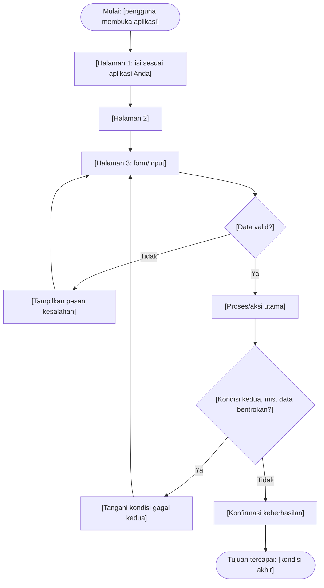

# Template — User Flow

Template ini digunakan pada Latihan Individu dan Tugas 4 (Pertemuan 4). Diagram ditulis dengan sintaks [Mermaid](https://mermaid.live/). Tempelkan kode di bawah ke Mermaid Live Editor untuk melihat hasilnya, lalu ubah sesuai alur aplikasi Anda. Sertakan kode diagram dan hasil ekspor gambar, bila ada, pada dokumen tugas.

---

## 1. Identitas Alur

| Aspek | Isi |
|:------|:----|
| Nama alur | [Contoh: mengajukan peminjaman ruang] |
| Aktor | [Persona mana yang menjalankan alur ini] |
| Tujuan alur | [Kondisi akhir yang menandakan tugas selesai] |

> Satu diagram menggambarkan **satu tujuan pengguna**. Bila aplikasi memiliki beberapa alur utama (mis. alur mahasiswa dan alur laboran), buat diagram terpisah untuk masing-masing.

## 2. Diagram User Flow

> Ketentuan minimal Tugas 4: **8 langkah**, **2 titik keputusan**, setiap keputusan memiliki **cabang gagal**. Simbol: `([ ])` titik mulai/tujuan, `[ ]` proses/halaman, `{ }` keputusan.

## 3. Daftar Langkah

> Menuliskan langkah dalam bentuk tabel memudahkan pemeriksaan jumlah langkah dan cabang. Baris keputusan wajib mencantumkan kedua cabangnya.

| No. | Jenis | Langkah/Halaman | Bila gagal |
|:---:|:------|:--------------|:-----------|
| 1 | Mulai | [...] | — |
| 2 | Halaman | [...] | — |
| 3 | Keputusan | [Data valid?] | Kembali ke form dengan pesan kesalahan |
| ... | ... | [...] | [...] |

## 4. Daftar Pemeriksaan Diagram

- [ ] Jumlah langkah minimal 8 (di luar titik mulai dan tujuan).
- [ ] Jumlah titik keputusan minimal 2.
- [ ] Setiap keputusan memiliki cabang "Ya" dan "Tidak" yang keduanya ditindaklanjuti.
- [ ] Tidak ada langkah yang buntu (tidak mengarah ke mana pun).
- [ ] Label setiap langkah dapat dipahami orang lain tanpa penjelasan lisan.
- [ ] Diagram telah diuji dengan cara ditelusuri oleh satu teman sekelas (peer review, Bagian 16 materi).
