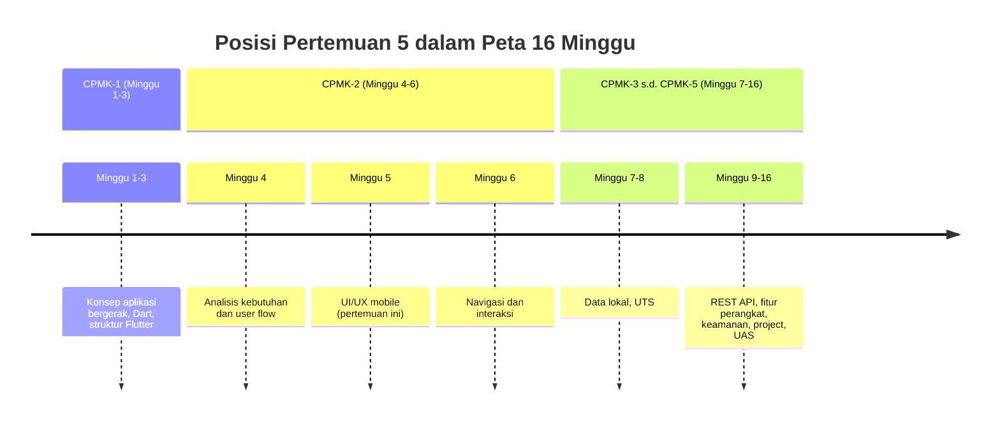
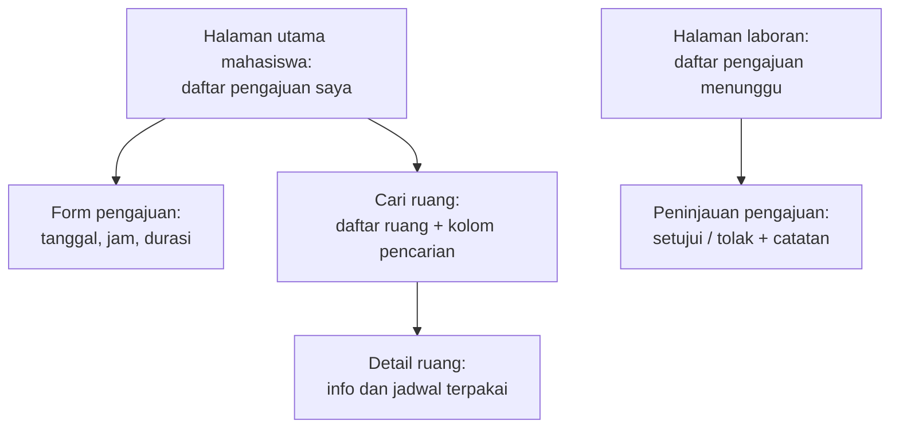
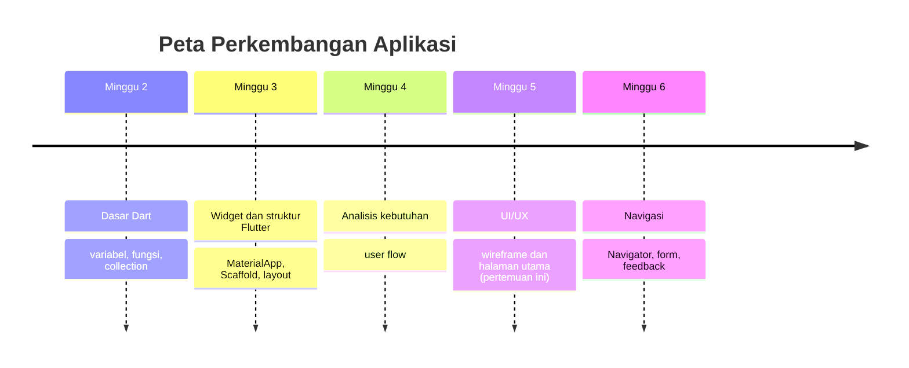

# Pertemuan 5 — UI/UX Mobile

| | |
|:--|:--|
| **Minggu** | 5 |
| **Tanggal** | Rabu, 14 Oktober 2026 (SI-VIIB) / Sabtu, 17 Oktober 2026 (SI-VIIA) |
| **CPMK** | CPMK-2 |
| **Model Pembelajaran** | Case Based Learning / Problem Based Learning |
| **Stack** | Flutter (tema dan komponen visual) + alat wireframe (Excalidraw/Figma) |

> **Catatan penting:** Pertemuan 5 membahas **UI/UX mobile**: information architecture, wireframe, prinsip antarmuka mobile (ukuran layar, target sentuh, hierarki visual, feedback), serta implementasi rancangan menjadi halaman Flutter. Pertemuan ini menerjemahkan hasil analisis Pertemuan 4 — tabel pemetaan kebutuhan ke antarmuka — menjadi rancangan visual dan implementasi halaman utama. Keluaran pertemuan ini adalah **prototype UI/UX** (information architecture, wireframe, dan halaman utama Flutter) untuk domain Sistem Informasi yang telah dipilih sejak Tugas 1.
>
> **Batas cakupan:** Pertemuan 5 berfokus pada perancangan dan implementasi **satu halaman** sesuai CPMK-2, RPS, dan urutan `TIMELINE.md`. Materi routing dan `Navigator` tidak dibahas pada pertemuan ini — navigasi antarlayar, form, dan feedback interaksi menjadi fokus **Pertemuan 6** sehingga prototype fungsional (M3) tersusun berurutan. Widget yang digunakan tetap seputar materi Pertemuan 3 (`Scaffold`, `Column`, `Row`, `ListView.builder`, `ListTile`) ditambah tema dan komponen visual (`ThemeData`, `Card`, `FilledButton`).

---

## Daftar Isi

- [Pertemuan 5 — UI/UX Mobile](#pertemuan-5--uiux-mobile)
  - [Daftar Isi](#daftar-isi)
  - [1. Keterkaitan Pertemuan dengan RPS OBE](#1-keterkaitan-pertemuan-dengan-rps-obe)
  - [2. Capaian Pembelajaran Pertemuan](#2-capaian-pembelajaran-pertemuan)
  - [3. Pemantik Kasus: Satu Layar untuk Semua Fitur](#3-pemantik-kasus-satu-layar-untuk-semua-fitur)
  - [4. Information Architecture](#4-information-architecture)
  - [5. Prinsip Antarmuka Mobile](#5-prinsip-antarmuka-mobile)
  - [6. Wireframe](#6-wireframe)
  - [7. Tema dan Komponen Visual Flutter](#7-tema-dan-komponen-visual-flutter)
  - [8. Dari Wireframe ke Widget](#8-dari-wireframe-ke-widget)
  - [9. Case Based Learning: Halaman Utama Aplikasi Peminjaman Ruang Laboratorium](#9-case-based-learning-halaman-utama-aplikasi-peminjaman-ruang-laboratorium)
  - [10. Aktivitas Kelompok](#10-aktivitas-kelompok)
  - [11. Latihan Individu](#11-latihan-individu)
  - [12. Pemanfaatan AI sebagai Coding Assistant](#12-pemanfaatan-ai-sebagai-coding-assistant)
  - [13. Kuis Formatif](#13-kuis-formatif)
  - [14. Keluaran Pembelajaran — Tugas 5](#14-keluaran-pembelajaran--tugas-5)
    - [Cara Pengumpulan — Push ke Repository GitHub Kelas](#cara-pengumpulan--push-ke-repository-github-kelas)
  - [15. Rubrik Tugas 5](#15-rubrik-tugas-5)
  - [16. Verifikasi Kode — Dua Jalur](#16-verifikasi-kode--dua-jalur)
    - [Jalur 1: DartPad (tanpa instalasi)](#jalur-1-dartpad-tanpa-instalasi)
    - [Jalur 2: Flutter SDK (sesuai Panduan Lengkap)](#jalur-2-flutter-sdk-sesuai-panduan-lengkap)
  - [17. Persiapan ke Pertemuan 6](#17-persiapan-ke-pertemuan-6)
  - [📎 Lampiran: Kode Praktikum](#-lampiran-kode-praktikum)

---

## 1. Keterkaitan Pertemuan dengan RPS OBE

Pertemuan 5 melanjutkan capaian **CPMK-2** — mahasiswa mampu menganalisis kebutuhan pengguna dan merancang solusi aplikasi bergerak yang sesuai dengan proses bisnis Sistem Informasi. Pada pertemuan ini, pembelajaran berfokus pada **perancangan dan implementasi antarmuka**: menyusun struktur halaman dari hasil analisis kebutuhan, menggambar wireframe, menerapkan prinsip antarmuka mobile, dan mengimplementasikan halaman utama di Flutter.

> Kebutuhan yang tidak diterjemahkan menjadi antarmuka yang dapat dilihat belum membuktikan apa pun. Sebaliknya, antarmuka yang menarik tetapi tidak memenuhi kebutuhan hanya menghasilkan layar yang indah namun tidak terpakai. Pertemuan ini menautkan kedua sisi tersebut: setiap elemen rancangan harus dapat dijelaskan dari kebutuhan (Pertemuan 4), dan setiap widget yang ditulis harus dapat dijelaskan dari rancangan.



Keterkaitan dengan milestone: pertemuan ini memulai **M2 — UI/UX Prototype** (deliverable: information architecture, wireframe/prototype, catatan keputusan UI/UX) dan menyiapkan **M3 — Implementasi Mobile Awal** yang dituntaskan pada Pertemuan 6–7 dengan navigasi dan data lokal.

---

## 2. Capaian Pembelajaran Pertemuan

Setelah mengikuti pertemuan ini, mahasiswa mampu:

| No. | Kemampuan | Indikator |
|:---:|:----------|:----------|
| 1 | Menyusun information architecture dari hasil analisis kebutuhan | Mendaftarkan layar aplikasi dari tabel pemetaan Tugas 4 dan menggambarkan hubungan antarlayar dalam satu diagram |
| 2 | Menggambar wireframe layar utama aplikasi | Membuat wireframe minimal 2 layar dengan anotasi fungsi setiap area |
| 3 | Menerapkan prinsip antarmuka mobile | Menilai dan memperbaiki rancangan berdasarkan target sentuh, hierarki visual, feedback, dan konsistensi |
| 4 | Mengimplementasikan wireframe menjadi halaman Flutter | Menulis halaman utama dengan tema terpusat dan komponen visual yang sesuai rancangan |
| 5 | Mendokumentasikan keputusan UI/UX | Menuliskan catatan keputusan (warna, hierarki, komponen) beserta alasan yang merujuk pada kebutuhan atau persona |

---

## 3. Pemantik Kasus: Satu Layar untuk Semua Fitur

Perhatikan kutipan diskusi kelompok mahasiswa pada semester sebelumnya:

> "Aplikasi kami ditolak saat review. Dosen membuka halaman utama dan menemukan sembilan tombol, teks kecil berdempetan, dan tidak ada petunjuk mana yang harus dibuka lebih dahulu. Ketika ditanya mana tombol untuk tugas utama pengguna, kami sendiri bingung menjawabnya."

Akibat yang umum terjadi ketika antarmuka dirancang tanpa prinsip UI mobile:

| Gejala | Akar masalah | Konsekuensi |
|:-------|:-------------|:------------|
| Semua fitur ditempatkan pada satu layar | Tidak ada information architecture sehingga layar tidak terkelompok berdasarkan tugas | Pengguna kesulitan menemukan fungsi yang dibutuhkan |
| Tombol dan tautan sulit ditekan dengan jari | Ukuran target sentuh tidak diperhitungkan | Pengguna melakukan tekanan yang salah dan meninggalkan aplikasi |
| Semua teks memiliki ukuran dan ketebalan yang sama | Hierarki visual tidak dirancang | Informasi penting tidak menonjol; layar terasa datar |
| Aplikasi diam setelah tombol ditekan | Tidak ada feedback atas aksi pengguna | Pengguna tidak yakin apakah aksinya berhasil |

Pertanyaan pemantik:

- Mengapa aplikasi mobile tidak dapat ditata seperti menu website yang padat tautan?
- Bagaimana cara memutuskan fitur mana yang tampil pada layar utama dan mana yang dipindah ke layar lain?
- Apa yang membedakan rancangan yang "banyak isinya" dari rancangan yang "membantu tugas"?

Pertemuan ini menjawab pertanyaan tersebut melalui information architecture, prinsip antarmuka mobile, wireframe, dan implementasi di Flutter.

---

## 4. Information Architecture

**Information architecture (IA)** adalah struktur yang mengelompokkan dan menyusun layar aplikasi sehingga pengguna menemukan fungsi yang dibutuhkan tanpa bertanya. IA berbeda dari user flow pada Pertemuan 4:

| Aspek | User Flow (Pertemuan 4) | Information Architecture (Pertemuan 5) |
|:------|:------------------------|:----------------------------------------|
| Menjawab | Bagaimana pengguna menyelesaikan satu tugas dari awal hingga selesai? | Layar apa saja yang ada dan bagaimana layar tersebut dikelompokkan? |
| Bentuk | Diagram alur dengan keputusan dan cabang gagal | Peta layar dengan hubungan induk-anak |
| Digunakan untuk | Memastikan tugas dapat diselesaikan dan kondisi gagal tertangani | Menentukan isi layar utama dan daftar layar yang perlu dibangun |

Langkah menyusun IA pada praktikum PAB:

1. **Ambil inventaris layar** dari tabel pemetaan kebutuhan ke antarmuka (Tugas 4) — kolom "Layar/Halaman yang Memenuhi".
2. **Tetapkan layar utama** — layar yang memenuhi kebutuhan *Must have* dan menjadi titik masuk pengguna.
3. **Kelompokkan layar pendukung** di bawah layar utama berdasarkan tugas, bukan berdasarkan jenis fitur.
4. **Gambarkan peta layar** — setiap layar disebut dengan nama yang sama persis dengan tabel pemetaan agar dokumen tetap konsisten.

Contoh IA aplikasi peminjaman ruang laboratorium (hasil analisis Pertemuan 4):



> **Kesalahan umum:** membuat IA berdasarkan struktur menu yang diinginkan pembuat, bukan berdasarkan kebutuhan. Setiap layar pada IA harus dapat ditelusuri kembali ke satu baris tabel pemetaan; layar tanpa kebutuhan dipindahkan ke kategori *Won't have* atau dihapus.

---

## 5. Prinsip Antarmuka Mobile

Antarmuka mobile bekerja pada layar kecil, disentuh dengan jari, dan dipakai dalam durasi singkat. Lima prinsip berikut menjadi acuan menilai rancangan pada pertemuan ini:

| Prinsip | Penjelasan | Acuan praktis | Kesalahan umum |
|:--------|:-----------|:--------------|:---------------|
| Target sentuh memadai | Elemen yang ditekan harus cukup besar dan berjarak | Minimal sekitar 48×48 dp per elemen aktif | Tautan teks rapat; ikon tanpa area tekan |
| Hierarki visual | Informasi penting tampil menonjol melalui ukuran, ketebalan, dan posisi | Judul layar paling menonjol; keterangan lebih kecil dan redup | Semua teks sama ukuran; judul sama dengan isi |
| Feedback | Setiap aksi pengguna mendapat respons yang terlihat | Status berubah warna; pesan tampil setelah aksi | Tombol ditekan tanpa respons apa pun |
| Konsistensi | Komponen sejenis tampil dan berperilaku sama di seluruh layar | Status selalu berbentuk label berwarna; aksi utama selalu berbentuk tombol | Status kadang teks biasa, kadang ikon; tombol utama berpindah posisi |
| Keterbacaan dan kontras | Teks mudah dibaca pada layar kecil dan pencahayaan beragam | Kontras teks terhadap latar memadai; ukuran teks isi tidak terlalu kecil | Teks putih pada latar kuning muda; teks abu-abu sangat muda |

Prinsip-prinsip ini bukan hiasan: pada rubrik Tugas 5, penerapan prinsip dinilai secara eksplisit, dan pada Pertemuan 15 rancangan Anda akan ditelusuri pihak lain melalui demo. Rancangan yang melanggar target sentuh atau kontras akan langsung terasa saat demo, bukan saat penilaian saja.

---

## 6. Wireframe

**Wireframe** adalah sketsa tata letak layar yang menunjukkan posisi dan fungsi setiap area tanpa detail warna dan gambar final. Wireframe menempati posisi tengah antara analisis dan implementasi: cukup rinci untuk menjadi acuan menulis widget, cukup ringan untuk diperbaiki cepat ketika kelompok lain menemukan masalah.

| Jenis | Kandungan | Kapan digunakan pada PAB |
|:------|:----------|:--------------------------|
| Low fidelity | Kotak, garis, dan blok abu-abu; anotasi fungsi per area | Pertemuan 5 — saat struktur layar masih berubah |
| High fidelity | Warna, ikon, teks final mendekati tampilan nyata | Opsional setelah implementasi halaman berjalan |

Isi minimal setiap wireframe pada Tugas 5:

1. **Area utama layar** — header, daftar, dan aksi utama digambar dalam posisi yang benar.
2. **Anotasi fungsi** — setiap area diberi keterangan singkat isi dan kebutuhan yang dipenuhi (mis. "daftar pengajuan — F-03").
3. **Kondisi kosong dan status** — layar menunjukkan bentuk tampilan ketika daftar kosong atau menunggu.

Alat yang digunakan: [Excalidraw](https://excalidraw.com/) atau [Figma](https://www.figma.com/) — keduanya gratis, berjalan di peramban, dan memadai untuk kebutuhan praktikum. Pilih satu dan gunakan secara konsisten hingga Pertemuan 15 agar dokumentasi seragam.

> **Kesalahan umum:** melompat langsung ke kode tanpa wireframe, lalu mengubah tata letak berulang kali saat menulis widget. Wireframe satu jam menghemat pengulangan yang jauh lebih lama pada implementasi.

---

## 7. Tema dan Komponen Visual Flutter

### 7.1 Tema Terpusat

Warna dan gaya teks didefinisikan **sekali** pada `ThemeData`, bukan ditulis ulang di setiap widget. Pendekatan ini menjaga konsistensi (prinsip keempat pada Bagian 5) dan membuat perubahan skema warna hanya menyentuh satu tempat:

```dart
MaterialApp(
  title: 'Peminjaman Ruang Lab',
  debugShowCheckedModeBanner: false,
  theme: ThemeData(
    colorScheme: ColorScheme.fromSeed(seedColor: Colors.indigo),
    useMaterial3: true,
  ),
  home: const HalamanUtama(),
);
```

`ColorScheme.fromSeed` menghasilkan palet warna lengkap dari satu warna benih — warna aksi, latar, dan aksen lahir dari palet yang sama sehingga komponen Material saling serasi tanpa dipilih satu per satu.

### 7.2 Komponen Visual yang Digunakan

| Komponen | Kegunaan | Kaitan dengan rancangan |
|:---------|:---------|:------------------------|
| `Card` | Mengelompokkan satu item daftar menjadi kartu dengan tepi dan bayangan halus | Area item pada wireframe |
| `ListTile` | Menyusun baris item: ikon, judul, keterangan, dan aksen kanan | Baris daftar pada wireframe |
| `FilledButton` | Tombol aksi utama dengan warna aksen dari tema | Tombol utama pada wireframe |
| `Chip` | Label kecil berwarna untuk status | Label status pada wireframe |
| `Text` dengan `style` | Menegaskan hierarki: judul tebal, keterangan redup | Anotasi hierarki pada wireframe |

### 7.3 Kesalahan Umum

| Kesalahan | Dampak | Perbaikan |
|:----------|:-------|:----------|
| Warna ditulis langsung di setiap widget (`color: Colors.purple`) | Warna berubah di banyak tempat ketika skema diubah; komponen saling bertabrakan | Gunakan warna dari `Theme.of(context).colorScheme` |
| Ukuran teks ditetapkan sendiri-sendiri | Hierarki visual tidak konsisten antarlayar | Gunakan `textTheme` dari tema untuk judul dan isi |
| Tombol aksi utama berbentuk tautan teks kecil | Melanggar target sentuh dan menurunkan keterlihatan aksi utama | Gunakan `FilledButton` dengan label jelas |

---

## 8. Dari Wireframe ke Widget

Implementasi halaman utama adalah penerjemahan langsung wireframe. Tabel berikut menjadi pola penerjemahan yang digunakan pada praktikum, CBL, dan Tugas 5:

| Area pada wireframe | Widget Flutter | Keterangan |
|:--------------------|:---------------|:-----------|
| Bilah atas layar | `AppBar` pada `Scaffold` | Judul layar; membawa hierarki tertinggi |
| Sapaan atau ringkasan atas | `Column` + `Text` bertingkat | Judul tebal, keterangan redup |
| Daftar item | `ListView.builder` | Efisien untuk daftar yang dapat bertambah |
| Satu item daftar | `Card` + `ListTile` | Ikon, judul, keterangan, dan aksen dalam satu kartu |
| Status item | `Chip` atau `Text` berwarna (ternary) | Warna dari tema, bukan warna tulisan tangan |
| Aksi utama | `FloatingActionButton.extended` atau `FilledButton` | Satu aksi utama per layar |
| Keadaan kosong | `Center` + `Text` + ikon | Layar tidak pernah kosong tanpa penjelasan |

> **Prinsip penerjemahan:** setiap area wireframe menghasilkan tepat satu blok widget, dan setiap blok widget dapat ditelusuri kembali ke area wireframe dan kebutuhan. Bila saat menulis kode Anda menambah widget yang tidak ada pada wireframe, kembalikan ke rancangan: tambahkan anotasinya terlebih dahulu beserta kebutuhan yang dipenuhinya, atau batalkan penambahan tersebut.

---

## 9. Case Based Learning: Halaman Utama Aplikasi Peminjaman Ruang Laboratorium

**Konteks (lanjutan kasus Pertemuan 4):** dokumen kebutuhan telah menetapkan empat kebutuhan teratas — F-01 mengajukan peminjaman (Must), F-02 menyetujui/menolak (Must), F-03 melihat status pengajuan (Must), dan F-04 mencari ruang (Should). Tugas Anda sekarang merancang dan mengimplementasikan **halaman utama mahasiswa** yang memenuhi F-03 dan menjadi titik masuk menuju F-01.

**Data pendukung dari observasi (sama dengan Pertemuan 4):**

| Fakta observasi | Implikasi rancangan UI |
|:----------------|:----------------------|
| Mahasiswa mengurus peminjaman di sela jadwal kuliah (5–10 menit) | Aksi utama (mengajukan) harus terlihat tanpa menggulir |
| Mahasiswa menyebut lupa status pengajuannya | Status tiap pengajuan tampil sebagai label berwarna pada daftar |
| Bentrokan jadwal adalah keluhan terbanyak | Kartu pengajuan menampilkan tanggal, jam, dan durasi secara jelas |
| Laboran memproses pengajuan dua kali sehari | Status "menunggu" harus mudah dibedakan dari "disetujui" dan "ditolak" |

Pertanyaan untuk dibahas bersama:

1. **Area mana yang wajib ada** pada layar utama berdasarkan F-03, dan area mana yang boleh ditunda karena hanya memenuhi F-04 (Should)?
2. **Bagaimana status "menunggu", "disetujui", dan "ditolak"** ditampilkan agar dibedakan tanpa membaca teksnya? (Petunjuk: `Chip` atau `Text` berwarna dengan ternary dari materi P2.)
3. **Di mana tombol "Ajukan" ditempatkan** dan mengapa bentuknya `FloatingActionButton.extended` alih-alih tautan teks? (Petunjuk: target sentuh dan aksi utama.)
4. **Apa yang tampil ketika daftar pengajuan masih kosong?** (Petunjuk: keadaan kosong — pengguna baru tidak boleh melihat layar putih.)

Kode penyelesaian tersedia di [`code/pertemuan-05/demo-ui-flutter.dart`](../code/pertemuan-05/demo-ui-flutter.dart). Kerjakan latihan individu terlebih dahulu, kemudian bandingkan hasilnya dengan kode tersebut.

---

## 10. Aktivitas Kelompok

Bentuk kelompok yang terdiri atas 3–4 mahasiswa:

1. **Susun IA bersama (15 menit)** — Ambil tabel pemetaan Tugas 4 kelompok lain. Daftarkan seluruh layar, tetapkan layar utama, dan gambarkan peta layar (Mermaid atau Excalidraw). Periksa: apakah setiap layar berasal dari satu baris tabel pemetaan? Layar mana yang tidak memiliki kebutuhan?
2. **Kritik wireframe (15 menit)** — Gambarkan wireframe low fidelity layar utama aplikasi Anda, lalu tukarkan dengan kelompok lain. Periksa dengan daftar prinsip Bagian 5: target sentuh, hierarki, feedback, konsistensi, dan keterbacaan. Catat satu perbaikan per prinsip yang dilanggar.
3. **Presentasi singkat (5 menit/kelompok)** — Satu kelompok memaparkan wireframe dan alasan setiap area; kelompok lain menelusuri: area mana yang tidak dapat dijelaskan dari kebutuhan?

**Target:** setiap kelompok menghasilkan satu peta layar (IA), satu wireframe yang telah dikritik dan diperbaiki, dan daftar keputusan UI beserta alasannya.

---

## 11. Latihan Individu

Kerjakan setelah demonstrasi; kerangka TODO terbimbing tersedia di [`code/pertemuan-05/latihan-ui-flutter.dart`](../code/pertemuan-05/latihan-ui-flutter.dart). Kasus: **halaman utama perpustakaan dengan tema dan komponen visual**.

1. **Langkah 1** — Susun IA kecil (3–5 layar) untuk domain aplikasi Anda dari tabel pemetaan Tugas 4; tetapkan layar utama.
2. **Langkah 2** — Gambar wireframe low fidelity layar utama (dengan anotasi kebutuhan) menggunakan Excalidraw atau Figma.
3. **Langkah 3** — Implementasikan wireframe di Flutter dengan mengerjakan TODO 1–6 pada `latihan-ui-flutter.dart`: tema terpusat, ringkasan atas, kartu daftar, status berwarna, dan keadaan kosong; pola aksi utama dapat diambil dari `demo-ui-flutter.dart`.
4. **Langkah 4** — Jalankan melalui [Jalur 1](#16-verifikasi-kode--dua-jalur) atau [Jalur 2](#16-verifikasi-kode--dua-jalur), lalu periksa hasil dengan daftar pemeriksaan visual pada Bagian 16.
5. **Langkah 5** — Tuliskan catatan keputusan UI: warna benih yang dipilih, bentuk status, dan posisi aksi utama — masing-masing dengan alasan yang merujuk pada kebutuhan atau persona Anda.

---

## 12. Pemanfaatan AI sebagai Coding Assistant

**AI assistant (GitHub Copilot, ChatGPT, Claude, Gemini, Cursor) dapat digunakan sebagai alat bantu pembelajaran dengan ketentuan berikut:**

**✅ Gunakan AI untuk:**

- Menjelaskan cara kerja `ColorScheme.fromSeed` dan perbedaan `useMaterial3: true` dengan tema lama
- Meminta kritik atas wireframe Anda: area mana yang melanggar target sentuh atau hierarki visual
- Membantu menafsirkan pesan error layout (mis. `RenderFlex overflowed`) saat mengimplementasikan wireframe
- Mengecek konsistensi pemetaan: apakah setiap widget pada kode Anda sesuai area wireframe dan kebutuhan

**❌ Jangan gunakan AI untuk:**

- Menghasilkan seluruh IA, wireframe, dan kode Tugas 5 — kemampuan menerjemahkan kebutuhan menjadi antarmuka adalah inti yang dinilai pada CPMK-2
- Memilih skema warna dan tata letak sepenuhnya oleh AI tanpa alasan yang dapat Anda jelaskan dari persona dan kebutuhan

**Etika di kelas ini:**

1. Anda **wajib dapat menjelaskan** alasan setiap area wireframe dan setiap komponen visual yang Anda tulis.
2. Jika memakai AI, **cantumkan** pada bagian akhir dokumen:

   ```text
   Deklarasi penggunaan AI: ChatGPT — meminta kritik atas kontras label status
   pada wireframe; keputusan akhir dan implementasi dirumuskan ulang oleh penulis.
   ```

3. AI digunakan sebagai **asisten pembelajaran**, bukan sebagai **pengganti proses perancangan**. Dokumen dan kode yang dihasilkan penuh oleh AI tanpa proses rancangan Anda akan tampak dari ketidakmampuan menjelaskannya saat review.

---

## 13. Kuis Formatif

**Kuis formatif (10 menit, dikerjakan tanpa membuka catatan):**

1. Apa perbedaan user flow (Pertemuan 4) dan information architecture? Kapan masing-masing digunakan?
2. Apa itu wireframe low fidelity dan mengapa dipakai sebelum menulis kode?
3. Sebutkan tiga prinsip antarmuka mobile beserta satu contoh pelanggarannya.
4. Mengapa warna aplikasi didefinisikan pada `ThemeData`, bukan ditulis langsung di setiap widget?
5. Sebutkan pemetaan wireframe → widget untuk: daftar item, satu item daftar, dan aksi utama.
6. Apa fungsi catatan keputusan UI/UX pada dokumentasi project Anda?

---

## 14. Keluaran Pembelajaran — Tugas 5

**Tugas 5 — Prototype UI/UX (dikumpulkan sebelum Pertemuan 6).** Panduan pengerjaan tersedia di [`contoh-tugas-5-mahasiswa.md`](./contoh-tugas-5-mahasiswa.md).

Gunakan **domain Sistem Informasi yang sama** dengan Tugas 1–4. Kerjakan:

1. **Buat file `information-architecture.md`** berisi:
   - Inventaris layar dari tabel pemetaan Tugas 4 (setiap layar mencantumkan ID kebutuhan yang dipenuhi).
   - Diagram IA (Mermaid) yang menunjukkan layar utama dan layar pendukungnya.
   - Penjelasan singkat mengapa layar utama dipilih.
2. **Buat wireframe `wireframe.png`** (atau `.excalidraw`/tautan Figma) berisi:
   - Minimal **2 layar** (layar utama + satu layar pendukung) dalam low fidelity.
   - Anotasi fungsi setiap area beserta ID kebutuhan yang dipenuhi.
   - Keadaan kosong atau status menunggu pada salah satu layar.
3. **Buat file `halaman-utama.dart`** berisi:
   - `MaterialApp` dengan `ThemeData` (`ColorScheme.fromSeed`, `useMaterial3: true`).
   - `Scaffold` + `AppBar` + daftar `ListView.builder` dengan `Card` + `ListTile`.
   - Status berwarna (ternary), satu aksi utama (`FloatingActionButton.extended` atau `FilledButton`), dan keadaan kosong.
   - Tanpa `Navigator` — navigasi menjadi materi Pertemuan 6.
4. **Tangkap layar hasil** pada target web (Chrome) atau DartPad; simpan sebagai `screenshot-halaman.png`.
5. **Buat file `catatan-keputusan-ui.md`** — tabel keputusan (warna benih, bentuk status, posisi aksi utama, hierarki teks) beserta alasan yang merujuk pada kebutuhan atau persona.
6. **Deklarasi penggunaan AI** (bila ada) sesuai format pada [Bagian 12](#12-pemanfaatan-ai-sebagai-coding-assistant).
7. **Refleksi** — 3 kalimat: bagian mana yang paling sulit dipertahankan konsistensinya antara wireframe, kode, dan catatan keputusan — dan mengapa?

### Cara Pengumpulan — Push ke Repository GitHub Kelas

Tugas dikumpulkan dengan melakukan **push ke repository GitHub kelas** (sesuai kelas Anda):

| Kelas | Repository |
|:------|:-----------|
| SI-VIIB | `SI-VIIB-Mobile` |
| SI-VIIA | `SI-VIIA-Mobile` |

> Alamat lengkap repo (organisasi/URL) dibagikan melalui kanal kelas. Gunakan repo kelas Anda sendiri — tugas yang di-push ke kelas lain tidak dinilai.

Langkah pengumpulan:

1. *Clone* repo kelas, lalu buat folder tugas dengan nama `<nim>-<nama>`:
   ```bash
   git clone https://github.com/<org-kelas>/SI-VIIB-Mobile.git
   cd SI-VIIB-Mobile
   mkdir -p tugas-5/<nim>-<nama>
   ```
2. Simpan berkas tugas ke dalam folder tersebut:
   - `information-architecture.md`, `wireframe.png`, `halaman-utama.dart`, `screenshot-halaman.png`, `catatan-keputusan-ui.md`
   - `README.md` — deskripsi singkat + refleksi 3 kalimat + deklarasi penggunaan AI (bila ada).
3. Periksa kembali dokumen menggunakan daftar pemeriksaan pada [`contoh-tugas-5-mahasiswa.md`](./contoh-tugas-5-mahasiswa.md).
4. Commit dan push:
   ```bash
   git add tugas-5/<nim>-<nama>
   git commit -m "tugas-5: prototype UI/UX - <nama> <nim>"
   git push origin main
   ```
5. **Verifikasi** — buka repository di browser dan pastikan berkas tugas Anda telah tampil sebelum tenggat. Terlambat dihitung dari waktu *push* terakhir.

---

## 15. Rubrik Tugas 5

| Kriteria | Bobot | 4 (Sangat Baik) | 3 (Baik) | 2 (Cukup) | 1 (Perlu Bimbingan) |
|:---------|:-----:|:----------------|:---------|:----------|:--------------------|
| Information architecture | 15% | Peta layar lengkap; setiap layar tertelusur ke kebutuhan; layar utama beralasan | Peta layar lengkap; penelusuran sebagian | Peta layar ada, sebagian layar tanpa kebutuhan | Tidak ada IA |
| Wireframe | 20% | ≥ 2 layar, anotasi kebutuhan lengkap, keadaan kosong ada | 2 layar, anotasi sebagian | 1 layar atau tanpa anotasi | Tidak ada wireframe |
| Implementasi halaman Flutter | 25% | Tema terpusat, komponen sesuai rancangan, keadaan kosong ada, tanpa error | Tema ada, 1–2 komponen menyimpang dari wireframe | Halaman jalan tetapi tidak mengikuti wireframe | Tidak ada kode |
| Penerapan prinsip UI mobile | 15% | Kelima prinsip terpenuhi dan dijelaskan pada catatan keputusan | 3–4 prinsip terpenuhi | 1–2 prinsip terpenuhi | Prinsip tidak terlihat |
| Catatan keputusan UI/UX | 15% | Seluruh keputusan beralasan dan merujuk kebutuhan/persona | Keputusan lengkap, alasan sebagian | Catatan parsial tanpa alasan | Tidak ada catatan |
| Refleksi dan ketepatan waktu | 10% | Refleksi 3 kalimat logis, tepat waktu | Refleksi ada, kurang mendalam | Refleksi kurang dari 3 kalimat | Tidak ada / terlambat |

**Nilai = Σ(bobot × skor) / 16 × 100.** Pengumpulan terlambat: pengurangan 1 level rubrik per hari.

---

## 16. Verifikasi Kode — Dua Jalur

Kode praktikum dan Tugas 5 diverifikasi melalui dua jalur berikut — sama dengan Pertemuan 3, tanpa emulator.

### Jalur 1: DartPad (tanpa instalasi)

1. Buka [DartPad](https://dartpad.dev/?template=app).
2. Ganti seluruh isi dengan kode halaman Anda.
3. Tekan **Run** dan amati hasil pada panel kanan.

### Jalur 2: Flutter SDK (sesuai Panduan Lengkap)

1. Gunakan kode tersebut sebagai dasar pada `lib/main.dart` project hasil `flutter create`.
2. Jalankan dari folder project:
   ```bash
   flutter run -d chrome
   ```

Setelah aplikasi berjalan, periksa hasil dengan daftar berikut:

| No. | Pemeriksaan | Bila gagal |
|:---:|:------------|:-----------|
| 1 | Warna berasal dari tema, bukan ditulis langsung di widget | Pindahkan warna ke `ThemeData`/`colorScheme` |
| 2 | Judul layar menonjol dibanding keterangan | Gunakan `textTheme`; kecilkan dan redupkan keterangan |
| 3 | Aksi utama berbentuk tombol besar yang mudah ditekan | Ganti tautan teks dengan `FilledButton` atau FAB |
| 4 | Status dibedakan warna secara konsisten | Gunakan ternary + `Chip`/`Text` berwarna dari tema |
| 5 | Daftar kosong menampilkan keadaan kosong, bukan layar putih | Tambahkan `Center` + ikon + teks penjelasan |
| 6 | Tidak ada pesan `RenderFlex overflowed` | Baca kembali materi `Expanded` pada Pertemuan 3 |

Jalankan `flutter analyze` (Jalur 2) dan pastikan tidak terdapat error yang diketahui sebelum mengumpulkan tugas.

---

## 17. Persiapan ke Pertemuan 6

Pada pertemuan ini, mahasiswa telah mempelajari **UI/UX mobile**: information architecture, prinsip antarmuka mobile, wireframe, tema dan komponen visual Flutter, serta pemetaan wireframe ke widget. Pada **Pertemuan 6** (**Navigasi dan Interaksi**, 21 Oktober 2026 — SI-VIIB; 24 Oktober 2026 — SI-VIIA), materi bergeser ke **menghubungkan layar dan merespons interaksi**: routing, `Navigator`, form, dan feedback — melengkapi prototype menjadi alur yang dapat dijalankan penuh (M2 selesai, M3 dimulai).

**Persiapan:**

- Pastikan seluruh berkas Tugas 5 telah di-push sebelum pertemuan — peta layar dan wireframe Anda menjadi dasar penentuan urutan navigasi pada Pertemuan 6.
- Tandai pada IA Anda cabang yang akan dihubungkan lebih dahulu: layar utama → satu layar pendukung (*Must have*).
- Tinjau kembali parameter `onPressed` dan `Function` dari materi Pertemuan 2 — navigasi diterapkan melalui fungsi yang dipanggil saat tombol ditekan.



- **Pertemuan 2** — Menguasai sintaks dan fitur dasar Dart sebagai bahasa aplikasi Flutter.
- **Pertemuan 3** — Menggunakan widget untuk membangun halaman aplikasi.
- **Pertemuan 4** — Menganalisis kebutuhan dan menyusun user flow aplikasi SI.
- **Pertemuan 5** — Merancang dan mengimplementasikan halaman utama berdasarkan dokumen kebutuhan.
- **Pertemuan 6** — Menghubungkan layar dengan navigasi dan merespons interaksi pengguna.

---

### 📎 Lampiran: Kode Praktikum

| Berkas | Keterangan |
|:-------|:-----------|
| [`demo-ui-flutter.dart`](../code/pertemuan-05/demo-ui-flutter.dart) | Penyelesaian CBL: halaman utama peminjaman ruang lab dengan tema terpusat, kartu daftar, status berwarna, dan aksi utama |
| [`latihan-ui-flutter.dart`](../code/pertemuan-05/latihan-ui-flutter.dart) | Latihan TODO terbimbing: halaman perpustakaan dengan tema dan komponen visual (6 TODO) |
| [`contoh-tugas-5-mahasiswa.md`](./contoh-tugas-5-mahasiswa.md) | Panduan pengerjaan Tugas 5 untuk mahasiswa: definisi komponen, struktur dokumen, dan daftar pemeriksaan mandiri |
| [`panduan/Panduan-Lengkap-PAB.md`](../panduan/Panduan-Lengkap-PAB.md) | Skenario instalasi dan peta kebutuhan environment per pertemuan (Bagian 2.1) — Minggu 5 cukup dengan skenario ringan/standar (target web) |
| [`../MILESTONE.md`](../MILESTONE.md) | Milestone M2 — UI/UX Prototype: deliverable dan kriteria selesai yang menjadi target pertemuan ini |
