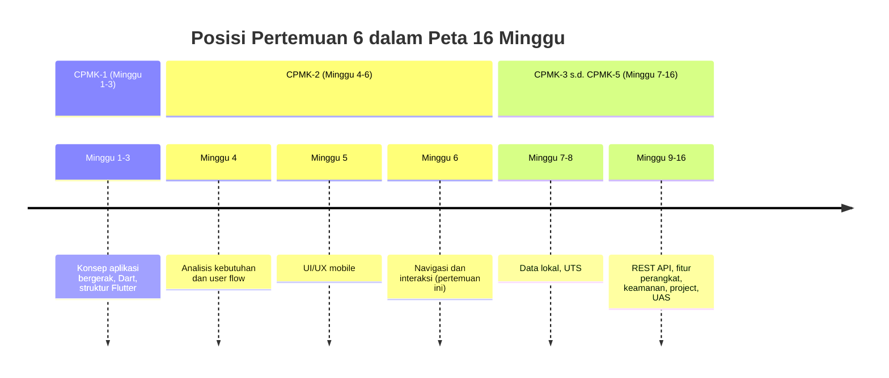
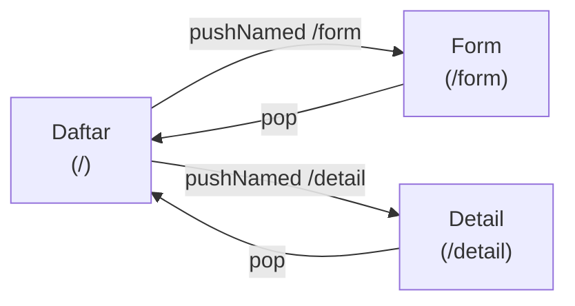
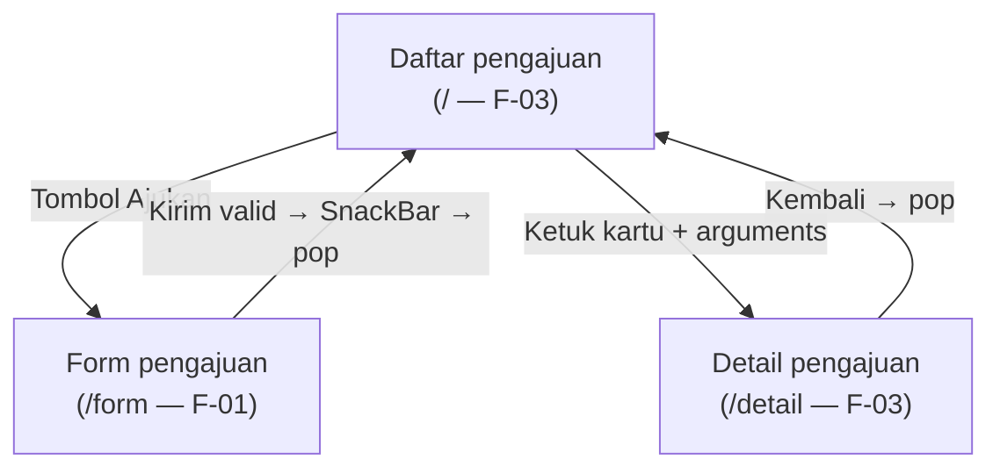
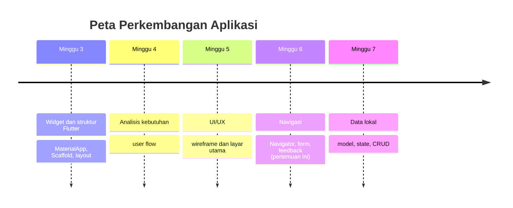

# Pertemuan 6 — Navigasi dan Interaksi

| | |
|:--|:--|
| **Minggu** | 6 |
| **Tanggal** | Rabu, 21 Oktober 2026 (SI-VIIB) / Sabtu, 24 Oktober 2026 (SI-VIIA) |
| **CPMK** | CPMK-2 |
| **Model Pembelajaran** | Case Based Learning / Problem Based Learning |
| **Stack** | Flutter (`Navigator`, route bernama, `Form`, `SnackBar`) tanpa package tambahan |

> **Catatan penting:** Pertemuan 6 membahas **navigasi dan interaksi**: menghubungkan beberapa layar yang dirancang pada Pertemuan 5 menjadi alur yang dapat dijalankan — route bernama, `Navigator.push` dan `Navigator.pop`, pengiriman data antarlayar, form dengan validasi, serta feedback interaksi (`SnackBar`). Pertemuan ini menuntaskan **M2 — UI/UX Prototype** (deliverable navigation flow) dan memulai **M3 — Implementasi Mobile Awal**.
>
> **Batas cakupan:** Pertemuan 6 menggunakan `Navigator` imperatif dengan route bernama yang tersedia bawaan Flutter — tanpa package tambahan, sehingga kode tetap berjalan pada DartPad dan target web. Routing deklaratif dengan package eksternal (mis. `go_router`) beserta deep linking berada di luar cakupan pertemuan ini. Penyimpanan permanen hasil form menjadi materi **Pertemuan 7** (data lokal); pada pertemuan ini aksi kirim berhenti pada validasi dan feedback.

---

## Daftar Isi

- [Pertemuan 6 — Navigasi dan Interaksi](#pertemuan-6--navigasi-dan-interaksi)
  - [Daftar Isi](#daftar-isi)
  - [1. Keterkaitan Pertemuan dengan RPS OBE](#1-keterkaitan-pertemuan-dengan-rps-obe)
  - [2. Capaian Pembelajaran Pertemuan](#2-capaian-pembelajaran-pertemuan)
  - [3. Pemantik Kasus: Aplikasi dengan Alur Navigasi yang Membingungkan](#3-pemantik-kasus-aplikasi-dengan-alur-navigasi-yang-membingungkan)
  - [4. Route dan Navigator](#4-route-dan-navigator)
  - [5. Data Antarlayar](#5-data-antarlayar)
  - [6. Form dan Validasi](#6-form-dan-validasi)
  - [7. Feedback Interaksi](#7-feedback-interaksi)
  - [8. Dari IA ke Navigation Flow](#8-dari-ia-ke-navigation-flow)
  - [9. Case Based Learning: Alur Pengajuan Peminjaman Ruang Laboratorium](#9-case-based-learning-alur-pengajuan-peminjaman-ruang-laboratorium)
  - [10. Aktivitas Kelompok](#10-aktivitas-kelompok)
  - [11. Latihan Individu](#11-latihan-individu)
  - [12. Pemanfaatan AI sebagai Coding Assistant](#12-pemanfaatan-ai-sebagai-coding-assistant)
  - [13. Kuis Formatif](#13-kuis-formatif)
  - [14. Keluaran Pembelajaran — Tugas 6](#14-keluaran-pembelajaran--tugas-6)
    - [Cara Pengumpulan — Push ke Repository GitHub Kelas](#cara-pengumpulan--push-ke-repository-github-kelas)
  - [15. Rubrik Tugas 6](#15-rubrik-tugas-6)
  - [16. Verifikasi Kode — Dua Jalur](#16-verifikasi-kode--dua-jalur)
    - [Jalur 1: DartPad (tanpa instalasi)](#jalur-1-dartpad-tanpa-instalasi)
    - [Jalur 2: Flutter SDK (sesuai Panduan Lengkap)](#jalur-2-flutter-sdk-sesuai-panduan-lengkap)
  - [17. Persiapan ke Pertemuan 7](#17-persiapan-ke-pertemuan-7)
  - [📎 Lampiran: Kode Praktikum](#-lampiran-kode-praktikum)

---

## 1. Keterkaitan Pertemuan dengan RPS OBE

Pertemuan 6 menuntaskan capaian **CPMK-2** — mahasiswa mampu menganalisis kebutuhan pengguna dan merancang solusi aplikasi bergerak yang sesuai dengan proses bisnis Sistem Informasi. Pada pertemuan ini, pembelajaran berfokus pada **menghubungkan layar dan merespons interaksi**: menyusun navigation flow dari information architecture (Pertemuan 5) dan user flow (Pertemuan 4), menerapkan route bernama dengan `Navigator`, mengirim data antarlayar, membuat form dengan validasi, dan memberikan feedback atas aksi pengguna.

> Layar yang belum terhubung belum membuktikan bahwa alur tugas dapat diselesaikan. Sebaliknya, alur yang menghubungkan layar tanpa validasi dan feedback menyulitkan pengguna: pengguna tidak mengetahui langkah berikutnya, mengisi form yang salah tanpa peringatan, dan menekan tombol tanpa kepastian. Pertemuan ini menghubungkan kedua aspek tersebut: setiap perpindahan layar harus dapat dijelaskan berdasarkan IA dan kebutuhan, dan setiap aksi pengguna harus mendapat respons yang dapat diperiksa.



Keterkaitan dengan milestone: pertemuan ini menuntaskan **M2 — UI/UX Prototype** (deliverable navigation flow) dan memulai **M3 — Implementasi Mobile Awal** yang dilanjutkan pada Pertemuan 7 dengan data lokal dan CRUD.

---

## 2. Capaian Pembelajaran Pertemuan

Setelah mengikuti pertemuan ini, mahasiswa mampu:

| No. | Kemampuan | Indikator |
|:---:|:----------|:----------|
| 1 | Menyusun navigation flow dari IA dan user flow | Menggambarkan diagram alur layar beserta nama route untuk tugas utama aplikasi |
| 2 | Menerapkan route bernama dengan `Navigator` | Berpindah antarlayar dengan `pushNamed` dan kembali dengan `pop` tanpa error |
| 3 | Mengirim data antarlayar melalui arguments | Menampilkan data yang dikirim dari layar daftar pada layar detail |
| 4 | Membuat form dengan validasi | Mencegah aksi kirim sebelum seluruh field valid; membersihkan controller pada `dispose` |
| 5 | Memberikan feedback atas interaksi pengguna | Menampilkan `SnackBar` setelah aksi dan pesan validasi pada field yang belum valid |

---

## 3. Pemantik Kasus: Aplikasi dengan Alur Navigasi yang Membingungkan

Perhatikan kutipan diskusi kelompok mahasiswa pada semester sebelumnya:

> "Aplikasi kami telah melewati review desain. Namun, saat demo, dosen menekan tombol kembali pada layar form dan aplikasi langsung tertutup. Ketika dosen mengosongkan seluruh field lalu menekan tombol Kirim, tidak ada peringatan dan tidak ada respons. Kami mengira navigasinya sudah benar karena tombolnya tampil."

Akibat yang umum terjadi ketika navigasi dan interaksi tidak dirancang:

| Gejala | Akar masalah | Konsekuensi |
|:-------|:-------------|:------------|
| Tombol kembali menutup aplikasi dari layar dalam | Layar dibuka tanpa route yang terdaftar pada stack `Navigator` | Pengguna kehilangan konteks dan harus mengulang dari awal |
| Setiap layar dapat dibuka, tetapi urutannya tidak jelas | Tidak ada navigation flow — layar dihubungkan langsung tanpa peta | Pengguna tidak mengetahui alur tugas yang harus diikuti |
| Form kosong dapat dikirim | Tidak ada validator pada field | Data tidak valid masuk ke proses berikutnya |
| Tombol ditekan tanpa respons | Tidak ada feedback setelah aksi | Pengguna menekan berulang kali atau mengira aplikasi tidak merespons |

Pertanyaan pemantik:

- Mengapa layar yang sudah bagus satu per satu tetap dapat menghasilkan aplikasi yang membingungkan?
- Apa yang harus terjadi ketika pengguna menekan tombol kembali pada layar form?
- Kapan aplikasi boleh diam setelah tombol ditekan, dan kapan aplikasi wajib merespons?

Pertemuan ini menjawab pertanyaan tersebut melalui route bernama, `Navigator`, pengiriman data antarlayar, form dengan validasi, dan feedback interaksi.

---

## 4. Route dan Navigator

**Route** adalah nama yang merujuk pada satu layar aplikasi. **Navigator** adalah pengelola tumpukan (*stack*) route — layar baru diletakkan di atas tumpukan dengan operasi push, dan layar teratas disingkirkan dengan operasi pop sehingga layar di bawahnya tampil kembali.

### 4.1 Peta Route Bernama

Peta route didefinisikan **sekali** pada `MaterialApp` melalui parameter `initialRoute` dan `routes`. Pendekatan ini menjaga satu sumber kebenaran: seluruh layar terdaftar pada satu tempat, dan setiap perpindahan merujuk nama yang sama.

```dart
MaterialApp(
  initialRoute: '/',
  routes: {
    '/': (context) => const HalamanUtamaMahasiswa(),
    '/form': (context) => const FormPengajuan(),
    '/detail': (context) => const DetailPengajuan(),
  },
);
```

`initialRoute` menentukan layar pertama; setiap entri `routes` memetakan nama route ke pembangun widget layar. Nama route ditulis sebagai konstanta string agar konsisten di seluruh kode.

### 4.2 Push dan Pop

Berpindah ke layar lain dilakukan dengan `Navigator.pushNamed`, kembali dilakukan dengan `Navigator.pop`:

```dart
// Maju ke form pengajuan.
Navigator.pushNamed(context, '/form');

// Kembali ke layar sebelumnya — menghapus layar teratas dari stack.
Navigator.pop(context);
```

Alur stack pada kasus peminjaman ruang:



Konsekuensi yang perlu diperhatikan: `pop` pada layar pertama (stack berisi satu route) menutup aplikasi. Oleh karena itu tombol kembali manual (`FilledButton` "Kembali") hanya dipasang pada layar yang memang dibuka melalui push — bukan pada layar utama.

### 4.3 Route Bernama Dibanding Route Langsung

| Aspek | Route bernama (`pushNamed`) | Route langsung (`MaterialPageRoute`) |
|:------|:----------------------------|:-------------------------------------|
| Pendaftaran layar | Terpusat pada `routes` | Tersebar pada setiap pemanggilan |
| Keterlacakan | Nama route dapat ditelusuri ke IA dan kebutuhan | Sulit ditelusuri karena konstruktor tersebar |
| Kecocokan materi | Digunakan pada Pertemuan 6 | Dikenal sebagai alternatif; tidak digunakan pada praktikum |

> **Kesalahan umum:** menulis nama route berbeda antara peta dan pemanggilan (mis. `/Form` dibanding `/form`) sehingga aplikasi menampilkan error pada layar saat tombol ditekan. Nama route bersifat case-sensitive — gunakan satu daftar nama dari navigation flow sebagai acuan, bukan dihafal.

---

## 5. Data Antarlayar

Layar detail perlu menampilkan data yang dipilih pada layar daftar. Pada Pertemuan 6, data dikirim melalui **arguments** pada saat push dan dibaca pada layar tujuan — layar tujuan bersifat read-only: menampilkan data tanpa mengubahnya.

### 5.1 Mengirim dan Membaca Arguments

```dart
// Layar daftar — mengirim data saat kartu diketuk.
Navigator.pushNamed(
  context,
  '/detail',
  arguments: pengajuan,
);
```

```dart
// Layar detail — membaca data yang dikirim.
final args = ModalRoute.of(context)?.settings.arguments;
final pengajuan = args is DataPengajuan ? args : null;
```

Pola baca tersebut menjawab tiga hal sekaligus: `ModalRoute.of(context)` dapat bernilai null bila widget tidak berada dalam route; `settings.arguments` bertipe `Object?` sehingga perlu pemeriksaan tipe (`is`); bila data tidak tersedia, layar menampilkan pesan pengganti alih-alih berhenti dengan error.

### 5.2 Batasan Pola Ini

| Aspek | Keputusan pada Pertemuan 6 | Alasan |
|:------|:---------------------------|:-------|
| Arah data | Satu arah: daftar → detail | Detail hanya menampilkan; pengubahan data menjadi materi Pertemuan 7 |
| Bentuk data | Objek sederhana (`DataPengajuan`) | Model formal dengan state menjadi materi Pertemuan 7 |
| Data tidak tersedia | Tampilkan teks pengganti | Layar tidak pernah berhenti dengan error karena data null |

> **Kesalahan umum:** membaca arguments tanpa pemeriksaan tipe (`as DataPengajuan` langsung) sehingga aplikasi mengalami error ketika route dibuka tanpa arguments — misalnya melalui deep link atau pengujian manual. Pemeriksaan `is` beserta cabang null adalah bentuk validasi yang sama pentingnya dengan validator form.

---

## 6. Form dan Validasi

**Form** adalah wadah yang mengelola status validasi sekumpulan field input. **Validator** adalah fungsi pada setiap field yang mengembalikan pesan error (berupa `String`) ketika input tidak valid, dan mengembalikan null ketika input valid.

### 6.1 Struktur Form

```dart
final _formKey = GlobalKey<FormState>();

Form(
  key: _formKey,
  child: ListView(
    children: [
      TextFormField(
        controller: _ruangController,
        decoration: const InputDecoration(
          labelText: 'Ruang',
          border: OutlineInputBorder(),
        ),
        validator: (value) {
          if (value == null || value.trim().isEmpty) {
            return 'Ruang wajib diisi.';
          }
          return null;
        },
      ),
      // ... field lain ...
    ],
  ),
);
```

`GlobalKey<FormState>` memegang status seluruh field dalam satu form; satu form memiliki tepat satu key. `TextFormField` menggabungkan field teks dengan validator — berbeda dari `TextField` biasa yang tidak memiliki validator.

### 6.2 Urutan Aksi Kirim

Aksi kirim selalu mengikuti urutan yang sama — validasi dahulu, kemudian baca, feedback, dan kembali:

```dart
void _kirim(BuildContext context) {
  if (!_formKey.currentState!.validate()) {
    return; // Berhenti — pesan error tampil otomatis di bawah field.
  }
  final ruang = _ruangController.text.trim();
  ScaffoldMessenger.of(context).showSnackBar(
    SnackBar(content: Text('Pengajuan "$ruang" dikirim (simulasi).')),
  );
  Navigator.pop(context);
}
```

`validate()` memicu seluruh validator dan mengembalikan false bila ada satu field tidak valid — pesan error tampil otomatis di bawah field yang bermasalah tanpa kode tambahan. Kata "(simulasi)" pada feedback bersifat sementara dan jujur: penyimpanan permanen belum ada hingga Pertemuan 7.

### 6.3 Controller dan Dispose

`TextEditingController` mengelola teks yang diketik pada satu field. Controller memegang sumber daya selama widget hidup, sehingga **wajib** dibersihkan pada `dispose`:

```dart
@override
void dispose() {
  _ruangController.dispose();
  _tanggalController.dispose();
  _jamController.dispose();
  super.dispose();
}
```

Konsekuensinya: form yang tidak memanggil `dispose` menumpuk controller yang tidak terpakai setiap kali layar dibuka — kebocoran memori yang tidak terlihat pada demo singkat, tetapi menumpuk pada pemakaian nyata. Oleh karena itu, layar yang memuat form ditulis sebagai `StatefulWidget`: `State` menyediakan siklus hidup `dispose` yang tidak dimiliki `StatelessWidget`.

### 6.4 Kesalahan Umum

| Kesalahan | Dampak | Perbaikan |
|:----------|:-------|:----------|
| Aksi kirim membaca controller tanpa `validate()` | Data kosong diteruskan seolah valid | Periksa `validate()` terlebih dahulu; berhenti bila false |
| Validator membandingkan `value == ''` tanpa null dan trim | Spasi lolos sebagai input valid; potensi error null | Periksa `value == null \|\| value.trim().isEmpty` |
| Controller tidak di-`dispose` | Kebocoran memori setiap layar dibuka | Bersihkan seluruh controller pada `dispose` |
| Form ditulis sebagai `StatelessWidget` | Tidak ada tempat membersihkan controller | Gunakan `StatefulWidget` untuk layar yang memuat form |

---

## 7. Feedback Interaksi

**Feedback** adalah respons terlihat yang diberikan aplikasi setelah pengguna melakukan aksi. Pada Pertemuan 6, dua bentuk feedback digunakan — masing-masing untuk momen yang berbeda:

| Momen | Bentuk | Contoh |
|:------|:-------|:-------|
| Field belum valid saat kirim ditekan | Pesan validator di bawah field | "Ruang wajib diisi." |
| Aksi berhasil dijalankan | `SnackBar` di bagian bawah layar | `Pengajuan "Lab Komputer 1" dikirim (simulasi).` |
| Sentuhan pada item daftar | Warna tertekan (`splashColor` dari tema) | `ListTile` berkedip mengikuti warna tema |

`SnackBar` ditampilkan melalui `ScaffoldMessenger`:

```dart
ScaffoldMessenger.of(context).showSnackBar(
  SnackBar(content: Text('Pengajuan "$ruang" dikirim (simulasi).')),
);
```

Prinsip pemilihan: pesan validator menjelaskan **apa yang salah dan di mana** (terikat pada field), sedangkan `SnackBar` mengonfirmasi **apa yang baru saja terjadi** (terikat pada aksi). Keduanya tidak saling menggantikan — form tanpa pesan validasi membuat pengguna menebak, dan aksi tanpa feedback membuat pengguna menekan tombol berulang kali.

---

## 8. Dari IA ke Navigation Flow

**Navigation flow** adalah diagram alur layar beserta nama route yang menghubungkan IA (Pertemuan 5) dengan implementasi `Navigator`. Tabel berikut menjadi pola penerjemahan yang digunakan pada praktikum, CBL, dan Tugas 6:

| Layar pada IA | Nama route | Dibuka dari | Data yang dikirim | Kebutuhan yang dipenuhi |
|:--------------|:-----------|:------------|:------------------|:------------------------|
| Daftar pengajuan (layar utama) | `/` | Awal (`initialRoute`) | — | F-03 |
| Form pengajuan | `/form` | Tombol Ajukan (`pushNamed`) | — (form diisi pengguna) | F-01 |
| Detail pengajuan | `/detail` | Ketukan kartu (`pushNamed` + arguments) | Objek pengajuan (read-only) | F-03 |



> **Prinsip penerjemahan:** setiap route pada peta `routes` berasal dari tepat satu layar IA, dan setiap layar IA yang menjadi tugas *Must have* memiliki route. Bila saat menulis kode Anda menambah route yang tidak ada pada IA, kembalikan ke rancangan: tambahkan layar tersebut pada IA beserta kebutuhan yang dipenuhinya, atau batalkan penambahan tersebut.

---

## 9. Case Based Learning: Alur Pengajuan Peminjaman Ruang Laboratorium

**Konteks (lanjutan kasus Pertemuan 4–5):** dokumen kebutuhan telah menetapkan F-01 mengajukan peminjaman (Must), F-02 menyetujui/menolak (Must), F-03 melihat status pengajuan (Must), dan F-04 mencari ruang (Should). Layar utama mahasiswa telah diimplementasikan pada Pertemuan 5. Tugas Anda sekarang menghubungkan layar tersebut menjadi alur: daftar → form pengajuan (F-01) dan daftar → detail (F-03).

**Data pendukung dari observasi (sama dengan Pertemuan 4–5):**

| Fakta observasi | Implikasi rancangan navigasi dan interaksi |
|:----------------|:-------------------------------------------|
| Mahasiswa mengurus peminjaman di sela jadwal kuliah (5–10 menit) | Alur utama maksimal tiga layar; tombol kembali selalu tersedia pada layar dalam |
| Mahasiswa menyebut lupa status pengajuannya | Ketukan kartu membuka detail berisi tanggal, jam, dan status yang sama dengan daftar |
| Bentrokan jadwal adalah keluhan terbanyak | Form menolak pengajuan kosong melalui validator sebelum data diteruskan |
| Laboran memproses pengajuan dua kali sehari | Feedback kirim menegaskan pengajuan tercatat (simulasi) agar mahasiswa tidak mengirim berulang |

Pertanyaan untuk dibahas bersama:

1. **Route apa saja** yang dibutuhkan dari IA Anda, dan layar IA mana yang menjadi `initialRoute`? (Petunjuk: layar utama memenuhi kebutuhan *Must have*.)
2. **Data apa yang dikirim** dari daftar ke detail, dan mengapa pola read-only cukup untuk F-03? (Petunjuk: Bagian 5 — siapa yang berhak mengubah status?)
3. **Field form mana** yang wajib divalidasi untuk F-01, dan apa pesan error masing-masing? (Petunjuk: Bagian 6 — tolak input kosong dan spasi.)
4. **Feedback apa** yang tampil setelah tombol Kirim ditekan, dan mengapa alur kembali ke daftar? (Petunjuk: Bagian 7 — konfirmasi aksi, bukan keheningan.)

Kode penyelesaian tersedia di [`code/pertemuan-06/demo-navigasi-flutter.dart`](../code/pertemuan-06/demo-navigasi-flutter.dart). Kerjakan latihan individu terlebih dahulu, kemudian bandingkan hasilnya dengan kode tersebut.

---

## 10. Aktivitas Kelompok

Bentuk kelompok yang terdiri atas 3–4 mahasiswa:

1. **Susun navigation flow bersama (15 menit)** — Ambil IA Tugas 5 kelompok lain. Daftarkan route (nama + layar), tetapkan `initialRoute`, dan gambarkan diagram alur (Mermaid) untuk satu tugas *Must have*. Periksa: apakah setiap route berasal dari satu layar IA? Route mana yang tidak memiliki kebutuhan?
2. **Kritik alur dan interaksi (15 menit)** — Tukarkan diagram dengan kelompok lain. Periksa dengan daftar berikut: tombol kembali tersedia pada setiap layar dalam; setiap form memiliki validator; setiap aksi memiliki feedback; tipe `arguments` diperiksa. Catat satu perbaikan untuk setiap pelanggaran yang ditemukan.
3. **Presentasi singkat (5 menit/kelompok)** — Satu kelompok memaparkan navigation flow dan alasan setiap route; kelompok lain menelusuri: route mana yang tidak dapat dijelaskan dari IA atau kebutuhan?

**Target:** setiap kelompok menghasilkan satu diagram navigation flow yang telah dikritik dan diperbaiki, beserta daftar keputusan route, data, validator, dan feedback.

---

## 11. Latihan Individu

Kerjakan setelah demonstrasi; kerangka TODO terbimbing tersedia di [`code/pertemuan-06/latihan-navigasi-flutter.dart`](../code/pertemuan-06/latihan-navigasi-flutter.dart). Kasus: **aplikasi perpustakaan bernavigasi — daftar buku menuju form peminjaman dan detail buku**.

1. **Langkah 1** — Susun navigation flow kecil (3 route) untuk domain aplikasi Anda dari IA Tugas 5; tetapkan `initialRoute` dan data yang dikirim tiap perpindahan.
2. **Langkah 2** — Kerjakan TODO 1–2: daftarkan peta route bernama pada `MaterialApp`, lalu hubungkan tombol Pinjam ke route form dengan `pushNamed`.
3. **Langkah 3** — Kerjakan TODO 3–4: kirim data buku melalui arguments saat kartu diketuk, lalu buat `ChipStatus` dan gunakan pada kartu.
4. **Langkah 4** — Kerjakan TODO 5–7: tulis aksi kirim dengan urutan validasi → feedback → pop, tambahkan validator tiap field, lalu buat layar detail read-only.
5. **Langkah 5** — Jalankan melalui [Jalur 1](#16-verifikasi-kode--dua-jalur) atau [Jalur 2](#16-verifikasi-kode--dua-jalur), lalu uji tiga skenario: kirim form kosong (validator muncul), kirim form valid (`SnackBar` tampil dan kembali ke daftar), buka detail lalu kembali (data tetap tampil).

---

## 12. Pemanfaatan AI sebagai Coding Assistant

**AI assistant (GitHub Copilot, ChatGPT, Claude, Gemini, Cursor) dapat digunakan sebagai alat bantu pembelajaran dengan ketentuan berikut:**

**✅ Gunakan AI untuk:**

- Menjelaskan perbedaan route bernama dengan route langsung dan kapan masing-masing tepat digunakan
- Membantu menafsirkan pesan error navigasi (mis. route tidak ditemukan, arguments bernilai null)
- Mengecek konsistensi pemetaan: apakah setiap route pada kode Anda sesuai layar IA dan kebutuhan
- Menyarankan pesan validator dan feedback yang jelas untuk form Anda

**❌ Jangan gunakan AI untuk:**

- Menghasilkan seluruh navigation flow, form, dan kode Tugas 6 — kemampuan menghubungkan layar dan memvalidasi input adalah inti yang dinilai pada CPMK-2
- Menentukan struktur alur sepenuhnya oleh AI tanpa alasan yang dapat Anda jelaskan dari IA dan kebutuhan

**Etika di kelas ini:**

1. Anda **wajib dapat menjelaskan** alasan setiap route, data yang dikirim, validator, dan feedback yang Anda tulis.
2. Jika memakai AI, **cantumkan** pada bagian akhir dokumen:

   ```text
   Deklarasi penggunaan AI: ChatGPT — meminta penjelasan pesan error
   "Could not find a generator for route"; perbaikan nama route
   dirumuskan ulang oleh penulis.
   ```

3. AI digunakan sebagai **asisten pembelajaran**, bukan sebagai **pengganti proses perancangan**. Dokumen dan kode yang dihasilkan penuh oleh AI tanpa proses rancangan Anda akan tampak dari ketidakmampuan menjelaskannya saat review.

---

## 13. Kuis Formatif

**Kuis formatif (10 menit, dikerjakan tanpa membuka catatan):**

1. Apa perbedaan `Navigator.pushNamed` dengan `Navigator.pop`? Kapan masing-masing digunakan?
2. Mengapa peta route didefinisikan terpusat pada `MaterialApp`, bukan tersebar pada setiap tombol?
3. Apa yang terjadi ketika `Navigator.pop` dipanggil pada layar pertama? Bagaimana rancangan menghindarinya?
4. Bagaimana layar detail membaca data yang dikirim melalui arguments, dan apa yang tampil bila data tidak tersedia?
5. Apa kontrak validator `TextFormField`: apa arti kembalian null dan kembalian string?
6. Mengapa controller form dibersihkan pada `dispose`, dan mengapa layar yang memuat form ditulis sebagai `StatefulWidget`?

---

## 14. Keluaran Pembelajaran — Tugas 6

**Tugas 6 — Navigation Flow dan Interaksi (dikumpulkan sebelum Pertemuan 7).** Panduan pengerjaan tersedia di [`contoh-tugas-6-mahasiswa.md`](./contoh-tugas-6-mahasiswa.md).

Gunakan **domain Sistem Informasi yang sama** dengan Tugas 1–5. Kerjakan:

1. **Buat file `navigation-flow.md`** berisi:
   - Daftar route dari IA Tugas 5 (nama route, layar, kebutuhan yang dipenuhi, `initialRoute`).
   - Diagram navigation flow (Mermaid) untuk satu tugas *Must have* — mencakup maju, kembali, dan pengiriman data.
   - Penjelasan singkat mengapa `initialRoute` tersebut dipilih.
2. **Buat file `form-interaksi.dart`** berisi:
   - `MaterialApp` dengan peta route bernama (`initialRoute` + `routes`) dari navigation flow Anda.
   - Navigasi maju (`pushNamed`) dan kembali (`pop`); layar dalam selalu menyediakan jalan kembali.
   - Pengiriman data melalui arguments dengan pemeriksaan tipe dan cabang null.
   - Satu form (`Form` + `GlobalKey<FormState>`) dengan validator pada setiap field dan controller yang dibersihkan pada `dispose`.
   - Feedback: pesan validator pada field dan `SnackBar` setelah aksi kirim.
3. **Ambil tangkapan layar hasil** pada target web (Chrome) atau DartPad: satu tangkapan layar detail terbuka dan satu tangkapan layar saat `SnackBar` tampil; simpan sebagai `screenshot-alur.png` dan `screenshot-feedback.png`.
4. **Buat file `catatan-keputusan-navigasi.md`** — tabel keputusan (nama route, data yang dikirim, validator tiap field, feedback tiap aksi) beserta alasan yang merujuk pada IA atau kebutuhan.
5. **Deklarasi penggunaan AI** (bila ada) sesuai format pada [Bagian 12](#12-pemanfaatan-ai-sebagai-coding-assistant).
6. **Refleksi** — 3 kalimat: bagian mana yang paling sulit dipertahankan konsistensinya antara navigation flow, kode, dan catatan keputusan — dan mengapa?

### Cara Pengumpulan — Push ke Repository GitHub Kelas

Tugas dikumpulkan dengan melakukan **push ke repository GitHub kelas** (sesuai kelas Anda):

| Kelas | Repository |
|:------|:-----------|
| SI-VIIB | `SI-VIIB-Mobile` |
| SI-VIIA | `SI-VIIA-Mobile` |

> Alamat lengkap repo (organisasi/URL) dibagikan melalui kanal kelas. Gunakan repo kelas Anda sendiri — tugas yang di-push ke kelas lain tidak dinilai.

Langkah pengumpulan:

1. *Clone* repo kelas, lalu buat folder tugas dengan nama `<nim>-<nama>`:
   ```bash
   git clone https://github.com/<org-kelas>/SI-VIIB-Mobile.git
   cd SI-VIIB-Mobile
   mkdir -p tugas-6/<nim>-<nama>
   ```
2. Simpan berkas tugas ke dalam folder tersebut:
   - `navigation-flow.md`, `form-interaksi.dart`, `screenshot-alur.png`, `screenshot-feedback.png`, `catatan-keputusan-navigasi.md`
   - `README.md` — deskripsi singkat + refleksi 3 kalimat + deklarasi penggunaan AI (bila ada).
3. Periksa kembali dokumen menggunakan daftar pemeriksaan pada [`contoh-tugas-6-mahasiswa.md`](./contoh-tugas-6-mahasiswa.md).
4. Commit dan push:
   ```bash
   git add tugas-6/<nim>-<nama>
   git commit -m "tugas-6: navigasi dan interaksi - <nama> <nim>"
   git push origin main
   ```
5. **Verifikasi** — buka repository di browser dan pastikan berkas tugas Anda telah tampil sebelum tenggat. Terlambat dihitung dari waktu *push* terakhir.

---

## 15. Rubrik Tugas 6

| Kriteria | Bobot | 4 (Sangat Baik) | 3 (Baik) | 2 (Cukup) | 1 (Perlu Bimbingan) |
|:---------|:-----:|:----------------|:---------|:----------|:--------------------|
| Navigation flow | 20% | Daftar route lengkap; setiap route tertelusur ke IA dan kebutuhan; `initialRoute` beralasan | Daftar route lengkap; penelusuran sebagian | Route ada, sebagian tanpa IA atau kebutuhan | Tidak ada navigation flow |
| Implementasi navigasi | 20% | `pushNamed`/`pop` benar; kembali tersedia di layar dalam; arguments diperiksa tipenya | Navigasi jalan; 1 aspek (kembali/arguments) kurang tepat | Alur jalan tetapi sebagian tombol tidak berfungsi | Tidak ada navigasi |
| Form dan validasi | 20% | Seluruh field bervalidasi; kirim tertahan saat tidak valid; controller di-`dispose` | Validator ada; 1 field atau `dispose` terlewat | Form ada tetapi kirim tanpa validasi | Tidak ada form |
| Feedback interaksi | 15% | `SnackBar` tiap aksi kirim; pesan validator jelas; sentuhan berfeedback tema | Feedback ada; 1 jenis terlewat | Feedback minim atau tidak konsisten | Tidak ada feedback |
| Catatan keputusan navigasi | 15% | Seluruh keputusan beralasan dan merujuk IA/kebutuhan | Keputusan lengkap, alasan sebagian | Catatan parsial tanpa alasan | Tidak ada catatan |
| Refleksi dan ketepatan waktu | 10% | Refleksi 3 kalimat logis, tepat waktu | Refleksi ada, kurang mendalam | Refleksi kurang dari 3 kalimat | Tidak ada / terlambat |

**Nilai = Σ(bobot × skor) / 16 × 100.** Pengumpulan terlambat: pengurangan 1 level rubrik per hari.

---

## 16. Verifikasi Kode — Dua Jalur

Kode praktikum dan Tugas 6 diverifikasi melalui dua jalur berikut — sama dengan Pertemuan 3 dan 5, tanpa emulator.

### Jalur 1: DartPad (tanpa instalasi)

1. Buka [DartPad](https://dartpad.dev/?template=app).
2. Ganti seluruh isi dengan kode navigasi Anda.
3. Tekan **Run** dan amati hasil pada panel kanan.

### Jalur 2: Flutter SDK (sesuai Panduan Lengkap)

1. Gunakan kode tersebut sebagai dasar pada `lib/main.dart` project hasil `flutter create`.
2. Jalankan dari folder project:
   ```bash
   flutter run -d chrome
   ```

Setelah aplikasi berjalan, periksa hasil dengan daftar berikut:

| No. | Pemeriksaan | Bila gagal |
|:---:|:------------|:-----------|
| 1 | Setiap tombol membuka route yang terdaftar pada peta | Samakan nama route dengan `routes`; nama bersifat case-sensitive |
| 2 | Layar dalam menyediakan jalan kembali; layar utama tidak menutup aplikasi saat kembali | Pasang tombol kembali hanya pada layar hasil push |
| 3 | Detail menampilkan data dari daftar; dibuka tanpa data menampilkan teks pengganti | Periksa arguments dengan `is` beserta cabang null |
| 4 | Kirim form kosong tertahan dan pesan validator tampil | Tambahkan validator; panggil `validate()` sebelum membaca input |
| 5 | Kirim form valid menampilkan `SnackBar` lalu kembali ke daftar | Urutkan: validasi → feedback → `pop` |
| 6 | Tidak ada pesan error analyzer yang diketahui | Jalankan `flutter analyze` (Jalur 2) sebelum mengumpulkan tugas |

Jalankan `flutter analyze` (Jalur 2) dan pastikan tidak terdapat error yang diketahui sebelum mengumpulkan tugas.

---

## 17. Persiapan ke Pertemuan 7

Pada pertemuan ini, mahasiswa telah mempelajari **navigasi dan interaksi**: route bernama, `Navigator.push` dan `Navigator.pop`, pengiriman data antarlayar, form dengan validasi, serta feedback interaksi. Navigation flow menuntaskan **M2 — UI/UX Prototype**. Pada **Pertemuan 7** (**Pengelolaan Data Lokal**, 28 Oktober 2026 — SI-VIIB; 31 Oktober 2026 — SI-VIIA), materi bergeser ke **menyimpan dan mengelola data di perangkat**: model data, state, dan CRUD lokal — memulai **M3 — Implementasi Mobile Awal** menuju MVP yang dapat didemonstrasikan.

**Persiapan:**

- Pastikan seluruh berkas Tugas 6 telah di-push sebelum pertemuan — navigation flow dan form Anda menjadi dasar penentuan data apa yang disimpan lokal pada Pertemuan 7.
- Tandai pada form Anda field-field yang akan menjadi penyimpanan permanen: field tersebut menjadi kandidat model data pertama.
- Tinjau kembali collection `List` dan `Map` dari materi Pertemuan 2 — data lokal pada Pertemuan 7 disimpan dalam struktur tersebut sebelum ditampilkan.



- **Pertemuan 3** — Menggunakan widget untuk membangun layar aplikasi.
- **Pertemuan 4** — Menganalisis kebutuhan dan menyusun user flow aplikasi SI.
- **Pertemuan 5** — Merancang dan mengimplementasikan layar utama berdasarkan dokumen kebutuhan.
- **Pertemuan 6** — Menghubungkan layar dengan navigasi dan merespons interaksi pengguna.
- **Pertemuan 7** — Menyimpan data form ke perangkat dan menampilkannya kembali.

---

### 📎 Lampiran: Kode Praktikum

| Berkas | Keterangan |
|:-------|:-----------|
| [`demo-navigasi-flutter.dart`](../code/pertemuan-06/demo-navigasi-flutter.dart) | Penyelesaian CBL: alur peminjaman ruang lab dengan route bernama, arguments, form validasi, dan `SnackBar` |
| [`latihan-navigasi-flutter.dart`](../code/pertemuan-06/latihan-navigasi-flutter.dart) | Latihan TODO terbimbing: aplikasi perpustakaan bernavigasi — form peminjaman dan detail buku (7 TODO) |
| [`contoh-tugas-6-mahasiswa.md`](./contoh-tugas-6-mahasiswa.md) | Panduan pengerjaan Tugas 6 untuk mahasiswa: definisi komponen, struktur dokumen, dan daftar pemeriksaan mandiri |
| [`panduan/Panduan-Lengkap-PAB.md`](../panduan/Panduan-Lengkap-PAB.md) | Skenario instalasi dan peta kebutuhan environment per pertemuan (Bagian 2.1) — Minggu 6 cukup dengan skenario ringan/standar (target web) |
| [`../MILESTONE.md`](../MILESTONE.md) | Milestone M2 (tuntas — navigation flow) dan M3 (dimulai — implementasi mobile awal) sebagai target pertemuan ini |
