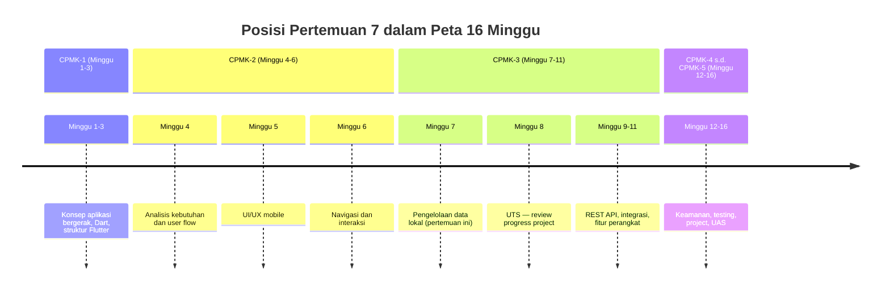
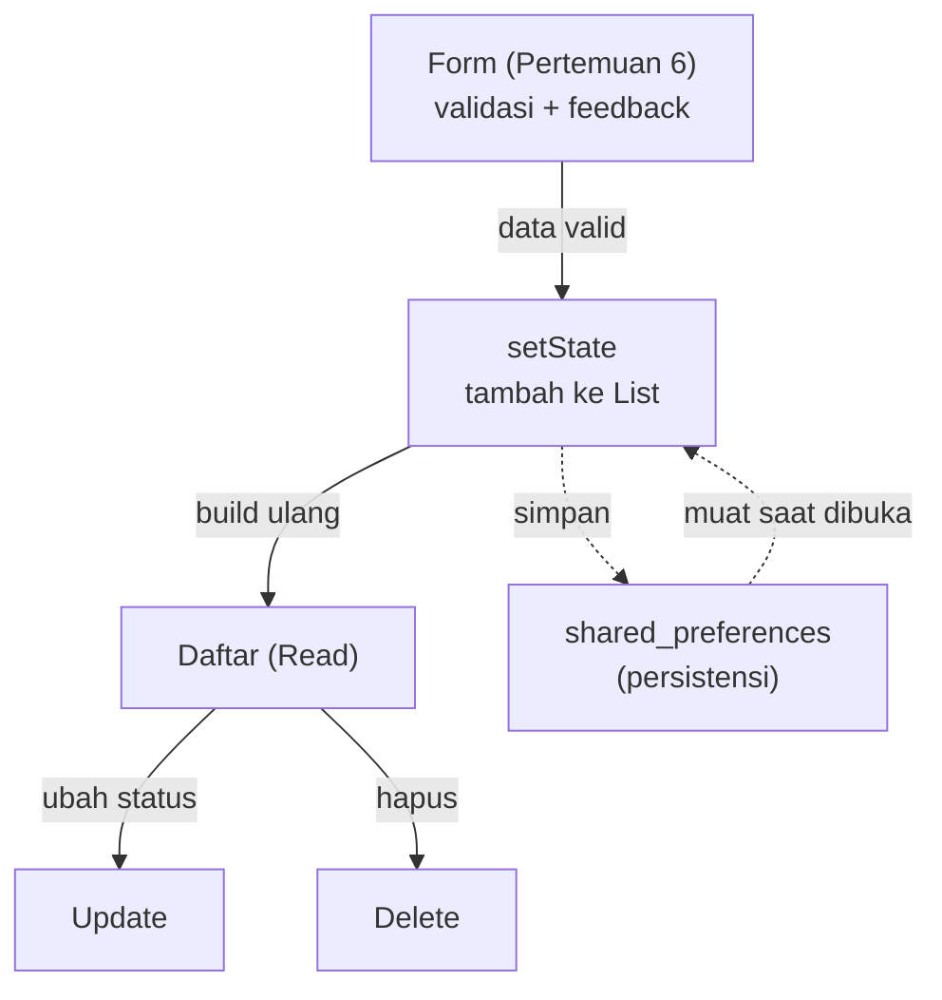
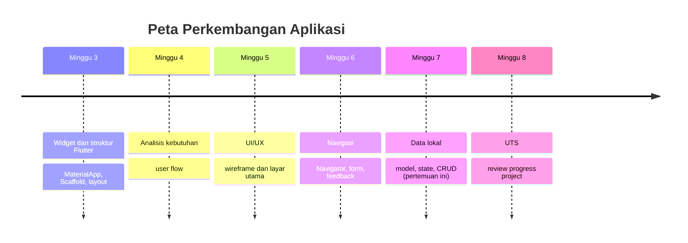

# Pertemuan 7 — Pengelolaan Data Lokal

| | |
|:--|:--|
| **Minggu** | 7 |
| **Tanggal** | Rabu, 28 Oktober 2026 (SI-VIIB) / Sabtu, 31 Oktober 2026 (SI-VIIA) |
| **CPMK** | CPMK-3 |
| **Model Pembelajaran** | Case Based Learning / Project Based Learning |
| **Stack** | Flutter (`StatefulWidget`, `setState`, model data, CRUD lokal) + package `shared_preferences` untuk persistensi |

> **Catatan penting:** Pertemuan 7 membahas **pengelolaan data lokal**: menyusun model data dari kebutuhan (Pertemuan 4), mengelola state dengan `StatefulWidget` dan `setState`, serta melakukan CRUD (Create, Read, Update, Delete) pada data yang disimpan di perangkat. Pertemuan ini menuntaskan **M3 — Implementasi Mobile Awal** (deliverable MVP awal) dan menjadi dasar review project pada **M4 — UTS** (Minggu 8).
>
> **Batas cakupan:** CRUD lokal pada pertemuan ini disimpan **dalam memori** (in-memory) menggunakan `List` — kode tetap berjalan pada DartPad dan target web tanpa package tambahan. **Persistensi** (data bertahan setelah aplikasi ditutup) diperkenalkan dengan package `shared_preferences` yang berjalan pada Flutter SDK (target web/Chrome). Database relasional lokal (`sqflite`) dan state management eksternal (mis. `provider`, `riverpod`) berada di luar cakupan pertemuan ini dan menjadi bahan pengembangan project lanjutan.

---

## Daftar Isi

- [Pertemuan 7 — Pengelolaan Data Lokal](#pertemuan-7--pengelolaan-data-lokal)
  - [Daftar Isi](#daftar-isi)
  - [1. Keterkaitan Pertemuan dengan RPS OBE](#1-keterkaitan-pertemuan-dengan-rps-obe)
  - [2. Capaian Pembelajaran Pertemuan](#2-capaian-pembelajaran-pertemuan)
  - [3. Pemantik Kasus: Data yang Hilang Setelah Aplikasi Ditutup](#3-pemantik-kasus-data-yang-hilang-setelah-aplikasi-ditutup)
  - [4. Model Data](#4-model-data)
  - [5. State dan setState](#5-state-dan-setstate)
  - [6. CRUD Lokal](#6-crud-lokal)
  - [7. Persistensi dengan shared_preferences](#7-persistensi-dengan-shared_preferences)
  - [8. Dari Form ke Data Lokal](#8-dari-form-ke-data-lokal)
  - [9. Case Based Learning: MVP Pengajuan Peminjaman Ruang Laboratorium](#9-case-based-learning-mvp-pengajuan-peminjaman-ruang-laboratorium)
  - [10. Aktivitas Kelompok](#10-aktivitas-kelompok)
  - [11. Latihan Individu](#11-latihan-individu)
  - [12. Pemanfaatan AI sebagai Coding Assistant](#12-pemanfaatan-ai-sebagai-coding-assistant)
  - [13. Kuis Formatif](#13-kuis-formatif)
  - [14. Keluaran Pembelajaran — Tugas 7](#14-keluaran-pembelajaran--tugas-7)
    - [Cara Pengumpulan — Push ke Repository GitHub Kelas](#cara-pengumpulan--push-ke-repository-github-kelas)
  - [15. Rubrik Tugas 7](#15-rubrik-tugas-7)
  - [16. Verifikasi Kode — Dua Jalur](#16-verifikasi-kode--dua-jalur)
    - [Jalur 1: DartPad (tanpa instalasi)](#jalur-1-dartpad-tanpa-instalasi)
    - [Jalur 2: Flutter SDK (sesuai Panduan Lengkap)](#jalur-2-flutter-sdk-sesuai-panduan-lengkap)
  - [17. Persiapan ke Pertemuan 8 (UTS)](#17-persiapan-ke-pertemuan-8-uts)
  - [📎 Lampiran: Kode Praktikum](#-lampiran-kode-praktikum)

---

## 1. Keterkaitan Pertemuan dengan RPS OBE

Pertemuan 7 memulai capaian **CPMK-3** — mahasiswa mampu mengimplementasikan aplikasi bergerak yang mengelola data sesuai kebutuhan proses bisnis Sistem Informasi. Pada pertemuan ini, pembelajaran berfokus pada **menyimpan dan mengelola data di perangkat**: menyusun model data dari kebutuhan (Pertemuan 4), mengelola state dengan `StatefulWidget` dan `setState`, melakukan CRUD lokal, serta memperkenalkan persistensi agar data bertahan setelah aplikasi ditutup.

> Form pada Pertemuan 6 berhenti pada validasi dan feedback — data yang dikirim tidak disimpan. Pertemuan 7 menjawab pertanyaan yang tertinggal: ke mana data itu pergi? Jawabannya adalah model data, state, dan CRUD lokal. Tanpa ketiganya, aplikasi hanya menampilkan data statis yang ditulis di kode; dengan ketiganya, aplikasi mulai menjadi MVP yang dapat digunakan — data dibuat, dibaca, diubah, dan dihapus oleh pengguna.



Keterkaitan dengan milestone: pertemuan ini menuntaskan **M3 — Implementasi Mobile Awal** (deliverable MVP awal: halaman utama, navigasi, form, data lokal, dan CRUD sederhana) dan menyiapkan **M4 — UTS Project Review** pada Minggu 8.

---

## 2. Capaian Pembelajaran Pertemuan

Setelah mengikuti pertemuan ini, mahasiswa mampu:

| No. | Kemampuan | Indikator |
|:---:|:----------|:----------|
| 1 | Menyusun model data dari kebutuhan | Mendefinisikan class model dengan field, konstruktor, dan representasi teks yang sesuai kebutuhan (Pertemuan 4) |
| 2 | Mengelola state dengan `StatefulWidget` dan `setState` | Menyimpan data pada `State`, memperbarui daftar setelah aksi, dan memicu pembaruan tampilan dengan `setState` |
| 3 | Melakukan CRUD lokal | Membuat, membaca, mengubah, dan menghapus data pada `List` melalui antarmuka pengguna tanpa error |
| 4 | Menerapkan persistensi dasar | Menyimpan dan memuat data dengan `shared_preferences` sehingga data bertahan setelah aplikasi ditutup |
| 5 | Menghubungkan form (Pertemuan 6) dengan data lokal | Data form yang valid tersimpan ke daftar dan tampil pada layar daftar |

---

## 3. Pemantik Kasus: Data yang Hilang Setelah Aplikasi Ditutup

Perhatikan kutipan diskusi kelompok mahasiswa pada semester sebelumnya:

> "Aplikasi kami sudah dapat mengisi form dan menampilkan feedback. Namun, setiap kali aplikasi ditutup dan dibuka kembali, seluruh data yang kami isi hilang. Kami menyadari bahwa data hanya tampil selama aplikasi berjalan — kami belum menyimpannya di mana pun."

Akibat yang umum terjadi ketika data tidak dikelola:

| Gejala | Akar masalah | Konsekuensi |
|:-------|:-------------|:------------|
| Data form hilang setelah aplikasi ditutup | Data hanya disimpan pada variabel sementara | Pengguna harus mengisi ulang dari awal |
| Daftar tidak berubah setelah aksi tambah | Tidak ada `setState` setelah data diubah | Tampilan tidak mencerminkan data terbaru |
| Data yang sama tampil di setiap layar | Tidak ada satu sumber data yang dikelola state | Layar menampilkan data berbeda-beda |
| Tidak ada cara mengubah atau menghapus data | Hanya menampilkan data statis | Aplikasi tidak dapat digunakan untuk tugas nyata |

Pertanyaan pemantik:

- Ke mana data form seharusnya disimpan setelah validasi?
- Apa yang terjadi pada tampilan ketika data ditambah, diubah, atau dihapus?
- Bagaimana data dapat bertahan setelah aplikasi ditutup?

Pertemuan ini menjawab pertanyaan tersebut melalui model data, state, CRUD lokal, dan persistensi dasar.

---

## 4. Model Data

**Model data** adalah class yang menggambarkan satu entitas data aplikasi — misalnya satu pengajuan peminjaman atau satu buku. Model menyatukan struktur data (field) dan perilaku sederhana (konstruktor, representasi teks) pada satu tempat, sehingga seluruh layar menggunakan bentuk data yang sama.

### 4.1 Mendefinisikan Model

```dart
class DataPengajuan {
  const DataPengajuan({
    required this.id,
    required this.ruang,
    required this.tanggal,
    required this.jam,
    required this.status,
  });

  final String id;
  final String ruang;
  final String tanggal;
  final String jam;
  final String status;
}
```

Setiap field bersifat `final` — data pengajuan tidak berubah setelah dibuat; perubahan (mis. status) menghasilkan objek baru. `required` memastikan setiap pembuatan objek mengisi seluruh field, sehingga tidak ada objek dengan data tidak lengkap.

### 4.2 Representasi Teks

Model dapat menyediakan representasi teks untuk keperluan tampilan dan pencarian:

```dart
@override
String toString() => 'Pengajuan $ruang — $tanggal ($jam)';
```

`toString` membantu saat mencetak data untuk pemeriksaan (debugging) dan menjadi dasar penampilan ringkas pada daftar.

### 4.3 Model Dibanding Data Statis

| Aspek | Data statis (Pertemuan 5–6) | Model data (Pertemuan 7) |
|:------|:----------------------------|:-------------------------|
| Asal data | Ditulis langsung pada kode (`const`) | Dibuat saat aksi pengguna (form) |
| Bentuk | Objek sederhana tanpa perilaku | Class dengan field, konstruktor, dan representasi teks |
| Perubahan | Tidak dapat diubah | Dapat ditambah, diubah, dihapus melalui CRUD |
| Keterkaitan kebutuhan | Menampilkan contoh | Field model diturunkan dari kebutuhan (Pertemuan 4) |

> **Kesalahan umum:** menulis data langsung pada widget tanpa model sehingga setiap layar mendefinisikan bentuk data yang berbeda. Model menyatukan bentuk data pada satu tempat — perubahan struktur cukup dilakukan sekali, bukan di setiap layar.

---

## 5. State dan setState

**State** adalah data yang dimiliki dan dikelola oleh satu widget selama widget tersebut hidup. **`setState`** adalah metode yang memberi tahu Flutter bahwa data berubah sehingga widget perlu dibangun ulang dengan data terbaru.

### 5.1 StatefulWidget dan State

Widget yang menyimpan data yang berubah ditulis sebagai `StatefulWidget` — dua class: widget itu sendiri (tidak berubah) dan `State` (menyimpan data yang berubah):

```dart
class HalamanDaftarPengajuan extends StatefulWidget {
  const HalamanDaftarPengajuan({super.key});

  @override
  State<HalamanDaftarPengajuan> createState() => _HalamanDaftarPengajuanState();
}

class _HalamanDaftarPengajuanState extends State<HalamanDaftarPengajuan> {
  final List<DataPengajuan> _daftar = [];

  @override
  Widget build(BuildContext context) {
    // Membangun tampilan dari _daftar.
  }
}
```

`_daftar` adalah state — data yang dimiliki layar. `build` membaca state untuk menampilkan daftar; setiap kali state berubah, `build` dipanggil ulang.

### 5.2 setState

Setiap aksi yang mengubah data wajib dibungkus `setState`:

```dart
void _tambah(DataPengajuan pengajuan) {
  setState(() {
    _daftar.add(pengajuan);
  });
}
```

Tanpa `setState`, `_daftar` berubah tetapi tampilan tidak diperbarui — pengguna tidak melihat data baru. `setState` menghubungkan data dan tampilan: data berubah, Flutter membangun ulang widget, tampilan mencerminkan data terbaru.

### 5.3 Kapan setState Diperlukan

| Aksi | Perubahan data | setState |
|:-----|:---------------|:--------:|
| Menambah pengajuan | `_daftar.add(...)` | Wajib |
| Mengubah status | Objek baru menggantikan yang lama | Wajib |
| Menghapus pengajuan | `_daftar.removeWhere(...)` | Wajib |
| Membaca data saat layar dibuka | Tidak mengubah data | Tidak perlu |

> **Kesalahan umum:** mengubah `_daftar` tanpa `setState` sehingga tampilan tidak berubah, atau memanggil `setState` tanpa mengubah data sehingga widget dibangun ulang tanpa alasan. Keduanya dihindari dengan satu aturan: panggil `setState` tepat setelah data benar-benar berubah.

---

## 6. CRUD Lokal

**CRUD** adalah empat operasi dasar pengelolaan data: **Create** (membuat), **Read** (membaca), **Update** (mengubah), dan **Delete** (menghapus). Pada pertemuan ini, CRUD dijalankan pada `List` yang disimpan dalam state.

### 6.1 Create — Menambah Data

Data dibuat dari form (Pertemuan 6) dan ditambahkan ke daftar:

```dart
void _simpanPengajuan() {
  if (!_formKey.currentState!.validate()) {
    return;
  }
  final pengajuan = DataPengajuan(
    id: DateTime.now().millisecondsSinceEpoch.toString(),
    ruang: _ruangController.text.trim(),
    tanggal: _tanggalController.text.trim(),
    jam: _jamController.text.trim(),
    status: 'menunggu',
  );
  setState(() {
    _daftar.add(pengajuan);
  });
  Navigator.pop(context);
}
```

`id` dihasilkan dari waktu saat ini agar setiap data unik — id menjadi kunci untuk operasi update dan delete. Urutan aksi sama dengan Pertemuan 6: validasi → buat data → `setState` → feedback → kembali.

### 6.2 Read — Menampilkan Data

Daftar ditampilkan dengan `ListView.builder` yang membaca state:

```dart
ListView.builder(
  itemCount: _daftar.length,
  itemBuilder: (context, index) {
    final pengajuan = _daftar[index];
    return Card(
      child: ListTile(
        title: Text(pengajuan.ruang),
        subtitle: Text('${pengajuan.tanggal} — ${pengajuan.jam}'),
        trailing: ChipStatus(status: pengajuan.status),
        onTap: () => _bukaDetail(pengajuan),
      ),
    );
  },
)
```

`itemCount` dan `itemBuilder` membaca state pada setiap pembangunan — ketika `setState` dipanggil, daftar dibangun ulang dan menampilkan data terbaru.

### 6.3 Update — Mengubah Data

Mengubah data berarti membuat objek baru dengan nilai yang diperbarui, lalu menggantikan objek lama pada posisi yang sama:

```dart
void _ubahStatus(String id, String statusBaru) {
  setState(() {
    final index = _daftar.indexWhere((p) => p.id == id);
    if (index != -1) {
      final lama = _daftar[index];
      _daftar[index] = DataPengajuan(
        id: lama.id,
        ruang: lama.ruang,
        tanggal: lama.tanggal,
        jam: lama.jam,
        status: statusBaru,
      );
    }
  });
}
```

`indexWhere` mencari posisi data berdasarkan `id`; objek baru menggantikan objek lama pada posisi tersebut. Field yang tidak berubah disalin dari objek lama.

### 6.4 Delete — Menghapus Data

Menghapus data dilakukan dengan `removeWhere` berdasarkan `id`:

```dart
void _hapus(String id) {
  setState(() {
    _daftar.removeWhere((p) => p.id == id);
  });
}
```

Penghapusan data yang mengubah daftar permanen sebaiknya dikonfirmasi terlebih dahulu — `showDialog` menanyakan kepastian sebelum data dihapus:

```dart
Future<void> _konfirmasiHapus(DataPengajuan pengajuan) async {
  final yakin = await showDialog<bool>(
    context: context,
    builder: (context) => AlertDialog(
      title: const Text('Hapus pengajuan?'),
      content: Text('Pengajuan ${pengajuan.ruang} akan dihapus.'),
      actions: [
        TextButton(
          onPressed: () => Navigator.pop(context, false),
          child: const Text('Batal'),
        ),
        FilledButton(
          onPressed: () => Navigator.pop(context, true),
          child: const Text('Hapus'),
        ),
      ],
    ),
  );
  if (yakin == true) {
    _hapus(pengajuan.id);
  }
}
```

### 6.5 Ringkasan CRUD

| Operasi | Method `List` | Kunci |
|:--------|:--------------|:------|
| Create | `add` | Data baru dengan `id` unik |
| Read | `itemCount` + `itemBuilder` | Membaca state pada `build` |
| Update | `indexWhere` + penggantian objek | `id` untuk menemukan posisi |
| Delete | `removeWhere` | `id` untuk menghapus data yang tepat |

> **Kesalahan umum:** menggunakan `index` daftar sebagai kunci operasi — ketika data dihapus, index berubah dan operasi mengenai data yang salah. `id` yang unik dan tidak berubah adalah kunci yang aman untuk update dan delete.

---

## 7. Persistensi dengan shared_preferences

CRUD pada Bagian 6 menyimpan data **dalam memori** — data hilang ketika aplikasi ditutup. **Persistensi** menyimpan data ke penyimpanan perangkat sehingga data bertahan. Pada pertemuan ini, persistensi diperkenalkan dengan package `shared_preferences` — penyimpanan pasangan kunci-nilai yang sederhana dan mendukung target web.

### 7.1 Menambahkan Package

Tambahkan `shared_preferences` pada `pubspec.yaml`:

```yaml
dependencies:
  flutter:
    sdk: flutter
  shared_preferences: ^2.3.0
```

Kemudian jalankan `flutter pub get` dari folder project. Package ini **tidak berjalan pada DartPad** — persistensi diverifikasi melalui Jalur 2 (Flutter SDK).

### 7.2 Menyimpan dan Memuat Data

`shared_preferences` menyimpan nilai sederhana (string, angka, boolean). Data model disimpan sebagai teks JSON — satu string per daftar:

```dart
import 'dart:convert';
import 'package:shared_preferences/shared_preferences.dart';

Future<void> _simpanKePenyimpanan() async {
  final prefs = await SharedPreferences.getInstance();
  final teks = jsonEncode(
    _daftar.map((p) => {
      'id': p.id,
      'ruang': p.ruang,
      'tanggal': p.tanggal,
      'jam': p.jam,
      'status': p.status,
    }).toList(),
  );
  await prefs.setString('daftar_pengajuan', teks);
}

Future<void> _muatDariPenyimpanan() async {
  final prefs = await SharedPreferences.getInstance();
  final teks = prefs.getString('daftar_pengajuan');
  if (teks == null) {
    return;
  }
  final data = jsonDecode(teks) as List<dynamic>;
  setState(() {
    _daftar.clear();
    _daftar.addAll(
      data.map((item) => DataPengajuan(
        id: item['id'] as String,
        ruang: item['ruang'] as String,
        tanggal: item['tanggal'] as String,
        jam: item['jam'] as String,
        status: item['status'] as String,
      )),
    );
  });
}
```

`jsonEncode` mengubah daftar menjadi teks; `jsonDecode` mengubah teks kembali menjadi daftar objek. `_muatDariPenyimpanan` dipanggil saat layar dibuka (pada `initState`), `_simpanKePenyimpanan` dipanggil setelah setiap perubahan data. Implementasi lengkap tersedia di [`code/pertemuan-07/demo-persistensi-flutter.dart`](../code/pertemuan-07/demo-persistensi-flutter.dart) — file ini hanya berjalan pada Jalur 2 (Flutter SDK).

### 7.3 Kapan Persistensi Diperlukan

| Kebutuhan (Pertemuan 4) | Tanpa persistensi | Dengan persistensi |
|:-------------------------|:------------------|:-------------------|
| Data tampil saat aplikasi dibuka | Data kosong setiap kali | Data terakhir tetap tampil |
| Pengguna menutup aplikasi di tengah tugas | Data hilang | Data tersimpan |
| Konektivitas terbatas | Tidak ada data offline | Data lokal tersedia |

> **Kesalahan umum:** memanggil `_simpanKePenyimpanan` tanpa `await` sehingga penyimpanan belum selesai saat aplikasi ditutup, atau memuat data tanpa memeriksa null sehingga aplikasi error saat penyimpanan kosong. Operasi penyimpanan bersifat asinkron — selalu `await` dan periksa hasil baca.

---

## 8. Dari Form ke Data Lokal

Pertemuan 6 dan 7 saling melengkapi: form menghasilkan data, data lokal menyimpannya. Tabel berikut menjadi pola penerjemahan yang digunakan pada praktikum, CBL, dan Tugas 7:

| Tahap | Pertemuan 6 | Pertemuan 7 |
|:------|:------------|:------------|
| Input | Form dengan validasi | Data valid dari form |
| Penyimpanan | Feedback `SnackBar` (simulasi) | `setState` + `List` (in-memory) |
| Tampilan | Data statis dari kode | Daftar dibaca dari state |
| Perubahan | Tidak ada | CRUD: tambah, ubah, hapus |
| Ketahanan | Data hilang saat ditutup | Persistensi `shared_preferences` |



> **Prinsip penerjemahan:** setiap field pada form (Pertemuan 6) menjadi field pada model data, dan setiap kebutuhan *Must have* yang melibatkan data (Pertemuan 4) dipenuhi oleh minimal satu operasi CRUD. Bila ada kebutuhan yang tidak dapat dipenuhi CRUD lokal, catat sebagai kebutuhan yang memerlukan backend (Pertemuan 9–10).

---

## 9. Case Based Learning: MVP Pengajuan Peminjaman Ruang Laboratorium

**Konteks (lanjutan kasus Pertemuan 4–6):** dokumen kebutuhan telah menetapkan F-01 mengajukan peminjaman (Must), F-02 menyetujui/menolak (Must), F-03 melihat status pengajuan (Must), dan F-04 mencari ruang (Should). Navigation flow dan form telah diimplementasikan pada Pertemuan 6 — tetapi data pengajuan masih statis dan form hanya menampilkan feedback simulasi. Tugas Anda sekarang mengubah aplikasi menjadi **MVP awal**: data pengajuan dibuat dari form, disimpan dalam state, ditampilkan pada daftar, dapat diubah statusnya, dan dapat dihapus.

**Data pendukung dari observasi (sama dengan Pertemuan 4–6):**

| Fakta observasi | Implikasi rancangan data lokal |
|:----------------|:-------------------------------|
| Mahasiswa mengurus peminjaman di sela jadwal kuliah (5–10 menit) | Daftar langsung diperbarui setelah kirim; tidak ada langkah tambahan |
| Mahasiswa menyebut lupa status pengajuannya | Status disimpan pada model dan tampil pada daftar serta detail |
| Laboran memproses pengajuan dua kali sehari | Status dapat diubah dari "menunggu" menjadi "disetujui"/"ditolak" |
| Mahasiswa kadang mengajukan salah ruang | Pengajuan dapat dihapus dengan konfirmasi |

Pertanyaan untuk dibahas bersama:

1. **Field apa saja** yang dimiliki model `DataPengajuan`, dan dari kebutuhan mana setiap field berasal? (Petunjuk: Bagian 4 — field diturunkan dari F-01 dan F-03.)
2. **Aksi apa saja** yang memerlukan `setState`, dan apa yang tampil bila `setState` tidak dipanggil? (Petunjuk: Bagian 5 — tampilan tidak mencerminkan data.)
3. **Operasi CRUD mana** yang memenuhi F-01, F-02, dan F-03? (Petunjuk: Bagian 6 — Create untuk F-01, Update untuk F-02, Read untuk F-03.)
4. **Kapan data perlu dipersistensikan**, dan apa konsekuensinya bila tidak? (Petunjuk: Bagian 7 — data hilang saat aplikasi ditutup.)

Kode penyelesaian tersedia di [`code/pertemuan-07/demo-data-lokal-flutter.dart`](../code/pertemuan-07/demo-data-lokal-flutter.dart) (CRUD in-memory) dan [`code/pertemuan-07/demo-persistensi-flutter.dart`](../code/pertemuan-07/demo-persistensi-flutter.dart) (persistensi, Jalur 2). Kerjakan latihan individu terlebih dahulu, kemudian bandingkan hasilnya dengan kode tersebut.

---

## 10. Aktivitas Kelompok

Bentuk kelompok yang terdiri atas 3–4 mahasiswa:

1. **Susun model data bersama (15 menit)** — Ambil dokumen kebutuhan Tugas 4 kelompok lain. Identifikasi 2–3 entitas data utama, lalu definisikan field model untuk setiap entitas beserta kebutuhan yang dipenuhi. Periksa: apakah setiap field dapat diisi dari form atau data yang tersedia?
2. **Petakan CRUD ke kebutuhan (15 menit)** — Untuk setiap kebutuhan *Must have* yang melibatkan data, tentukan operasi CRUD yang memenuhinya. Catat kebutuhan yang tidak dapat dipenuhi CRUD lokal (mis. data bersama antar pengguna) sebagai kandidat backend.
3. **Presentasi singkat (5 menit/kelompok)** — Satu kelompok memaparkan model data dan peta CRUD; kelompok lain menelusuri: entitas mana yang tidak memiliki operasi CRUD lengkap, dan kebutuhan mana yang tidak tertangani?

**Target:** setiap kelompok menghasilkan satu daftar model data (entitas + field + kebutuhan) dan satu peta CRUD yang telah dikritik dan diperbaiki.

---

## 11. Latihan Individu

Kerjakan setelah demonstrasi; kerangka TODO terbimbing tersedia di [`code/pertemuan-07/latihan-data-lokal-flutter.dart`](../code/pertemuan-07/latihan-data-lokal-flutter.dart). Kasus: **aplikasi perpustakaan dengan data lokal — daftar buku yang dapat ditambah, diubah, dan dihapus**.

1. **Langkah 1** — Identifikasi field model `DataBuku` dari form peminjaman Tugas 6 Anda; tentukan field yang menjadi `id` unik.
2. **Langkah 2** — Kerjakan TODO 1–2: definisikan model `DataBuku` dengan field, konstruktor, dan `toString`; ubah layar daftar menjadi `StatefulWidget` dengan `List<DataBuku>` pada state.
3. **Langkah 3** — Kerjakan TODO 3–4: tambahkan data dari form ke daftar dengan `setState`; tampilkan daftar dengan `ListView.builder` yang membaca state.
4. **Langkah 4** — Kerjakan TODO 5–6: ubah status buku (tersedia/habis) dengan penggantian objek; hapus buku dengan konfirmasi `AlertDialog`.
5. **Langkah 5** — Jalankan melalui [Jalur 1](#16-verifikasi-kode--dua-jalur) atau [Jalur 2](#16-verifikasi-kode--dua-jalur), lalu uji tiga skenario: tambah buku (daftar bertambah), ubah status (daftar diperbarui), hapus buku (daftar berkurang setelah konfirmasi).

---

## 12. Pemanfaatan AI sebagai Coding Assistant

**AI assistant (GitHub Copilot, ChatGPT, Claude, Gemini, Cursor) dapat digunakan sebagai alat bantu pembelajaran dengan ketentuan berikut:**

**✅ Gunakan AI untuk:**

- Menjelaskan perbedaan state in-memory dengan persistensi dan kapan masing-masing tepat digunakan
- Membantu menafsirkan pesan error CRUD (mis. data tidak ditemukan, index di luar jangkauan)
- Mengecek konsistensi: apakah setiap field model berasal dari kebutuhan dan setiap kebutuhan *Must have* dipenuhi CRUD
- Menyarankan struktur model data dan pesan konfirmasi yang jelas untuk operasi hapus

**❌ Jangan gunakan AI untuk:**

- Menghasilkan seluruh model data, CRUD, dan kode Tugas 7 — kemampuan menyusun model dan mengelola data adalah inti yang dinilai pada CPMK-3
- Menentukan struktur data sepenuhnya oleh AI tanpa alasan yang dapat Anda jelaskan dari kebutuhan

**Etika di kelas ini:**

1. Anda **wajib dapat menjelaskan** alasan setiap field model, operasi CRUD, dan keputusan persistensi yang Anda tulis.
2. Jika memakai AI, **cantumkan** pada bagian akhir dokumen:

   ```text
   Deklarasi penggunaan AI: ChatGPT — meminta penjelasan pesan error
   "RangeError (index)"; perbaikan pencarian data dengan id dirumuskan
   ulang oleh penulis.
   ```

3. AI digunakan sebagai **asisten pembelajaran**, bukan sebagai **pengganti proses perancangan**. Dokumen dan kode yang dihasilkan penuh oleh AI tanpa proses rancangan Anda akan tampak dari ketidakmampuan menjelaskannya saat review.

---

## 13. Kuis Formatif

**Kuis formatif (10 menit, dikerjakan tanpa membuka catatan):**

1. Apa perbedaan data statis (Pertemuan 5–6) dengan model data (Pertemuan 7)? Mengapa model data diperlukan?
2. Apa fungsi `setState`, dan apa yang terjadi bila data diubah tanpa `setState`?
3. Sebutkan empat operasi CRUD beserta method `List` yang digunakan pada pertemuan ini.
4. Mengapa `id` digunakan sebagai kunci operasi update dan delete, bukan index daftar?
5. Apa perbedaan penyimpanan in-memory dengan persistensi `shared_preferences`? Kapan masing-masing digunakan?
6. Mengapa operasi `shared_preferences` bersifat asinkron, dan apa yang terjadi bila `await` diabaikan?

---

## 14. Keluaran Pembelajaran — Tugas 7

**Tugas 7 — MVP Awal dengan Data Lokal (dikumpulkan sebelum Pertemuan 8/UTS).** Panduan pengerjaan tersedia di [`contoh-tugas-7-mahasiswa.md`](./contoh-tugas-7-mahasiswa.md).

Gunakan **domain Sistem Informasi yang sama** dengan Tugas 1–6. Kerjakan:

1. **Buat file `model-data.md`** berisi:
   - Daftar entitas data utama dari dokumen kebutuhan Tugas 4 (entitas, field, tipe, kebutuhan yang dipenuhi).
   - Penjelasan singkat mengapa setiap field diperlukan dan dari mana nilainya berasal (form, sistem, atau perhitungan).
2. **Buat file `crud-lokal.dart`** berisi:
   - Model data dengan field, konstruktor, dan `toString`.
   - Layar daftar sebagai `StatefulWidget` dengan `List` pada state.
   - CRUD lengkap: tambah dari form (`setState`), tampilkan dengan `ListView.builder`, ubah data (penggantian objek), hapus dengan konfirmasi.
   - Setiap aksi yang mengubah data dibungkus `setState`.
3. **Ambil tangkapan layar hasil** pada target web (Chrome) atau DartPad: satu tangkapan layar daftar berisi data hasil tambah dan satu tangkapan layar dialog konfirmasi hapus; simpan sebagai `screenshot-daftar.png` dan `screenshot-hapus.png`.
4. **Buat file `catatan-keputusan-data.md`** — tabel keputusan (field model, operasi CRUD, kunci data, keputusan persistensi) beserta alasan yang merujuk pada kebutuhan.
5. **Deklarasi penggunaan AI** (bila ada) sesuai format pada [Bagian 12](#12-pemanfaatan-ai-sebagai-coding-assistant).
6. **Refleksi** — 3 kalimat: bagian mana yang paling sulit dipertahankan konsistensinya antara model data, CRUD, dan kebutuhan — dan mengapa?

### Cara Pengumpulan — Push ke Repository GitHub Kelas

Tugas dikumpulkan dengan melakukan **push ke repository GitHub kelas** (sesuai kelas Anda):

| Kelas | Repository |
|:------|:-----------|
| SI-VIIB | `SI-VIIB-Mobile` |
| SI-VIIA | `SI-VIIA-Mobile` |

> Alamat lengkap repo (organisasi/URL) dibagikan melalui kanal kelas. Gunakan repo kelas Anda sendiri — tugas yang di-push ke kelas lain tidak dinilai.

Langkah pengumpulan:

1. *Clone* repo kelas, lalu buat folder tugas dengan nama `<nim>-<nama>`:
   ```bash
   git clone https://github.com/<org-kelas>/SI-VIIB-Mobile.git
   cd SI-VIIB-Mobile
   mkdir -p tugas-7/<nim>-<nama>
   ```
2. Simpan berkas tugas ke dalam folder tersebut:
   - `model-data.md`, `crud-lokal.dart`, `screenshot-daftar.png`, `screenshot-hapus.png`, `catatan-keputusan-data.md`
   - `README.md` — deskripsi singkat + refleksi 3 kalimat + deklarasi penggunaan AI (bila ada).
3. Periksa kembali dokumen menggunakan daftar pemeriksaan pada [`contoh-tugas-7-mahasiswa.md`](./contoh-tugas-7-mahasiswa.md).
4. Commit dan push:
   ```bash
   git add tugas-7/<nim>-<nama>
   git commit -m "tugas-7: data lokal dan CRUD - <nama> <nim>"
   git push origin main
   ```
5. **Verifikasi** — buka repository di browser dan pastikan berkas tugas Anda telah tampil sebelum tenggat. Terlambat dihitung dari waktu *push* terakhir.

---

## 15. Rubrik Tugas 7

| Kriteria | Bobot | 4 (Sangat Baik) | 3 (Baik) | 2 (Cukup) | 1 (Perlu Bimbingan) |
|:---------|:-----:|:----------------|:---------|:----------|:--------------------|
| Model data | 20% | Field lengkap, setiap field tertelusur ke kebutuhan dan sumber nilai | Field lengkap; penelusuran sebagian | Model ada, sebagian field tanpa kebutuhan | Tidak ada model data |
| State dan `setState` | 20% | Data pada state; setiap perubahan dibungkus `setState`; tampilan selalu sinkron | `setState` pada sebagian aksi | Data berubah tanpa `setState` pada beberapa aksi | Tidak ada state |
| CRUD lengkap | 25% | Create, Read, Update, Delete berjalan; `id` sebagai kunci; hapus dengan konfirmasi | CRUD jalan; 1 aspek (kunci/konfirmasi) kurang tepat | Sebagian operasi tidak berfungsi | Tidak ada CRUD |
| Keterkaitan kebutuhan | 15% | Setiap kebutuhan *Must have* data dipenuhi CRUD; kebutuhan backend dicatat | Keterkaitan sebagian | Keterkaitan lemah | Tidak ada keterkaitan |
| Catatan keputusan data | 10% | Seluruh keputusan beralasan dan merujuk kebutuhan | Keputusan lengkap, alasan sebagian | Catatan parsial tanpa alasan | Tidak ada catatan |
| Refleksi dan ketepatan waktu | 10% | Refleksi 3 kalimat logis, tepat waktu | Refleksi ada, kurang mendalam | Refleksi kurang dari 3 kalimat | Tidak ada / terlambat |

**Nilai = Σ(bobot × skor) / 16 × 100.** Pengumpulan terlambat: pengurangan 1 level rubrik per hari.

---

## 16. Verifikasi Kode — Dua Jalur

Kode praktikum dan Tugas 7 diverifikasi melalui dua jalur berikut — sama dengan Pertemuan 3, 5, dan 6, tanpa emulator.

### Jalur 1: DartPad (tanpa instalasi)

1. Buka [DartPad](https://dartpad.dev/?template=app).
2. Ganti seluruh isi dengan kode CRUD in-memory Anda (tanpa `shared_preferences`).
3. Tekan **Run** dan amati hasil pada panel kanan.

### Jalur 2: Flutter SDK (sesuai Panduan Lengkap)

1. Gunakan kode tersebut sebagai dasar pada `lib/main.dart` project hasil `flutter create`.
2. Tambahkan `shared_preferences` pada `pubspec.yaml` dan jalankan `flutter pub get` (hanya bila menerapkan persistensi).
3. Jalankan dari folder project:
   ```bash
   flutter run -d chrome
   ```

Setelah aplikasi berjalan, periksa hasil dengan daftar berikut:

| No. | Pemeriksaan | Bila gagal |
|:---:|:------------|:-----------|
| 1 | Tambah data dari form menambah daftar dan tampil | Bungkus `add` dengan `setState` |
| 2 | Ubah data memperbarui daftar | Ganti objek pada posisi `indexWhere`; bungkus dengan `setState` |
| 3 | Hapus data mengurangi daftar setelah konfirmasi | Gunakan `removeWhere` dengan `id`; tampilkan `AlertDialog` |
| 4 | Data bertahan setelah aplikasi ditutup (Jalur 2) | Simpan dengan `setString` setelah perubahan; muat pada `initState` |
| 5 | Tidak ada pesan error analyzer yang diketahui | Jalankan `flutter analyze` (Jalur 2) sebelum mengumpulkan tugas |

Jalankan `flutter analyze` (Jalur 2) dan pastikan tidak terdapat error yang diketahui sebelum mengumpulkan tugas.

---

## 17. Persiapan ke Pertemuan 8 (UTS)

Pada pertemuan ini, mahasiswa telah mempelajari **pengelolaan data lokal**: model data, state dengan `StatefulWidget` dan `setState`, CRUD lokal, serta persistensi dasar dengan `shared_preferences`. Data lokal menuntaskan **M3 — Implementasi Mobile Awal** dan menyiapkan **M4 — UTS Project Review** pada **Pertemuan 8** (4 November 2026 — SI-VIIB; 7 November 2026 — SI-VIIA).

**Persiapan:**

- Pastikan seluruh berkas Tugas 7 telah di-push sebelum pertemuan — MVP awal Anda menjadi bahan demo pada UTS.
- Siapkan penjelasan singkat untuk setiap keputusan: mengapa field model ini, mengapa operasi CRUD ini, dan mengapa data disimpan lokal (atau tidak).
- Tinjau kembali seluruh materi Minggu 1–7: konsep aplikasi bergerak, Dart, widget, kebutuhan, UI/UX, navigasi, dan data lokal — seluruhnya menjadi cakupan UTS.



- **Pertemuan 4** — Menganalisis kebutuhan dan menyusun user flow aplikasi SI.
- **Pertemuan 5** — Merancang dan mengimplementasikan layar utama berdasarkan dokumen kebutuhan.
- **Pertemuan 6** — Menghubungkan layar dengan navigasi dan merespons interaksi pengguna.
- **Pertemuan 7** — Menyimpan data form ke perangkat dan menampilkannya kembali.
- **Pertemuan 8** — Mengevaluasi pemahaman konsep dan progress project melalui UTS.

---

### 📎 Lampiran: Kode Praktikum

| Berkas | Keterangan |
|:-------|:-----------|
| [`demo-data-lokal-flutter.dart`](../code/pertemuan-07/demo-data-lokal-flutter.dart) | Penyelesaian CBL: MVP pengajuan peminjaman ruang lab dengan model data, state, dan CRUD lokal (in-memory — berjalan di DartPad) |
| [`demo-persistensi-flutter.dart`](../code/pertemuan-07/demo-persistensi-flutter.dart) | Persistensi dengan `shared_preferences` (Jalur 2 — Flutter SDK): simpan dan muat data setelah aplikasi ditutup |
| [`latihan-data-lokal-flutter.dart`](../code/pertemuan-07/latihan-data-lokal-flutter.dart) | Latihan TODO terbimbing: aplikasi perpustakaan dengan data lokal — CRUD buku (6 TODO) |
| [`contoh-tugas-7-mahasiswa.md`](./contoh-tugas-7-mahasiswa.md) | Panduan pengerjaan Tugas 7 untuk mahasiswa: definisi komponen, struktur dokumen, dan daftar pemeriksaan mandiri |
| [`panduan/Panduan-Lengkap-PAB.md`](../panduan/Panduan-Lengkap-PAB.md) | Skenario instalasi dan peta kebutuhan environment per pertemuan (Bagian 2.1) — Minggu 7 cukup dengan skenario standar (target web) |
| [`../MILESTONE.md`](../MILESTONE.md) | Milestone M3 (tuntas — MVP awal) dan M4 (UTS project review) sebagai target pertemuan ini |